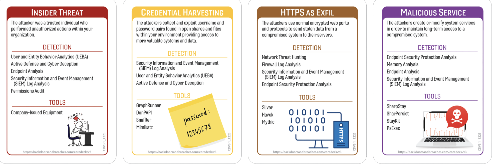
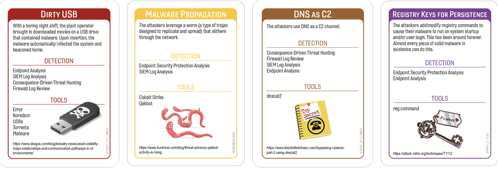
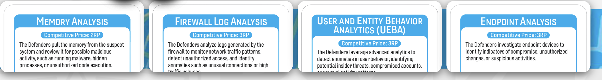

# Congratulations, Your Removable Media Is Now an International Incident
### Author:Robin Noyes
## Summary of Event
Between late 2024 and early 2025, U.S. and international cybersecurity authorities disrupted a long‑running malware campaign involving a variant of the PlugX remote‑access trojan (RAT), a tool historically associated with Chinese state‑sponsored threat actors, including Mustang Panda. This PlugX strain was notable for its USB‑worming capability, allowing it to hide on removable drives and automatically infect new Windows systems when the devices were connected. Once active, the malware enabled remote access, data theft, and persistent footholds through registry‑based mechanisms.

After French authorities and Sekoia sinkholed PlugX command‑and‑control infrastructure in 2024, the FBI and U.S. Department of Justice executed a court‑authorized remediation operation. Leveraging access to the seized C2 servers, the FBI issued a remote self‑delete command to infected hosts. The operation removed PlugX from approximately 4,200–4,258 computers across the United States, without collecting user data or modifying legitimate files. The DOJ emphasized that the action targeted only the malware components and did not access personal content on affected systems.

Public reporting indicates that PlugX infections affected a mix of home systems, enterprise networks, and international organizations, with the earliest observations occurring in 2008. While U.S. court documents do not name specific companies, earlier PlugX campaigns tied to the same threat actors impacted European shipping companies and other commercial entities. As a result, it is reasonable to conclude that business environments were among the systems infected and subsequently remediated, even though individual organizations were not publicly identified.  

## Tags
PlugX, Mustang Panda, USB
## Compatible Decks
Core Deck, ICS/IoT V1, Huntress, Expansion Deck

## Scenarios
### Variation 1

### Variation 2

### Initial Compromise
_**Insider Threat/Dirty USB**_
PlugX’s entry point relied on the oldest trick in the book: a removable drive that had seen more desks than an overworked intern. The malware’s USB‑worming variant hid itself in a concealed directory, waiting patiently for a curious user or an inattentive employee to plug the device into a Windows system. Once mounted, the malicious file executed through standard user interaction, leveraging the victim’s own trust in removable media. This method aligned with PlugX’s long‑standing operational pattern—quiet, opportunistic, and dependent on human behavior moving faster than security policy updates.
* MiTRE
    - T1091: Replication Through Removable Media
    - T1204.002 (User Execution: Malicious File)

### Pivot & Escalate
_**Credential Harvesting/Malware Propgation.**_
After landing on the initial host, PlugX expanded its foothold by harvesting credentials and replicating itself across additional systems. The malware used built‑in Windows mechanisms to access credential material, enabling lateral movement without raising immediate alarms. Its removable‑media propagation continued in parallel, turning every infected USB device into a roaming infection vector. This dual‑path escalation allowed the malware to spread quietly through both digital pathways and physical workflows—an unfortunate reminder that “air‑gapped” often means “only as secure as the nearest thumb drive.”
* MITRE
	- T1003 – OS Credential Dumping
	- T1091 – Replication Through Removable Media
### C2 & Exfil
_**HTTPS as Exfil/ DNS as C2.**_
Once embedded, PlugX established communication with its command‑and‑control infrastructure using DNS‑based signaling, blending into routine network noise with the enthusiasm of a background process no one monitors. For data exfiltration, the malware used HTTPS channels, ensuring that outbound traffic appeared indistinguishable from legitimate encrypted web activity. This combination provided reliable remote access and covert data movement, allowing operators to maintain control even in environments with moderately attentive firewall policies.
* MITRE
	- T1041 – Exfiltration Over C2 Channel (HTTPS)
	- T1071.004 – Application Layer Protocol: DNS
### Persistence
_**Malicious Service/ Registry Key Persistence.**_
To ensure long‑term survival, PlugX deployed persistence mechanisms through Windows registry run keys and malicious service creation. These methods allowed the malware to relaunch automatically after system reboots and blend into legitimate service lists. The approach was consistent with PlugX’s historical behavior—quiet, durable, and designed to survive everything except a determined forensic analyst or, in this case, a court‑authorized FBI remediation command.
* MITRE
	- T1547.001 – Registry Run Keys / Startup Folder
	- T1543.003 – Create or Modify System Process: Windows Service

## Procedures that Reveal the Attack Chain

 * Endpoint Analysis
	* D3-PROCESS-ANALYSIS 
	* D3-MALWARE-ANALYSIS 
	* D3-AUTORUN-HARDENING 
	* D3-EXECUTION-PREVENTION
* Memory Analysis
	* D3-MEMORY-ANALYSIS 
	* D3-CREDENTIAL-HARDENING 
	* D3-PROCESS-ANALYSIS
	* D3-EXECUTION-INSPECTION 
	* D3-FORENSIC-COLLECTION 
* Firewall Log Review
	* D3-NETWORK-BOUNDARY-ENFORCEMENT 
	* D3-NETWORK-TRAFFIC-ANALYSIS
	* D3-PROTOCOL-VALIDATION 
	* D3-NETWORK-SEGMENTATION 
*  User Entity Behavior Analytics (UEBA)
	* D3-ANOMALY-DETECTION
	* D3-IDENTITY-ANALYTICS
	* D3-AUTHENTICATION-HARDENING
	* D3-ACCESS-MONITORING
	* D3-BEHAVIOR-ANALYSIS

## Written Procedures
* Endpoint Analysis
	* Endpoint analysis starts with digging through the workstation like an archaeologist who didn’t sign up for legacy USB mysteries. Analysts sift through odd directories, questionable executables, and persistence entries that look like they were added during a coffee‑fueled late night. It’s the kind of task where you mutter under your breath about “who still uses removable media,” while piecing together how PlugX quietly set up shop without tripping alarms. 
    Reviewing file system artifacts, process activity, scheduled tasks, and service configurations to identify deviations from expected system behavior. The objective is to isolate PlugX’s presence, confirm its execution path, and document all observable changes in a structured, repeatable manner.

* Memory Analysis
	* Memory analysis often feels like staring into the system’s subconscious, hoping it reveals something useful before the next alert storm hits. Analysts comb through volatile memory looking for injected modules, unpacked payloads, and runtime behavior that never touches disk. It’s meticulous work, occasionally interrupted by the realization that the malware has been running longer than the last update to the internal documentation.
    Capturing and examining volatile memory can help to identify in‑memory components associated with PlugX. This includes injected code, decrypted payloads, and active command‑and‑control routines. The goal is to extract actionable indicators that validate the malware’s operational state and support further investigation.

* Firewall Log Review
	* Firewall log review is where analysts discover all the “probably normal” traffic that suddenly looks suspicious once PlugX enters the chat. You scroll through timestamps and encrypted outbound bursts, wondering how many anomalies were quietly ignored during busier weeks. It’s a reminder that structured log review is less glamorous than threat hunting but far more revealing.
    Analyzing outbound communication patterns, including HTTPS and DNS traffic, are a way to identify activity consistent with PlugX’s command‑and‑control behavior. Analysts correlate destinations, timing, and anomalies to reconstruct communication timelines and determine whether exfiltration occurred.

* User and Entity Behavior Analytics (UEBA)
	* UEBA is where the environment’s quirks finally make sense — or at least point to the workstation acting like it’s had too much caffeine. Analysts compare observed behavior against established baselines, spotting anomalies such as unexpected removable‑media access or credential usage that stands out like a humming mystery box in a forgotten rack.
    The UEBA can help to detect deviations in user and system behavior to identify patterns associated with PlugX infection. This includes analyzing access patterns, credential usage, and movement across systems. The procedure provides behavioral context that helps map infection spread and identify persistence or lateral movement attempts.

## Procedure Success 
### General Reasons 
_**Technical**_   
- The environment had just enough visibility to make suspicious activity stand out like a neon sign, allowing analysts to spot anomalies before they turned into a multi‑day incident marathon.
- Baselines were actually up to date — a rare cosmic alignment that made deviations obvious instead of triggering the usual “is this normal?” debate.
- Detection logic had been tuned recently, meaning the alerts were helpful for once and didn’t require deciphering like ancient runes.
- Controls were configured well enough that the attacker couldn’t wander freely, making their behavior easier to track and significantly less dramatic.

_**Financial**_
- Prior investments in security capabilities paid off, proving that the budget meeting everyone dreaded last quarter was worth the caffeine and emotional damage.
- Funding for operational improvements meant analysts were not stuck waiting on missing data or slow systems, which is always a pleasant surprise.
- Training budgets had been used wisely, resulting in a team that actually knew how to interpret what they were seeing instead of guessing their way through the investigation.
- Strategic spending decisions ensured the organization had the capacity to support a real investigation instead of relying on “hope” as a security control.

_**Political**_
- Leadership prioritized the investigation quickly, sparing analysts from the usual bureaucratic obstacle course and allowing work to begin before the situation escalated.
- Ownership of systems and processes was clear enough that analysts didn’t have to chase down five different teams to get basic answers.
- Cross‑team cooperation was unusually smooth, suggesting that everyone understood the stakes — or simply didn’t want to be blamed later.
- Stakeholders aligned on urgency, reducing the number of “status update” meetings and allowing analysts to focus on actual analysis.

_**Personnel**_
- Analysts with the right expertise were available and not already buried under three other incidents, which is a success story in itself.
- Familiarity with the environment helped the team quickly identify what didn’t belong, saving hours of “is this normal?” discussions.
- Communication across the team was clear and efficient, allowing insights from one part of the investigation to accelerate progress elsewhere.
- Adequate staffing meant the team could work methodically instead of triaging everything with the “who’s the least tired?” assignment strategy.

## Procedure Success Explanations
_**Technical**_
- System visibility was just good enough that PlugX’s activity couldn’t hide in the usual noise, giving analysts a rare moment where the telemetry actually cooperated.
- Baselines were current — a miracle attributed to someone finally finishing last quarter’s tuning — making PlugX’s deviations stand out instead of blending into legacy weirdness.
- Detection logic had been updated recently, meaning the alerts were helpful for once and didn’t require deciphering like a cryptic puzzle left by a former employee.
- Controls were configured tightly enough that PlugX couldn’t roam freely, making its behavior easier to trace and significantly less dramatic than it could have been.
_**Financial**_
    - Prior investments in monitoring and analysis paid off, proving that last year’s budget battles weren’t just an exercise in collective suffering.
    - Funding for operational improvements meant analysts weren’t stuck waiting on missing data or slow systems, allowing the investigation to move forward without financial‑related delays.
    - Training budgets had been used wisely, resulting in a team that actually knew how to interpret what they were seeing instead of guessing their way through the analysis.
    - Strategic spending decisions ensured the organization had enough capacity and retention to support a real investigation instead of relying on “hope” as a security control.

_**Political**_
- Leadership prioritized the investigation quickly, sparing analysts from the usual bureaucratic obstacle course and allowing work to begin before the situation escalated.
- Ownership of systems and processes was clear enough that analysts didn’t have to chase down multiple teams just to get basic access or answers.
- Cross‑team cooperation was unusually smooth, suggesting that everyone understood the stakes — or simply didn’t want to be blamed later.
- Stakeholders aligned on urgency, reducing the number of “status update” meetings and allowing analysts to focus on actual analysis instead of presentation slides.

_**Personnel**_
- Analysts with the right expertise were available and not already buried under three other incidents, which is a success story in itself.
- Familiarity with the environment helped the team quickly identify what didn’t belong, saving hours of “is this normal?” discussions.
- Communication across the team was clear and efficient, allowing insights from one part of the investigation to accelerate progress elsewhere.
- Adequate staffing meant the team could work methodically instead of triaging everything with the “who’s the least tired?” assignment strategy.

## Procedure Failures
### General Reasons
_**Technical**_
- Visibility into critical activity wasn’t quite where it needed to be, leaving analysts squinting at partial data and hoping the missing pieces weren’t important (they usually are).
- Baselines were outdated enough that distinguishing normal behavior from suspicious activity felt like guesswork with extra steps.
- Detection logic hadn’t been tuned recently, resulting in alerts that were either too quiet, too loud, or too philosophical to be useful.
- Controls were configured loosely enough that malicious behavior blended in a little too well, making the attacker’s path harder to trace than anyone would prefer.

_**Financial**_
- Funding gaps meant key improvements were still sitting on someone’s “future budget consideration” list, leaving analysts to work with whatever hadn’t broken yet.
- Budget constraints delayed upgrades that would have made detection easier, proving once again that security is cheaper before the incident, not after.
- Limited investment in training left the team relying on tribal knowledge, sticky notes, and sheer determination instead of well‑developed expertise.
- Competing financial priorities resulted in reduced coverage or retention, creating blind spots that analysts discovered at the worst possible moment.

_**Political**_
- Leadership didn’t prioritize the investigation quickly, forcing analysts to navigate the usual approval labyrinth while the incident politely refused to wait.
- Ownership of systems and processes was unclear, leading to the classic “who actually manages this?” scavenger hunt that slows everything down.
- Interdepartmental friction made collaboration feel more like negotiation, delaying access to information that should have been readily available.
- Stakeholders weren’t aligned on urgency, resulting in conflicting demands that pulled analysts away from the investigation at critical moments.

_**Personnel**_
- Analysts with the right expertise were unavailable or already buried under other incidents, leaving the team stretched thinner than anyone was comfortable admitting.
- Limited familiarity with the environment made it difficult to recognize what was suspicious versus what was just poorly documented.
- Communication breakdowns slowed the investigation, turning simple clarifications into multi‑step relay races across teams.
- Staffing shortages forced analysts to triage aggressively, reducing the depth of analysis and increasing the likelihood of missing important details.

### Procedure Failures Explanations
_**Technical**_
- The procedure failed because the system providing the data had partial or outdated telemetry, leaving analysts with just enough information to be confused but not enough to be useful.
- Baselines were so old that “normal behavior” looked suspicious and “suspicious behavior” looked normal, turning the analysis into a guessing game with extra steps.
- Detection logic hadn’t been tuned in months, resulting in alerts that were either too quiet to notice or too loud to trust, making it impossible to separate meaningful signals from routine noise.
- Controls were configured loosely enough that unusual activity blended in perfectly with everyday chaos, preventing the procedure from identifying anything actionable.

_**Financial**_
- The procedure failed because licensing limitations restricted visibility, leaving critical data behind a paywall that finance had labeled “non‑essential.”
- Budget constraints delayed upgrades that would have improved detection, forcing analysts to rely on tools that were technically functional but practically unhelpful.
- Training budgets had been trimmed, leaving staff without the specialized knowledge needed to interpret complex or ambiguous results.
- Competing financial priorities reduced retention windows or coverage, creating blind spots that only became obvious once the investigation was already underway.

_**Political**_
- The procedure stalled because ownership of the relevant systems was unclear, triggering a multi‑team debate over who was responsible for providing access or approving the next step.
- Leadership deprioritized the investigation, causing delays that allowed the issue to blend into routine operational noise before anyone could act on it.
- Interdepartmental friction slowed collaboration, turning simple data requests into prolonged negotiations that hindered timely analysis.
- Stakeholders were not aligned on urgency, resulting in conflicting directives that pulled analysts away from the procedure before it could be completed effectively.

_**Personnel**_
- The procedure failed because the only person familiar with the required tools or systems was unavailable, leaving the team to improvise with partial knowledge and outdated notes.
- Analysts were already overloaded with other incidents, reducing the time and attention needed to perform the procedure thoroughly.
- Communication breakdowns caused critical details to be missed or misunderstood, leading to incomplete or incorrect execution of the procedure.
- Staffing shortages forced the team to triage aggressively, reducing the depth of analysis and increasing the likelihood that important indicators were overlooked.

## Game Start
The shift was already running on stale coffee and questionable optimism when someone plugged in “just a harmless USB” they’d been meaning to check. A workstation that had been quietly behaving like a background extra suddenly lit up the SIEM like it had main‑character energy—new processes, odd file paths, and network traffic that looked a little too eager to leave the building. At first, it felt like yet another false positive in a long week of noise, but the pattern wouldn’t go away: removable media, strange binaries, and a host that suddenly wanted to talk to places it had never visited before. Something had changed, and whatever it was, it was now your problem. Time to investigate.

## Game Conclusion
The investigation confirmed that PlugX had entered the environment through infected removable media, quietly establishing persistence and using encrypted outbound traffic for command‑and‑control. Endpoint and memory analysis tied the activity to known PlugX behaviors, while firewall and UEBA data helped reconstruct how the malware moved and maintained access without immediately triggering full containment. Ultimately, remediation efforts aligned with broader law‑enforcement operations that targeted PlugX infrastructure, and the affected systems were cleaned without impacting legitimate data or business operations. The scenario closed with a clear lesson: unmanaged removable media, incomplete visibility, and lightly enforced policies can turn a single USB device into a foothold for long‑lived, externally coordinated malware.

## Lessons Learned and Mitigating Controls
 * Removable media is a high‑risk vector, not a convenience. PlugX’s USB‑borne variant showed how a single infected device can quietly move across desks, networks, and organizations, relying entirely on normal user behavior and trust in removable media. “The malware’s USB‑worming variant hid itself in a concealed directory, waiting patiently for a curious user or an inattentive employee to plug the device into a Windows system.” 
* Long‑lived RATs turn into infrastructure problems, not isolated incidents. PlugX had been active for years, with infections persisting across home systems, enterprise networks, and international organizations. The FBI’s court‑authorized operation removed PlugX from roughly 4,200+ U.S. computers, underscoring how quietly such malware can accumulate and remain undetected. 
* Detection without coordinated remediation leaves risk on the table. Prior reporting had documented PlugX campaigns, but many owners of infected systems were unaware until law‑enforcement‑driven remediation occurred. That gap highlights the need for organizations to act on threat intelligence, not just consume it. 

### Mitigating Controls
* Strict removable‑media governance:
	- Disable or tightly restrict USB storage on critical systems.
    - Require device registration, encryption, and logging for any permitted removable media.
	- Pair technical controls with clear policy and enforcement.
  
* Endpoint hardening and visibility:
	- Enforce application control, autorun hardening, and EDR coverage on all endpoints, including “temporary” or test systems.
	- Monitor for unusual process trees, DLL sideloading behavior, and persistence mechanisms such as suspicious services or registry run keys. 
  
* Network‑level detection for RAT behavior:
	- Use firewall and proxy logs to baseline outbound HTTPS and DNS patterns, then alert on anomalous destinations, timing, or volumes consistent with C2.
	- Apply segmentation so that a single infected host cannot freely pivot across sensitive environments. 
  
* Behavioral analytics for infection spread:
	- Use UEBA to flag unusual removable‑media usage, credential reuse, or lateral movement from previously low‑risk hosts.
	- Correlate identity, endpoint, and network signals to identify clusters of potentially infected systems rather than treating each alert as isolated.
  
* Coordinated remediation playbooks:
	- Maintain playbooks for RAT removal that include endpoint cleaning, persistence eradication, credential hygiene, and network re‑baselining.
	- Where appropriate, integrate with vendor or law‑enforcement guidance when court‑authorized or coordinated operations are available. 

## References
BleepingComputer. “PlugX Malware Hides on USB Devices to Infect New Windows Hosts.” BleepingComputer, https://www.bleepingcomputer.com/news/security/plugx-malware-hides-on-usb-devices-to-infect-new-windows-hosts/.

BleepingComputer. “FBI Deletes Chinese PlugX Malware from Thousands of US Computers.” BleepingComputer, https://www.bleepingcomputer.com/news/security/fbi-deletes-chinese-plugx-malware-from-thousands-of-us-computers/.

Cimpanu, Catalin. “FBI Hacked Thousands of Computers to Uninstall PlugX Malware.” The Verge, 14 Jan. 2025, https://www.theverge.com/2025/1/14/24343495/fbi-computer-hack-uninstall-plugx-malware.

CyberInsider. “FBI Neutralizes PlugX Malware on 4,200 Computers across the U.S.” CyberInsider, https://cyberinsider.com/fbi-neutralizes-plugx-malware-on-4200-computers-across-the-u-s/.

Goodin, Dan. “FBI Deletes PlugX Malware from 4,250 Infected Systems.” The Hacker News, https://thehackernews.com/2025/01/fbi-deletes-plugx-malware-from-4250.html.

Bitdefender. “FBI Pulls the Plug on PlugX Malware, Removing It from Thousands of Devices.” Bitdefender HotForSecurity, https://www.bitdefender.com/en-us/blog/hotforsecurity/fbi-pulls-the-plug-on-plugx-malware-removing-it-from-thousands-of-devices.

CyberNews. “FBI Deletes Chinese PlugX Malware from Thousands of Infected Computers.” CyberNews, https://cybernews.com/security/fbi-deletes-chinese-plugx-malware-thousands-infected-computers/.

United States Department of Justice. Search and Seizure Application: PlugX Malware Operation. RegMedia, 14 Jan. 2025, https://regmedia.co.uk/2025/01/14/plugx_malware_search_and_seizure_application.pdf.

Ace News Today. “FBI Mass Erases Chinese Malware ‘PlugX’ from Thousands of U.S. Computers.” Ace News Today, https://www.acenewstoday.com/fbi-mass-erases-chinese-malware-plugx-from-thousands-of-u-s-computers/.