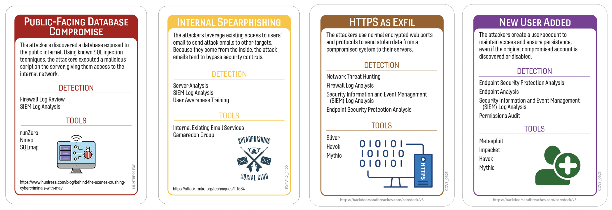
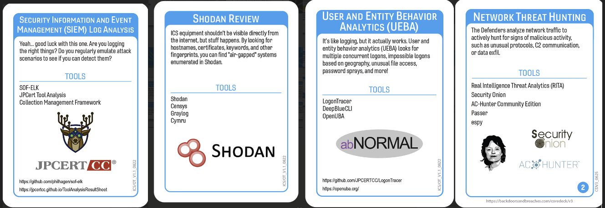

# Exactly What You Are Looking For, Right?
## Exactis
### Author:Robin Noyes
## Summary of Event 
A U.S based marketing firm out of Palm Coast, Florida, potentially exposed the data of roughly 340 million, consisting of 230 million individuals and 110 million businesses; which totals roughly 2TB of data or potentially 3.5 billion digital elements (ConsumerFinanicial, 2018).  A security researcher, Vinny Troia, discovered the leak while researching publicly exposed ElasticSystems databases systems.  The data was said to contain upwards of 400 different elements including not only name, home and email addresses but also identifiers such as whether you smoked, what your personal interest and habits are, whether you have pets,  and name, age, and gender of children.  (TechTarget,2018).  The amount of data available could be used for automated social engineering attacks or combined with other data dumps to have more specific information to either compromise accounts or perform more detailed social engineering attacks.  Most articles indicate that the length of time the data was exposed is unknown, but the company was started in 2015 and the database accessible until it was removed after being reported in 2018.  Offers “highest quality triple-validated business and consumer marketing data” that allows you to “grow your business with the cleanest most accurate marketing data available (Tomshardware, 2018).  You might want to go update your security questions with new or even opposite information. 
## Tags
Publicly accessible servers, databases, data brokers, Exactis Breach
## Compatible Decks 
Huntress Exp,  Core V2.2

## Scenarios

### Initial Compromise
_**Public Facing Database Compromise**_
Security researchers as well as threat actors use tools of the trade for similar purposes.  In this case, a security researcher found the publicly available ElasticSearch database readily available for anyone to access using Shodan searches.
### Pivot & Escalate
_**Internal Password Spray**_
There is no evidence of a breach of Exactis but this card was selected as the data available could easily be used to pivot to a spear phishing or out-of-bands phishing.
### C2 & Exfil
_**HTTPS as Exfil**_
Although there was no C2 identified, as the data was publicly available, this card was selected as the method of download and access.
### Persistence
_**New User Added**_
This event has not confirmed to have been the result of an attack, but with the volume of data available it could have been used to reset credentials of privilege users with the intention of making new user accounts.

## Procedures that Reveal the Attack Chain

## Written Procedures
* User and Entity Behavior Analytics (EUBA)  
	* This card was included because it does not discover any items in the attack chain. Just like in real life, just because you're good at something, doesn't mean it will help you. EUBA tools are typically agent based and installed on company assets to provide telemetry around that system and user.   In the case of Exactis, the attack actions took place  through non-managed devices, directly over the internet.
* Security Information and Even Management (SIEM) Log Analysis
	* This procedure was selected as it can detect Initial Compromise and Pivot and Escalate.  Elastic audit or search logs could have shown evidence of access coming from external IPs.  Community articles appear to indicate the adversary may have changed IP's, used VPN or cloud hosting for access attempts, as well as scripting access activity.  It is possible that user-agent statistics may also have shown this activity.  Web application telemetry may have shown accessing other distant family trees that were not typical for the customer. 
* Shodan Review
	* This procedure was selected as it is used by adversaries, researchers, and should be used by organizations to see what internet exposure they may have.  This tool should be included as part of any threat/vulnerability scanning performed by the organization.

* Network Thread Hunting - Zeek/RITA Analysis
	* This procedure was selected as it can detect and/or recreate traffic, files, etc.  The download of the zip file and connections from previously unknown IPs accessing administration portals could have been used to detect this incident ahead of time. 

## Procedure Success (explanations of why it worked)
### General Reasons
Technical
	- VarProcedure operated successfully because agents and logging mechanisms were not only installed but also thoroughly validated for alert logic, data quality, and completeness.
	- VarProcedure returned accurate results because the search parameters included all relevant CIDR ranges, including internal, external, and any cloud-based assets.

- Financial
	 - VarProcedure functioned as expected because there was clear prioritization and alignment between projects, avoiding conflicts and ensuring that tool implementation and logging strategies were fully supported and integrated.
	- VarProcedure SME has returned from training with new in-depth knowledge to share.

- Political
	 - VarProcedure worked successfully because the Owner/VP/Project Manager aligned with the security team early in the planning phase, ensuring it was configured at the subsidiary/branch/business unit without impacting their critical project timeline. Cross-functional collaboration made the integration smooth.
	-  VarProcedure was applied across all devices, including executive/VIP endpoints, because leadership acknowledged the importance of consistent controls. Security policies were upheld with support from HR and the CISO, ensuring no exemptions undermined detection capability.
	 
- Personnel
	- VarProcedure worked successfully because the contractor’s hours were managed proactively, and internal staff were trained to continue deployment seamlessly.
	- VarProcedure worked successfully because the approval team established remote processes, enabling decisions even while attending conferences.

## Procedure Failures
### General Reasons
- Technical
	-  VarProcedure did not detect the attack because the agent could not be deployed on the OS/Server/Laptop/Endpoint due to unsupported/legacy/criticality of the asset.
	- VarProcedure did not work because the appliance/server is undergoing patch maintenance and is unavailable.
- Financial
	- VarProcedure did not work because the tool/service features that would have detected it were part of the more expensive package that was not purchased.
	- VarProcedure did not work because of competing and conflicting projects would have negated/changed where the tool/logging should be implemented.
- Political
	-VarProcedure did not work because prior requests to connect to the network segment/application/tool caused major disruptions in services.  The approver wants a meeting to clearly define what it does and what impact of using the tool could be.  Ever DDoS'ed your network running authenticated vuln-scans on major production implementation days?
	- VarProcedure did not work because an executive/VP/VIP stated that rules did not apply to them and therefor worked with HR to require security to remove blocks/tools from their device.  They are being redeployed now and could provide information in the future.
- Personnel
	- VarProcedure did not work as the team went to the new ‘raw bar’ down the street and everyone is suffering from food poisoning.
	- VarProcedure did not work because the team that manages/approves using VarProcedure is away at a conference.

### Procedure Failures Explanations
- UEBA
	- Technical
		-  Agents, connectors, or collectors were never deployed to key systems, leaving blind spots.
	- Financial
		- The UBEA is currently in its renewal period awaiting approvals, causing data ingest gaps or key features being disabled.
	- Political
		- The cloud, security, IT, and networking teams disagree on priorities and placement of the tools, delaying integrations.
	- Personnel
		-  The team has little to no experience with the new UBEA.  Therefore behavioral analytics, risk scoring, and model tuning are all OoB (out-of-the-box) and flooded with false positive alerts.
- SIEM
	- Technical
		- VarProcedure did not work as the SIEM tool is in the middle of a major cloud provider migration (Azure, AWS, GCP) so only half the data is available on the existing platform.
	- Financial
		- End of year budget adjustments caused the team to reduce the data retention timeframe to reduce costs, losing historical information.  
- Shodan
	- Technical
		- Major DNS providers are suffering from a DDoS, therefore the site is not accessible.
	- Financial
		- Shodan had to revoke all free API keys to obtain additional infrastructure to manage the requests.  We must build a business case to purchase an enterprise license for executives.
	- Politcal
		- Someone heard that Shodan was a ‘known bad’ site and blocked access from within the network.  You either have to convince the networking team that it is needed or do you searches from your personal device.  I am sure legal would have no issues with that, right ??
	- Personnel
	- Shodan?  What is Shodan?  The assigned team member is not aware of how to query shodan data. 
- Network Threat Hunting
	- Technical
		- Inconsistent multi-cloud log formats for Azure, GCP, AWS hosted systems is causing logging failures or dropped events. 
	- Financial
		- The team had submitted a request earlier in the year to increase the available storage space.  We have run out of space and can no longer ingest data until we clean up data or get more space ASAP.

## Game Start 

## Game Conclusion

References
* [McAfee Blogs —The Exactis Data Breach: What Consumers Need to Know](https://www.mcafee.com/blogs/privacy-identity-protection/exactis-data-breach/) 
* [Kiss Your Privacy Goodbye. Exactis Leaks A Database With 340 Million Personal Data Records](https://blog.knowbe4.com/kiss-your-privacy-goodbye-forever.-marketing-firm-exactis-leaks-a-database-with-340-million-personal-data-records )
* [DiCello Levitt Files National Class Action Against Exactis in Wake of Massive Data Breach](https://dicellolevitt.com/dicello-levitt-casey-files-national-class-action-exactis-wake-massive-data-breach/)
* [What is Exactis—and how could it have leaked the data of nearly every American?]( https://www.marketwatch.com/story/what-is-exactisand-how-could-it-have-the-data-of-nearly-every-american-2018-06-28)
* [Marketing Firm Exactis Leaked a Personal Info Database With 340 Million Records](https://www.wired.com/story/exactis-database-leak-340-million-records/)
* [Tech Target - Exactis Leak Exposes Database With 340 Million Records](https://www.techtarget.com/searchsecurity/news/252444018/Exactis-leak-exposes-database-with-340-million-records)

Additional recources

[https://www.wired.com/story/exactis-data-leak-fallout/](https://www.wired.com/story/exactis-data-leak-fallout/)
[https://www.pcmag.com/news/marketing-firm-accidentally-exposes-340-million-records-online](https://www.pcmag.com/news/marketing-firm-accidentally-exposes-340-million-records-online)
[https://www.tomshardware.com/news/exactis-data-breach-leak,37381.html](https://www.tomshardware.com/news/exactis-data-breach-leak,37381.html)
[https://www.engadget.com/2018-06-28-exactis-leak-340-million-records.html](https://www.engadget.com/2018-06-28-exactis-leak-340-million-records.html)
[https://www.consumerfinancialserviceslawmonitor.com/2018/07/exactis-data-leak-to-affect-millions-of-americans/](https://www.consumerfinancialserviceslawmonitor.com/2018/07/exactis-data-leak-to-affect-millions-of-americans/)
[https://www.infosecurity-magazine.com/news/340-million-records-exposed-in/](https://www.infosecurity-magazine.com/news/340-million-records-exposed-in/)