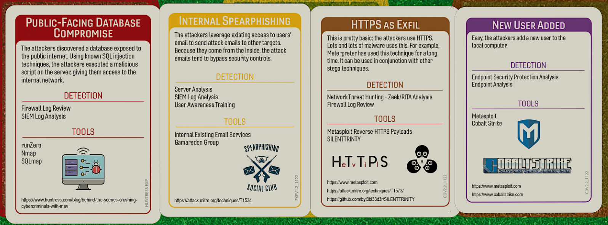

# Exactly What You Are Looking For, Right?
### Author:Robin Noyes
## Summary of Event 
A U.S based marketing firm out of Palm Coast, Florida, potentially exposed the data of roughly 340 million, consisting of 230 million individuals and 110 million businesses; which totals roughly 2TB of data or potentially 3.5 billion digital elements (ConsumerFinanicial, 2018).  A security researcher, Vinny Troia, discovered the leak while researching publicly exposed ElasticSystems databases systems.  The data was said to contain upwards of 400 different elements including not only name, home and email addresses but also identifiers such as whether you smoked, what your personal interest and habits are, whether you have pets,  and name, age, and gender of children.  (TechTarget,2018).  The amount of data available could be used for automated social engineering attacks or combined with other data dumps to have more specific information to either compromise accounts or perform more detailed social engineering attacks.  Most articles indicate that the length of time the data was exposed is unknown, but the company was started in 2015 and the database accessible until it was removed after being reported in 2018.  Offers “highest quality triple-validated business and consumer marketing data” that allows you to “grow your business with the cleanest most accurate marketing data available (Tomshardware, 2018).  You might want to go update your security questions with new or even opposite information. 
## Tags
Publicly accessible servers, databases, data brokers, Exactis Breach
## Compatible Decks 
Huntress Exp,  Core V2.2

## Scenarios

### Initial Compromise
_**Public Facing Database Compromise
Security researchers as well as threat actors use tools of the trade for similar purposes.  In this case, a security researcher found the publicly available ElasticSearch database readily available for anyone to access using Shodan searches.
### Pivot & Escalate
_**Internal Password Spray_
There is no evidence of a breach of Exactis but this card was selected as the data available could easily be used to pivot to a spear phishing or out-of-bands phishing.
### C2 & Exfil
_**HTTPS as Exfil**
Although there was no C2 identified, as the data was publicly available, this card was selected as the method of download and access.
### Persistence
_**New User Added**
This event has not confirmed to have been the result of an attack, but with the volume of data available it could have been used to reset credentials of privilege users with the intention of making new user accounts.

## Procedures that Reveal the Attack Chain

## Written Procedures
* User and Entity Behavior Analytics (EUBA)  
	* This card was included because it does not discover any items in the attack chain. Just like in real life, just because you're good at something, doesn't mean it will help you. EUBA tools are typically agent based and installed on company assets to provide telemetry around that system and user.   In the case of Exactis, the attack actions took place  through non-managed devices, directly over the internet.
* Security Information and Even Management (SIEM) Log Analysis
	* This procedure was selected as it can detect Initial Compromise and Pivot and Escalate.  Elastic audit or search logs could have shown evidence of access coming from external IPs.  Community articles appear to indicate the adversary may have changed IP's, used VPN or cloud hosting for access attempts, as well as scripting access activity.  It is possible that user-agent statistics may also have shown this activity.  Web application telemetry may have shown accessing other distant family trees that were not typical for the customer. 
* Shodan Review
	* This procedure was selected as it can detect …
* Network Thread Hunting - Zeek/RITA Analysis
	* This procedure was selected as it can detect … 

## Procedure Success (explanations of why it worked)
### General Reasons
Technical
- VarProcedure found unauthorized/suspicious evidence of IP/commands/software/log deletion on the system.  This was found by correlating logs from multiple data sets EDR/Windows Logs/Firewall/Proxy/Server/UberAgent.  This allowed for finding patient zero to use in subsequent searches.
	- VarProcedure discovered suspect network/data/flow activity between two devices that warrant further investigation of ports and protocols used.
	- VarProcedure discovered system changes during off-hours/outside of scheduled maintenance windows, leading the team to dig deeper into changes made.
	- VarProcedure discovered the system had several unpatched vulnerabilities/vulnerable libraries in use.
	- VarProcedure discovered a portion of the attack due to recent signature/agent/module updates.

- Financial
	- VarProcedure  was successful due to the recent budget approval to collect/deploy additional tool/services/application/log sources across the environment.”
	- “VarProcedure  was successful due to the recent implementation of additional models/packages for the tool/service/application which allowed key features to be enabled.”
	- “VarProcedure was successful due to the recent hire of a SME on the specific tool.”
	- “VarProcedure worked due to the recent approval for additional collectors implemented in the branch/office/data center.”
	-  VarProcedure SME has returned from training with new in-depth knowledge to share.

- Political
	-
	 
- Personnel
	- VarProcedure

## Procedure Failures
### General Reasons
- Technical
	-  VarProcedure didn't detect anything because the attacker changed TTPs (Tactics, Techniques, Procedures).
	- VarProcedure didn't detect the attack because the agent or signatures are out of date.
	-  VarProcedure didn't detect the attack because the agent couldn't be deployed on the OS/Server/Laptop/Endpoint.
	- VarProcedure didn’t work because the appliance/server is undergoing patch maintenance and unavailable.”
	- VarProcedure didn’t work because the data center had an outage or no owner was identified for the system so it was unplugged/ripped out as part of vulnerability management.”
- Financial
	- VarProcedure didn't work because the budget wasn't approved to expand licensing for tool/service/project/application to subsidiary/offices/datacenter/branch/new location/work from home/contractors.
	-  VarProcedure failed because the PO to renew the tool/service got stuck in the payment process. The tool/service stopped before someone noticed.
	- VarProcedure couldn't identify any of the attack because the tool/service features that would have detected it were part of the more expensive package that wasn't purchased.
- Political
	- VarProcedure wasn't configured at subsidiary/branch/business unit because Owner/VP/Senior Know-it-All/Project Manager said it would interfere with their CrItIcAl PrOjEcT timeline.
	-  VarProcedure found nothing because the project to deploy agent/service/tool/configuration was delayed until next fiscal year by the board.
	- VarProcedure couldn't identify the attack because a member of the change board denied the change to deploy the service based on disagreements with the security team.
	-Personnel
	-  The only person that knows how to do/use VarProcedure is Casey and they're on vacation.
	- The contractor hired to deploy VarProcedure ran out of hours in their contract.
	- The team that manages VarProcedure is away at a conference.

### Procedure Failures Explanations
-Server Analysis
- Technical
	- 
- Financial
	- 
- Political
	- 
- Personnel
	-  

-Firewall Analysis
- Technical
	- 
- Financial
	-  
- Political
	- 
- Personnel

-SIEM
- Technical
	- 
- Financial
	-   
- Political
	- 
- Personnel

-Cloud
- Technical
	- 
- Financial
	-  
- Political
	- 
- Personnel

## Game Start 
You have been contacted by a security researcher 

## Game Conclusion

References
* McAfee Blogs —The Exactis Data Breach: What Consumers Need to Know 
[https://www.mcafee.com/blogs/privacy-identity-protection/exactis-data-breach/ ](https://www.mcafee.com/blogs/privacy-identity-protection/exactis-data-breach/)
* Kiss Your Privacy Goodbye. Exactis Leaks A Database With 340 Million Personal Data Records 
[https://blog.knowbe4.com/kiss-your-privacy-goodbye-forever.-marketing-firm-exactis-leaks-a-database-with-340-million-personal-data-records ](# "Kiss Your Privacy Goodbye FOREVER")
* DiCello Levitt Files National Class Action Against Exactis in Wake of Massive Data Breach 
[https://dicellolevitt.com/dicello-levitt-casey-files-national-class-action-exactis-wake-massive-data-breach/ ](#)
* What is Exactis—and how could it have leaked the data of nearly every American? 
[ https://www.marketwatch.com/story/what-is-exactisand-how-could-it-have-the-data-of-nearly-every-american-2018-06-28 ](#)
* Marketing Firm Exactis Leaked a Personal Info Database With 340 Million Records
[https://www.wired.com/story/exactis-database-leak-340-million-records/](#)
* Tech Target - Exactis Leak Exposes Database With 340 Million Records 
[https://www.techtarget.com/searchsecurity/news/252444018/Exactis-leak-exposes-database-with-340-million-records ](#)

Additional recources
[https://www.wired.com/story/exactis-data-leak-fallout/](https://www.wired.com/story/exactis-data-leak-fallout/)
[https://www.pcmag.com/news/marketing-firm-accidentally-exposes-340-million-records-online](https://www.pcmag.com/news/marketing-firm-accidentally-exposes-340-million-records-online)
[https://www.tomshardware.com/news/exactis-data-breach-leak,37381.html](https://www.tomshardware.com/news/exactis-data-breach-leak,37381.html)
[https://www.engadget.com/2018-06-28-exactis-leak-340-million-records.html](https://www.engadget.com/2018-06-28-exactis-leak-340-million-records.html)
[https://www.consumerfinancialserviceslawmonitor.com/2018/07/exactis-data-leak-to-affect-millions-of-americans/](https://www.consumerfinancialserviceslawmonitor.com/2018/07/exactis-data-leak-to-affect-millions-of-americans/)
[https://www.infosecurity-magazine.com/news/340-million-records-exposed-in/](https://www.infosecurity-magazine.com/news/340-million-records-exposed-in/)