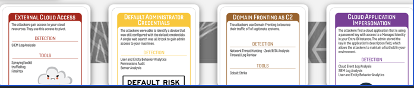
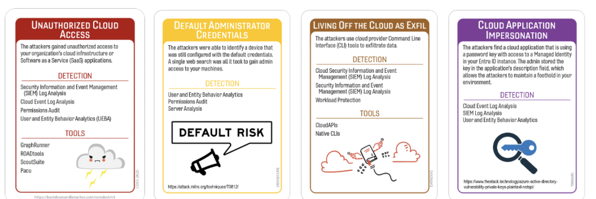
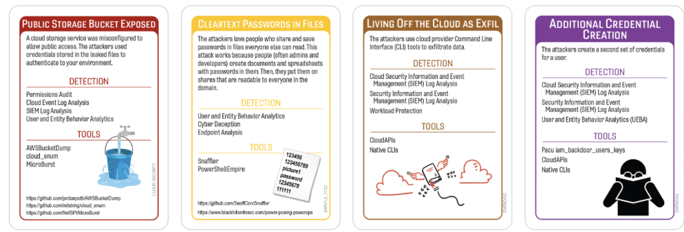
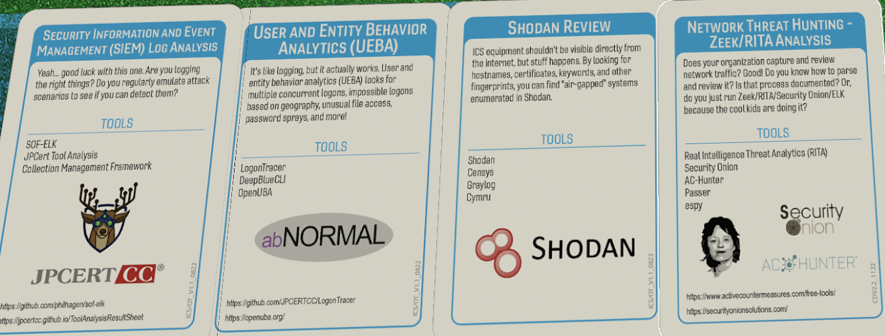

# From Bankgok to Backdoor: The Biggest Export No One Asked For
## AIS/AWN
### Author: Robin Noyes
## Summary of Event
In 2020, a massive data exposure surfaced involving 8.3 billion internet usage records tied to Thailand’s largest mobile provider, Advanced Info Service (AIS) (or its subsidiary Advanced Wireless Network Co (AWN). The exposed dataset reportedly included DNS query logs and NetFlow / IP flow metadata — effectively revealing which domains users visited, what apps they used, and traffic patterns (e.g. device types, browsers, antivirus software, social media, websites).   Accessing the exposed data required no authentication and the database lacked encryption (TechCrunch, BangkokPost)  

A security researcher, Justin Paine, discovered the data by scanning internet‐exposed systems (via tools like Shodan or BinaryEdge) and alerted AIS of the exposed Elastic database. After limited or no response, he escalated to Thailand’s CERT, prompting AIS to take the database offline. (Reference) AIS later claimed the issue was due to human error, believing the system was for testing and insisted no personal or financial information was compromised. (SecurityMagazine, BangkokPost)

In more recent years, there are newer claims of a breach by a hacker group Desorden in 2023, who allege theft of 198 GB of client data including call records, voice files, and client databases via PBX servers. However, AIS has not officially confirmed that claim. (TheCyberExpress).

## Tags
DNS, Netflow, User Profile

## Compatible Decks
Core V1/3, Expansion V1.2, Cloud Security V1.1, Densecure, Trimaranc, Datadog
## Scenarios
### Variation 1

### Variation 2

### Variation 1

### Initial Compromise
**_External Cloud Access / Unauthorized Cloud Access / Public Storage Bucket Exposed_**
This is the moment the attackers found the first loose thread in the sweater. Whether it was an exposed cloud endpoint, an overly generous storage bucket, or an access control policy written by someone who clearly believed in radical trust, the attackers spotted an opening and took it. Think of it as the digital equivalent of leaving your front door unlocked — not because you meant to, but because you were ‘just running back inside for a second.’ The attackers simply walked in, admired the décor, and decided to stay awhile.   Researches, hackers, and others scan the internet for open unsecured systems to attack.  Always know your perimeter  and scan yourself often.  
MITRE ATT&CK:
- T1190 — Exploit Public‑Facing Application
- T1046 — Network Service Discovery
- T1087 — Account Discovery (secondary)
- T1133 — External Remote Services

### Pivot & Escalate
**_Default Administrator Credentials/Cleartext Password in Files_**
Once inside, the attackers did what attackers always do: they went exploring. Maybe they found default admin credentials lying around like a spare key under the mat, or maybe they stumbled across a cleartext password tucked into a file named something subtle like ‘DO_NOT_SHARE.txt.’ Either way, they upgraded their access with the enthusiasm of someone discovering their hotel key opens the penthouse suite. It’s the classic ‘why stop at one door when all the doors are open?’ maneuver.  This was selected as there is no option for ’no password required’ .   
MITRE ATT&CK:
- T1195 — Supply Chain Compromise
- T1078 — Valid Accounts
- T1068 — Privilege Escalation

### C2 & Exile
**_Domain Fronting as C2 / Living off the Cloud Exfil_**
Here’s where the attackers started whispering back to home base or quietly shuttling data out the side door. Whether they hid inside legitimate cloud traffic or blended into CDN noise like a chameleon in a paint store, their goal was simple: stay connected, stay unnoticed, and move data without raising alarms. It’s the cyber equivalent of using the office Wi‑Fi to stream movies during work hours — technically possible, highly questionable, and surprisingly hard to spot if you know what you’re doing.  None of the references indicate there was any C2 used for the exile as the information was available directly on the internet.  These C2 were selected to make the game play more interesting.
MITRE ATT&CK:
- T1041 — Exfiltration Over C2 Channel
- T1567 — Exfiltration to Cloud Storage

### Persistence
**_Cloud Application Impersonation / Additional Credential Created_**
Persistence is where the attackers made sure they could come back later, even if defenders slammed the door shut. Maybe they impersonated a cloud application with just enough legitimacy to pass casual inspection, or maybe they created new credentials with the confidence of someone adding themselves to the VIP list. Either way, they left behind a quiet little backdoor — not flashy, not loud, just a subtle ‘don’t mind me’ foothold designed to outlive the initial intrusion.”  None of the research indicated any persistence mechanism used.  However, these options were selected based on other cloud specific attack vectors.
MITRE ATT&CK:
- T1098 — Account Manipulation
- T1505 — Server‑Side Component Persistence

## Procedures that Reveal the Attack Chain

* Cloud Security Information and Even Management (CSIEM) Log Analysis
	* MiTRE D3FEND Mapping
	* D3‑ANALYZE (Log Analysis)
	* D3‑DETECT (Behavior Anomaly Detection)
	* D3‑COLLECT (Cloud Telemetry Collection)
* Server Analysis
	* MiTRE D3FEND Mapping:
	* D3‑ANALYZE (System Behavior Profiling)
	* D3‑DETECT (Unauthorized Access Detection)
	* D3‑HARDEN (Server Configuration Hardening)
* Shodan Review
	* MiTRE D3FEND Mapping:  (Closest match — no direct D3FEND technique)
	* D3‑INVESTIGATE (External Reconnaissance Review)
	* D3‑HARDEN (Exposure Reduction)
* Network Threat Hunting
	* MiTRE D3FEND Mapping:
	* D3‑DETECT (Network Traffic Analysis)
	* D3‑ANALYZE (Threat Investigation)
	* D3‑COLLECT (Network Telemetry Collection)  

## Written Procedures
* Cloud Security Information and Even Management (CSIEM) Log Analysis
	* Every cloud service in the enterprise flings logs into the SIEM like raccoons hurling trash into a dumpster — noisy, chaotic, and occasionally containing something important. Buried somewhere between the 47,000 ‘informational’ alerts and the one critical alert everyone hopes is a false positive lies the truth of what the attacker actually did. With enough patience (and caffeine), Cloud SIEM can reveal the entire attack chain… assuming it didn’t drop half the logs on the way in.
* Server Analysis
	* Server Analysis is where defenders roll up their sleeves and dive into the machines that actually do the work — or in some cases, the machines that haven’t been patched since the last solar eclipse. Whether it’s a PBX server, a cloud VM, or a mystery box humming in a forgotten rack, this is where unauthorized processes, suspicious configs, and ‘why is that running?’ moments tend to surface. It’s digital archaeology with more swearing.
* Shodan Review
	* Shodan Review is the cybersecurity equivalent of Googling yourself, except instead of embarrassing photos, you’re checking to see which of your systems are accidentally moonlighting as public internet attractions. If something is exposed — a storage bucket, a login portal, or a server that definitely shouldn’t be talking to the world — Shodan will happily rat you out. It’s like having a very judgmental neighbor who reports everything they see.
 * Network Threat Hunting
	* Network Threat Hunting is where defenders follow the faint footprints of suspicious traffic through the digital wilderness. Whether the attackers were beaconing, exfiltrating, or just wandering around like confused tourists, the network always leaves clues. The challenge is spotting them among the stampede of normal traffic — it’s like trying to identify one weird squirrel in a forest full of weird squirrels.

## Procedure Success 
### General Reasons
- Technical
	- Strong telemetry coverage captured the attacker’s activity across cloud access, credential misuse, and exfiltration paths. 
	- Baseline tuning allowed analysts to quickly identify anomalies such as domain‑fronted traffic, cloud‑native exfiltration, or unexpected storage access.
	- Automated correlation linked identity events, server logs, and network flows, revealing the attacker’s movement across systems.
	- Monitoring tools detected unauthorized credential creation or impersonation attempts early in the attack.
- Financial
	 - Funding supported advanced monitoring tools that captured cloud, server, and network telemetry.
	- Adequate storage retention allowed analysts to reconstruct the full attack timeline.
	- Licensing included modules for cloud identity events, storage access logs, and network analytics.
	- Budget allocation ensured vendor‑managed systems were properly monitored.
- Political
	- Cross‑team collaboration enabled rapid validation of suspicious activity across cloud, server, and network domains.
	- Leadership mandated centralized logging, ensuring visibility across all business units.
	- Security had approval to perform external reconnaissance and threat hunting.
	- Vendor relationships allowed quick access to PBX or cloud server telemetry.
- Personnel
	- Analysts recognized suspicious patterns due to prior training in cloud and network investigations.
	- The team had adequate staffing to investigate alerts promptly.
	- Server and cloud engineers were available to validate anomalies quickly.
	- Analysts were familiar with credential‑related attack patterns.

## Procedure Success 
### Explanations
- Technical
	- The logs actually loaded before timing out — a rare and beautiful moment.
	- A random dashboard glitch highlighted the attacker’s activity like a neon sign.
	- The attacker’s traffic stuck out because everything else was broken that day.
	- Someone typo’d a query and accidentally uncovered the entire attack chain.
- Financial
	- We caught the attacker because procurement accidentally approved the expensive module.
	- Retention hadn’t expired yet — a miracle in itself.
	- We still had a Shodan subscription because no one remembered to cancel it.
	- The fancy analytics tool was still in its trial period.
- Political
	- Cloud, network, and server teams actually cooperated — a historic event.
	- Leadership said ‘go hunt’ and actually meant it.
	- The vendor answered the phone on the first try — shocking.
	- No one argued about who owned the exposed asset for once.
- Personnel
	- A junior analyst found the smoking gun while looking for something else entirely.
	- Night shift caffeine levels were high enough to spot the anomaly.
	- Someone remembered an obscure detail from a previous incident and saved the day.
	- A random hunch turned out to be exactly right.

## Procedure Failures
### General Reasons
- Technical
	-  Logging gaps hid the attacker’s initial access, whether through exposed endpoints, unauthorized API calls, or public bucket enumeration.
	- Detection rules failed to identify domain‑fronted C2 or cloud‑native exfiltration due to insufficient tuning.
	- Credential‑related events (default passwords, cleartext credentials, new accounts) blended into normal operational noise.
	- Server or cloud telemetry was incomplete, preventing reconstruction of the attacker’s pivot.
- Financial 
	- Licensing limitations prevented ingestion of critical cloud or server logs.
	- Retention windows were too short to capture the attacker’s full activity.
	- Budget constraints delayed deployment of monitoring agents on key systems.
	- External attack‑surface monitoring was not funded, leaving exposed assets unnoticed.
- Political 
	- A business unit refused to onboard its logs, creating blind spots.
	- Leadership deprioritized detection tuning in favor of operational tasks.
	- Vendor‑managed systems lacked visibility due to contractual restrictions.
	- Disagreements over system ownership delayed investigation.
- Personnel 
	- Analysts lacked experience with cloud‑native telemetry or PBX systems.
	- The on‑call team misinterpreted early indicators as benign.
	- Key personnel were unavailable during the critical window.
	- Alert fatigue caused important signals to be overlooked.
	- Server engineers were unavailable during the critical window.

## Procedure Failures 
### Explanations
- Technical
	-  Half the telemetry was missing because someone unchecked a box months ago.
	- Domain‑fronted traffic blended perfectly with our usual chaos.
	- The attacker’s credential creation looked exactly like our normal misconfigurations.
	- Packet capture was disabled ‘temporarily’ — six months ago.
- Financial 
	- We were on the budget tier — cloud logs cost extra.
	- Storage was full of old PCAPs and memes no one wanted to delete.
	- We could not afford the module that detects this exact attack.
	- Retention was set to ‘hope for the best’ mode.
- Political 
	- One team insisted logging was optional — guess which one got breached.
	- Leadership said tuning could wait until next quarter.
	- The vendor insisted everything was fine — it absolutely was not.
	- IT said the compromised server was ‘not their problem.’
- Personnel 
	- The only person who understood this system was on PTO in Bali.
	- Someone muted the alert channel because it was ‘too noisy.’
	- We dismissed the suspicious activity as a false positive — like everything else.
	- The only threat hunter was at a conference posting selfies.

## Game Start

## Game Conclusion

## Lessons Learned and Mitigating Controls

## References

[ Bangkok Post "NBTC Warns AWN on Data Breach"](https://www.bangkokpost.com/business/general/1924736/nbtc-warns-awn-on-data-breach )

[ Bangkok Post "AIS Play Down 8.3B Record Leak" ](https://www.bangkokpost.com/thailand/general/1924012/ais-plays-down-8-3bn-record-leak )

[ CyberExpress "AIS Thailand Cyber Atteck Desorden Hackers" ](https://thecyberexpress.com/ais-thailand-cyber-attack-desorden-hackers/ )
  
[ Security Magazine "Top 10 Data Breaches" ](https://www.securitymagazine.com/articles/94076-the-top-10-data-breaches-of-2020 )

[ TechCrunch "Thai Billions of Internet Records Leaked"](https://techcrunch.com/2020/05/24/thai-billions-internet-records-leak/ )