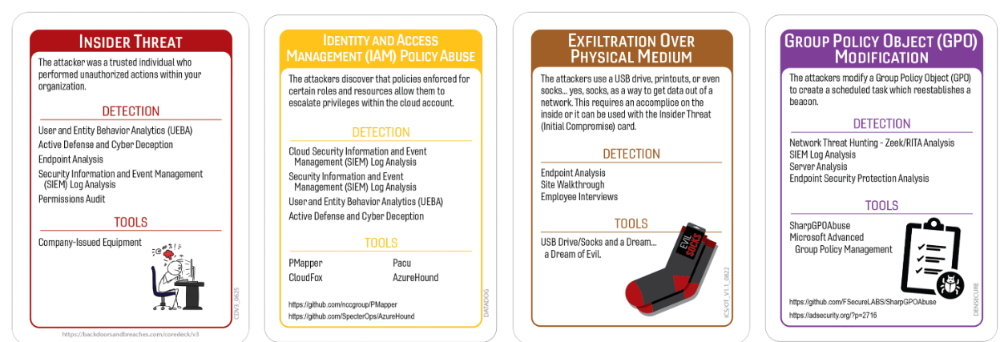
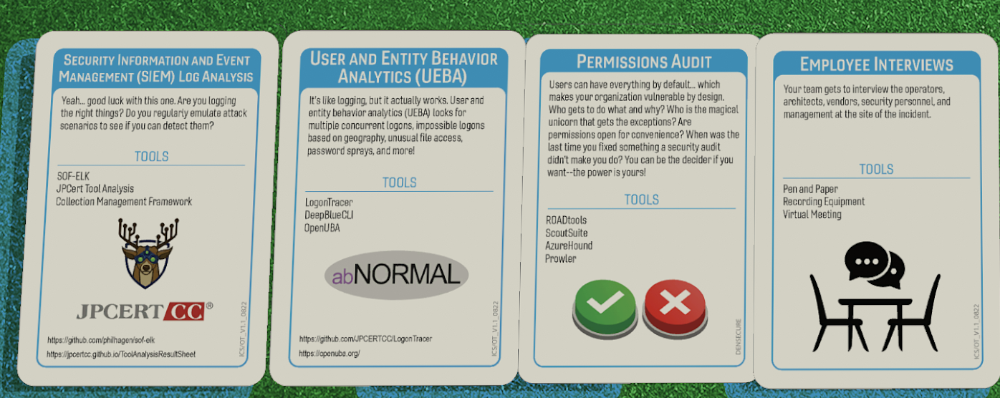

# Paging Dr. USB: Your Extraction Is Ready 
## South Georgia Medical 2022
### Author:Robin Noyes
## Summary of Event
In November 2021, South Georgia Medical Center (SGMC) detected that a recently separated employee had copied patient data to a USB drive, triggering a security alert the following day. Investigations and public statements indicated the copied information included names, dates of birth, and test results, affecting 41,692 individuals; SGMC reported the incident to HHS OCR under HIPAA, offered credit monitoring, and law enforcement charged the ex-employee with felony computer theft and invasion of privacy (HipaaJournal). SGMC emphasized that no financial data or Social Security numbers were involved and that the files were recovered, though the event exposed gaps in insider access governance and removable media (Yahoo).

The most likely attack vector was an insider misuse of legitimate credentials and access privileges during or immediately after employment termination, combined with inadequate endpoint data loss prevention (DLP) and insufficient controls on removable storage. The rapid alert suggests monitoring existed, but prevention and least-privilege segmentation were lacking, allowing bulk export of ePHI to a USB device before controls kicked in; public reporting and legal filings further underscore the insider nature and compliance ramifications of the breach. Beyond SGMC, related resources and commentary highlight the broader regulatory and litigation context for healthcare privacy incidents and the need for stronger technical and administrative safeguards against insider .

Law enforcement was contacted and the local sheriff has arrested the former employee and charged them with felony computer theft and felony computer invasion of privacy.   Both of which carry penalties of up to $50,00 fines and up to 15 years in prison.  There has been no motive identified but the hospital has stated that they believe the data had not been used and had been recovered. (Valdosta Times)

## Tags
South Georgia Medical Center, Protected Health Information, Insider Threat, USB
## Compatible Decks
Core V3, Expansion ,Datadog,Densecure, ICS/IOT

## Scenarios

### Initial Compromise
**Insider Threat**
In order for any business to run, you need employees.  However, over the last 15 years 6300+ incidents have been attributed to those trusted insiders doing everything from selling corporate secrets, working with foreign governments, committing fraud or straight up theft to soliciting the help of other employees.  None of the research has indicated any specific reason given by the former employee in this case, they just decided to take some data with them on their final day in the office.
* MITRE :
	- T1078 – Valid Accounts
	- T1059.001 – Command and Scripting Interpreter: PowerShell 
	- T1087 – Account Discovery

### Pivot & Escalate
**Identity and Access Management (IAM) Policy Abuse**
This card was selected as a loose interpretation of neglecting to have the off boarding controls include disabling accounts and access rights at the moment of termination, even better if it is all automated.
* MITRE:
	- T1098 – Account Manipulation
	- T1069 – Permission Group Discovery
	- T1078 – Valid Accounts (Privilege Abuse)

### C2 & Exfil
** Exfil over Physical Medium**
Time and time again we hear about data growing feet and walking out of the building.  Who has time to build a C2, run scripts, create email forwarding rules or other methods to get data out.
 * MITRE :
	- T1052 – Exfiltration Over Physical Medium
	- T1020 – Automated Exfiltration (loose, if any tooling assisted the copy)
### Persistence
**Group Policy Object (GPO) Modification**
There is no information to suggest that there was any persistence mechanism used in this scenario.  However, this card was selected as a loose interpretation of not disabling the account.
 * MITRE :
	- T1484.001 – Domain Policy Modification: Group Policy Modification
	- T1098 – Account Manipulation 
	
## Procedures that Reveal the Attack Chain

* Security Information and Even Management (SIEM) Log Analysis
	- D3 ANALYZE LOGS
	- D3 AUDT Audit Log Aggregation
	- D3 HOSTBASED SENSOR
	- D3 NETWORK TRAFFIC ANALYSIS
	- D3 APPLICATION HARDENING

* User and Entity Behavior Analytics (EUBA)
	- D3 ACCESS MONITORING
	- D3 ANOMALY DETECTION
	- D3 AUTHENTICATION HARDENING
	- D3 BEHAVIOR ANALYSIS
	- D3 IDENTITY ANALYTICS

* Employee Interviews
	- D3 INCIDENT RESPONSE
	- D3 THREAT HUNTING
	- D3 SECURITY AWARENESS
	- D3 INVESTIGATION SUPPORT

* Permissions Audit
	- D3 ACCESS CONTROL
	- D3 CREDENTIAL HARDENING
	- D3 PERMISSION MANAGEMENT
	- D3 IDENTITY ANALYTICS
	- D3 CONFIGURATION AUDIT

## Written Procedures
* Security Information and Even Management (SIEM) Log Analysis
	* Great. Fantastic. The one threat vector you cannot patch. Someone inside SGMC decided their job description included ‘moonlighting as a threat actor.’ Their account is suddenly doing gymnastics at 02:17, and the logs look like someone spilled alphabet soup on the SIEM.
* User and Entity Behavior Analytics (EUBA)
	* The account is not breaking rules — it is interpreting them like a lawyer who gets paid by the loophole. They found permissions nobody remembered granting, and now they are touching systems like they are on a guided tour of the network.
* Employee Interviews
	* Of course it is a USB stick. Why use fancy malware when you can just plug in a $9 flash drive from the gas station and walk out with half the hospital’s data? The endpoint logs are screaming, but apparently no one listens to removable‑media alerts.
* Permissions Audit
	* Someone tweaked a GPO like they were adjusting the thermostat. One tiny change, and suddenly offboarding controls are taking a nap. It is subtle, quiet, and exactly the kind of thing that ruins your weekend.

## Procedure Success (explanations of why it worked)
### General Reasons
- Technical
	- VarProcedure worked as tools were fully deployed across relevant systems, ensuring complete visibility into authentication events, workstation activity, and policy changes.
	- VarProcedure baselines were up to date, enabling UEBA to correctly identify deviations in user activity without generating excessive false positives.
	- VarProcedure  was successful due to logging agents functioning correctly, producing consistent, timestamp‑aligned telemetry that supported rapid correlation and analysis.

- Financial
	- VarProcedure  worked as the organization maintained appropriate SIEM and UEBA licensing tiers, enabling full access to advanced analytics, long‑term log retention, and identity‑focused detection modules.
	- The renewal and procurement processes were well‑managed, ensuring no lapse in monitoring capabilities or access to critical audit tools.
	- Budget allocations supported ongoing training for analysts and IAM staff, improving their ability to interpret complex identity‑related telemetry.

- Political
	- IAM, Security, and HR had well‑defined responsibilities, enabling efficient collaboration during the investigation and reducing ambiguity around access‑related decisions.
	- Leadership supported transparent information sharing across departments, ensuring timely access to badge logs, HR data, and system activity records.
	- Executive leadership treated identity‑related anomalies as high‑priority issues, enabling rapid escalation and resource allocation.

- Personnel
	-Skilled team members with strong IAM and log‑analysis expertise were available during the incident window, enabling efficient triage and investigation.
- Staff conducting employee interviews were trained in eliciting accurate information, improving the quality of insights gathered from personnel.
- Security, IAM, and HR teams worked cohesively, sharing information promptly and coordinating investigative tasks without friction.

### Procedure Success Explanations
- Technical
	- The SIEM actually had the right logs this time, instead of 900 GB of printer noise.
	- The removable‑media alert fired correctly, shocking everyone who thought that rule was broken.
	- UEBA noticed the user suddenly behaving like a caffeinated raccoon in a file cabinet.
	-  The IAM pivot showed up as a deviation from the user’s normal “I only touch two systems” pattern.
	- The permissions audit caught the fact that the user had access to systems they had not touched in years.
- Financial
	-  The security team had funding for interview training, making them better at spotting inconsistencies.
	- The organization invested in a tool that actually maps entitlements instead of guessing.
	- Funding existed for quarterly access reviews, so the baseline was fresh.
	- The UEBA license included the “identity drift” feature that caught the IAM pivot.
- Political
	- Leadership finally agreed that “identity is the new perimeter,” so IAM alerts were prioritized.
	- Interdepartmental cooperation meant IT, HR, and Security actually shared data.
	-  IAM and Security were aligned for once, so the audit was not blocked by turf wars.
- Personnel
	- A night‑shift analyst actually noticed the alert instead of assuming it was noise.
	- The team had someone skilled enough to interpret IAM anomalies.
	- Analysts were motivated because the incident smelled like a real one
	- Someone remembered seeing the insider with a USB drive.

## Procedure Failures
### General Reasons
- Technical
	- VarProcedure failed as certain endpoints or identity systems were missing logging agents or had outdated configurations, resulting in incomplete visibility during the investigation.
	- Varprocedure failed due to the UEBA models had not been retrained recently, causing them to misclassify abnormal activity as routine or fail to detect meaningful deviations.
	- The SIEM ingestion pipelines or correlation rules were outdated, leading to missed alerts or delayed detection of key events.
- Financial
	- VarProcedure cost‑saving decisions resulted in reduced SIEM or UEBA functionality, limiting retention windows, analytics features, or endpoint coverage.
	- Renewal delays or budget freezes caused temporary gaps in monitoring capabilities or prevented the acquisition of needed audit tools.
	- Budget constraints limited hiring or training, leaving teams without the expertise required to analyze identity‑centric anomalies or policy changes.
- Political
	- Overlapping responsibilities between IAM, IT, and Security created delays in determining who should investigate or approve access‑related findings.
	- Certain business units were reluctant to share information or acknowledge potential issues, slowing down the investigation and limiting visibility.
	- Leadership deprioritized the incident due to operational pressures, delaying analysis and allowing the issue to persist longer than necessary.
- Personnel
	- Key personnel with deep knowledge of IAM policies, GPO structures, or SIEM configurations were unavailable due to leave, turnover, or scheduling gaps.
	- Analysts lacked sufficient training in identity‑centric investigations, leading to misinterpretation of logs or missed indicators.
	- Overextended staff struggled to prioritize the incident effectively, resulting in slower response times and reduced investigative depth.

### Procedure Failures Explanations
- Technical
	- Half the logs were missing because the agent on the compromised workstation was “scheduled for upgrade.”
	- The USB alert was buried under 4,000 “informational” messages about cafeteria badge swipes.
	- The SIEM rule for IAM anomalies was disabled during “tuning week,” which has lasted six months.
	- The audit tool crashed when asked to evaluate nested permissions older than the SOC interns.
- Financial
	- The SIEM license did not include USB monitoring — that was in the “Platinum Ultra Deluxe” tier.
	- UEBA anomaly detection was throttled because SGMC bought the “Essentials” package. 
	- HR cut training budgets, so employees could not tell suspicious behavior from normal chaos.
- Political
	-  A senior leader insisted the alert was “noise,” delaying the investigation.
	- The insider’s department claimed the account activity was “normal for them,” despite evidence.
	- HR refused to release interview notes due to “internal sensitivities.”
- Personnel
	- A junior analyst closed the alert thinking it was a false positive.
	- Interviewers lacked experience and accepted vague answers.
	- No one had the motivation to dig through nested permissions older than the building.

## Game Start
The night shift at South Georgia Medical Center was already held together with copious amounts of caffeine, sheer spite, and the collective willpower of an overworked and underpaid SOC team when the SIEM decided to reenact a fireworks show. Suddenly it was alerts, alerts, everywhere but no time to think, the dashboards screaming like they were being paid by the decibel, and every analyst silently questioning their life choices. Somewhere in the chaos, one workstation deep in the clinical wing started behaving like it had taken the caffeine too. And just like that, your peaceful night dissolved into another round of “find the threat before the threat finds HR. Your peaceful night is gone. Time to investigate.

## Game Conclusion

## Lessons Learned and Mitigating Controls
1. Treat insider risk as a primary threat: Build controls that assume trusted accounts can be abused; monitor for anomalous access patterns and large data movements from insider endpoints.
2. Make offboarding atomic: Access revocation, device hand-in, and account disablement must be completed before or at the moment employment ends, not hours later.
3. Harden endpoints against ePHI (electronic protected health information)egress: Block unapproved storage, enforce encryption and logging for any permitted exports, and use DLP with content inspection on endpoints and gateways.
4. Adopt least privilege with break-glass: Default to minimal data visibility; require time-bound, auditable elevation for specific clinical tasks and prohibit bulk exports without dual authorization.
5. Strengthen detection-to-action: Couple alerts with automated containment (session kill, device isolation), and keep incident playbooks rehearsed to reduce dwell time and impact.

### References

https://www.hipaajournal.com/former-south-georgia-medical-center-employee-arrested-over-41k-record-data-breach/
https://www.hipaaguidelines101.com/ex-employee-of-south-georgia-medical-center-detained-because-of-41k-record-data-breach/
https://www.yahoo.com/news/ex-hospital-worker-arrested-sgmc-001600795.html
https://databreaches.net/2022/01/15/ex-hospital-worker-arrested-in-south-georgia-medical-center-data-breach/ 
https://compliancy-group.com/breach-weekly-news-roundup/
https://valdostadailytimes.com/2022/01/14/ex-hospital-worker-arrested-in-sgmc-data-breach/
https://nationalinsiderthreatsig.org/pdfs/insider-threat-threats-incidents-report-disgruntled-malicious-employees%205-31-25.pdf