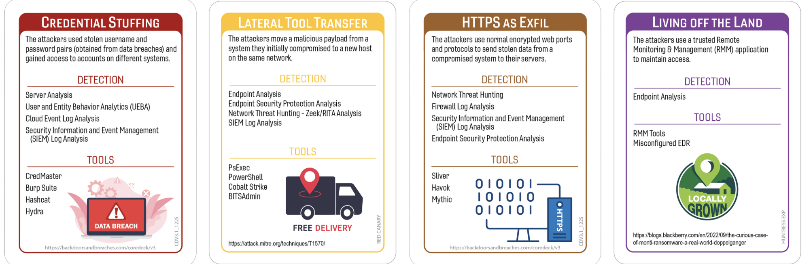
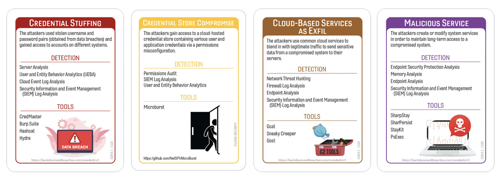

# Ransomware at Rush Hour: When a Password Breach Triggered a Fuel Crisis
### Colonial Pipeline 2021 
### Author:Robin Noyes
## Summary of Event
The Colonial Pipeline ransomware incident was discovered on May 7, 2021, when Colonial Pipeline identified ransomware on its IT network. ZDNet reported that attackers accessed the environment using a compromised password for a legacy VPN account that lacked multi‑factor authentication, noting: “The password… was found in a batch of leaked passwords on the dark web”. TechTarget similarly states that the attackers used stolen credentials to gain remote access to Colonial’s systems.

Once inside the IT network, attackers conducted internal reconnaissance and exfiltrated approximately 100 GB of data before deploying DarkSide ransomware (TechTarget). BBC confirmed that Colonial Pipeline shut down its entire pipeline system as a precaution to prevent potential spread from IT systems into operational technology (OT) systems, reporting: “The company shut down its entire pipeline system…". The shutdown resulted in regional fuel shortages, panic buying, and emergency declarations.

In testimony before the U.S. Senate, Colonial Pipeline’s CEO stated that the company paid a ransom of 75 Bitcoin (approximately $4.4 million) to the DarkSide group (U.S. Senate Hearing). NPR further reports that the ransom was paid to accelerate restoration of business systems, quoting the CEO: “We paid the ransom because it was the right thing to do for the country”. Federal authorities publicly attributed the attack to DarkSide, and the incident prompted new TSA cybersecurity directives for pipeline operators (Medium).

## Tags

## Compatible Decks
Core V1-3.1, glueck kanja V1,  RedCanary, DataDog, Huntress

## Scenario
## Variation 1

## Variation 2

### Initial Compromise
**_Credential Stuffing/Compromised VPN Appliance_**
Attackers began by abusing previously leaked credentials to authenticate through a remote‑access VPN endpoint that lacked multi‑factor authentication. From the SOC’s perspective, it looked like a routine login at first—just another entry in a sea of authentication noise—until timing, geography, and behavioral patterns started whispering “this isn’t normal.” Professionally, this combined vector represents a high‑risk failure of credential hygiene and remote‑access governance: reused passwords, legacy accounts, and insufficient authentication controls created a perfect storm. The attackers slipped in quietly, gaining a stable foothold inside the environment without triggering immediate alarms.
- MITRE ATT&CK:
	- T1110.004 — Credential Stuffing
	- T1133 — External Remote Services
	- T1078 — Valid Accounts

### Pivot & Escalate
**_Lateral Tool Transfer/Credential Store Compromise_**
Once inside, the attackers moved laterally with the subtlety of a bored housecat exploring a new room—copying tools between hosts, launching reconnaissance commands, and poking at internal systems to see what squeaked. SOC analysts later found traces of credential harvesting, suggesting the attackers raided local password stores to escalate privileges and widen their reach. Professionally, this phase reflects a predictable ransomware escalation pattern: tool propagation, credential theft, and privilege expansion. These actions enabled the attackers to map the environment, identify high‑value systems, and prepare for broader impact.
- MITRE ATT&CK:
	- T1570 — Lateral Tool Transfer
	- T1021 — Remote Services
	- T1555 — Credentials from Password Stores
	- T1003 — OS Credential Dumping

### C2 & Exfil
**_HTTPS as Exfil/Cloud-Based Services as Exfil_**
Data began flowing out through encrypted HTTPS channels that blended seamlessly with legitimate traffic—just another stream in the river of normal operations. At the same time, investigators later found evidence of cloud‑storage staging, suggesting the attackers used external cloud accounts to stash exfiltrated data. SOC analysts described it as “trying to spot a single suspicious raindrop in a thunderstorm.” Professionally, this phase demonstrates modern double‑extortion tradecraft: encrypted exfiltration for stealth, cloud‑based staging for redundancy, and operational cover through common protocols.
- MITRE ATT&CK:
	- T1041 — Exfiltration Over C2 Channel
	- T1071.001 — Web Protocols
	- T1567.002 — Exfiltration to Cloud Storage
	- T1537 — Transfer Data to Cloud Account

### Persistence
**_Living off the Land/Malicious Services_**
To maintain presence long enough to complete reconnaissance and ransomware deployment, attackers relied on built‑in administrative tools—scripts, scheduled tasks, and command interpreters that looked deceptively legitimate. SOC analysts later found traces of modified or newly created services designed to ensure continued execution of malicious components. Professionally, this reflects a blend of stealth and durability: living‑off‑the‑land techniques reduce detection likelihood, while malicious services provide stable persistence for long‑term operations.
- MITRE ATT&CK:
	- T1059 — Command and Scripting Interpreter
	- T1036 — Masquerading
	- T1543.003 — Create or Modify System Process: Windows Service
	- T1035 — Service Execution

## Procedures that Reveal the Attack Chain ##

* Network Threat Hunting – Zeek/RITA
	* D3‑BA Behavior Analytics
	* D3‑NTA Network Traffic Analysis
	* D3‑EBA Endpoint Behavior Analysis
	* D3‑AD Anomaly Detection
* Isolation 
	* D3‑NI Network Isolation
	* D3‑EI Execution Isolation
	* D3‑PR Privilege Restriction
	* D3‑CT Containment
	* D3‑HI Host Isolation
* Security Information and Event Management (SIEM) Log Analysis 
	* D3‑LG Logging
	* D3‑EC Event Correlation
	* D3‑AT Alert Triage
	* D3‑FA Forensic Analysis
	* D3‑TA Telemetry Aggregation
* Permissions Audit 
	* D3‑AC Access Control
	* D3‑CH Credential Hardening
	* D3‑PM Privilege Management
	* D3‑IV Identity Verification
	* D3‑AE Authorization Enforcement

## Written Procedures
* Network Threat Hunting - Zeek/Rita
	* Threat hunting becomes digital archaeology: analysts sift through mountains of network flows, searching for anomalies that look suspiciously like someone hauling data out the back door. Every connection is a clue, every odd timing pattern a breadcrumb. The tools help, but the real magic is the analyst’s intuition—spotting the subtle differences between normal chatter and malicious exfiltration. It’s part detective work, part endurance sport, and part “why is this server talking to that IP at 3 a.m.?”
* Isolation
	* Isolation is the cybersecurity equivalent of slamming a door shut before the smoke spreads. Analysts identify compromised systems and quarantine them with urgency, cutting off lateral movement and halting attacker progress. It’s a race against time: disconnect the right machines fast enough to stop the bleeding, but carefully enough to avoid breaking critical operations. When done well, isolation feels like threading a needle during an earthquake.
* Security Information and Even Management (SIEM) Log Analysis
	* SIEM analysis is where chaos meets pattern recognition. Analysts dive into dashboards overflowing with alerts—some helpful, many unhinged—and try to piece together a coherent timeline. Logs become a kind of digital tarot deck: authentication failures, odd process launches, strange network spikes. Each entry hints at a story, and analysts must figure out which ones matter. It’s noisy, frustrating, and occasionally enlightening, especially when a single log line reveals the attacker’s next move.
* Permissions Audit
	* A permissions audit is a journey into the forgotten corners of identity sprawl. Analysts uncover accounts that should have been retired years ago, permissions that grew quietly like weeds, and access paths no one remembers approving. It’s equal parts cleanup and discovery: mapping who can do what, identifying privilege creep, and revealing the hidden footholds attackers love to exploit. Every audit uncovers surprises—some harmless, some catastrophic.

## Procedure Success 
### General Reasons
 - Technical
	- Strong log retention enabled analysts to reconstruct attacker movement with clarity.
	- Network segmentation limited lateral movement and prevented deeper compromise.
	- Authentication telemetry provided enough detail to identify suspicious login patterns.
	- Endpoint visibility allowed rapid triage and containment of affected systems.

- Financial
	- Prior investment in IR tooling ensured analysts had the right capabilities during the event.
	- Funding availability supported overtime staffing and accelerated response.
	- Monitoring infrastructure paid off by reducing investigation time.
	- Existing vendor contracts enabled immediate external support without delays.

- Political
	- Leadership aligned quickly on containment actions, reducing decision bottlenecks.
	- Clear ownership of security responsibilities prevented confusion during escalation.
	- Cross‑department cooperation improved response coordination.
	- Decision‑makers supported aggressive containment despite operational impact.

- Personnel
	- Experienced analysts recognized attacker behavior early and responded decisively.
	- IR team familiarity with ransomware patterns accelerated investigation.
	- Adequate staffing ensured continuous monitoring throughout the incident.
	- Strong SOC communication reduced missteps during high‑pressure moments.

### Procedure Success Explanations
- Technical
	- Strong log retention meant analysts weren’t stuck piecing together the attack from half‑missing breadcrumbs; instead, the timeline lit up clearly enough that even the sleepy shift lead could follow it.
	- Network segmentation actually behaved for once, turning what could’ve been a sprawling mess into a neatly contained problem instead of a “why is everything on fire?” situation.
	- Authentication telemetry didn’t just exist — it cooperated, making the suspicious login patterns glow like someone turned on the “intruder highlight” feature.
		-Endpoint visibility was solid enough that malicious processes couldn’t hide behind the usual noise, giving analysts a rare moment of “oh good, the tools are doing the thing.”
- Financial
	- Prior IR investments finally paid off, proving that last year’s budget battle wasn’t just performative suffering — the tools genuinely made the investigation faster and less chaotic.
	- Funding availability meant analysts weren’t stuck waiting for approvals or rationing overtime like it was a scarce natural resource.
	- Monitoring infrastructure upgrades shaved hours off correlation work, sparing the team from the dreaded “manual log archaeology” marathon.
	- Vendor contracts kicked in immediately, adding reinforcements before the SOC devolved into the usual “we’re doing the work of three teams with five people” scenario.
- Political
	- Leadership aligned so quickly it felt suspicious — approvals came through without the traditional obstacle course of meetings, forms, and existential dread.
	- Clear ownership meant analysts didn’t have to embark on a cross‑department scavenger hunt just to figure out who controlled a critical system.
	- Cross‑team cooperation was smooth enough that analysts wondered if someone had bribed the universe; everyone actually shared information instead of hoarding it.
	- Stakeholders agreed on urgency early, dramatically reducing the number of “status update” meetings that normally multiply like gremlins.
- Personnel
	- The right analysts were available at the right time — a miracle in itself — and none were already drowning in three other incidents. 
	- Familiarity with the environment let the team spot “that doesn’t belong” moments instantly, avoiding hours of philosophical debate about normal behavior.
	- Communication flowed cleanly across the SOC, turning individual observations into collective momentum instead of isolated confusion.
	- Adequate staffing meant the team could work deliberately instead of resorting to the classic “assign tasks based on who looks the least exhausted” strategy.

## Procedure Failures
### General Reasons
 - Technical
	- Certain systems lacked complete telemetry or had outdated configurations, creating blind spots.
	- Stale baselines made it difficult to distinguish legitimate activity from suspicious patterns.
	- Detection rules were outdated or misconfigured, causing missed alerts.
	- Limited visibility into cloud‑storage interactions delayed exfiltration detection.
- Financial
	- Budget constraints limited access to advanced analytics modules or reduced retention windows.
	- Procurement delays resulted in temporary monitoring gaps or incomplete endpoint coverage.
	- Limited investment in training left analysts without specialized knowledge for complex anomalies.
	- Deferred modernization of remote‑access infrastructure increased exposure to credential‑based attacks.
- Political
	- Unclear ownership of systems or logs caused delays in obtaining necessary data.
	- Leadership initially deprioritized the incident, slowing investigation and containment.
	- Interdepartmental friction hindered collaboration and information sharing.
	- Misalignment between IT and OT leadership complicated early risk assessment.
- Personnel
	- Key personnel with expertise in AD or network hunting were unavailable.
	- Alert fatigue caused analysts to misinterpret or dismiss early indicators.
	- Communication gaps led to missed context or incomplete execution of procedures.
	- Outdated documentation caused confusion around legacy account ownership.
## Procedure Failures 
### Explanations
 - Technical
	-  Missing telemetry turned the investigation into a tragic guessing game, where analysts had to squint at half‑formed clues and pretend they were actionable.
	- Stale baselines meant abnormal behavior blended in beautifully with the usual nonsense, forcing the team into the dreaded “is this actually bad or just Tuesday?” debate.
	- Detection logic hadn’t been tuned in ages, so alerts were either nonexistent or so cryptic they might as well have been written in ancient hieroglyphics.
	- Weak controls let the attacker wander around like they were on a self‑guided tour, making their movements harder to track and significantly more dramatic than anyone wanted.
- Financial
	- Budget constraints meant the tools analysts needed were stuck in procurement limbo, leaving the team to fight a modern attack with last‑season’s capabilities.
	- Monitoring gaps caused by delayed renewals turned parts of the environment into a digital blind spot, which is exactly as fun as it sounds.
	- Training investments had been “reprioritized,” leaving analysts to interpret complex anomalies using the time‑honored method of educated guessing.
	- Deferred upgrades meant the organization was relying on hope, duct tape, and legacy infrastructure — none of which are recognized security controls.
- Political
	- Ownership confusion forced analysts to chase down multiple teams just to access basic logs, turning a simple request into a bureaucratic scavenger hunt.
	- Leadership initially downplayed the incident, delaying containment until the situation had already started to warm up uncomfortably.
	- Interdepartmental friction slowed collaboration to a crawl, as teams debated responsibilities instead of sharing information.
	- Stakeholders couldn’t agree on urgency, resulting in more meetings than actions and a response timeline that aged everyone involved.
- Personnel
	- The one person who actually understood the legacy systems was out, leaving the team to reverse‑engineer mysteries no one had documented in a decade.
	- Alert fatigue caused analysts to dismiss early indicators as just more noise, because everything looks suspicious when everything is suspicious.
	- Communication gaps meant critical details were shared with the speed and reliability of a carrier pigeon, causing missteps across the investigation.
	- Staffing shortages forced the team into triage mode, where tasks were assigned based on who looked the least overwhelmed rather than who was best suited.

## Game Start
The SOC is already running hot when the alert fires—authentication noise everywhere, dashboards flickering like a slot machine someone kicked too hard, and analysts halfway through cold coffee that tastes like regret. Then a single login event starts whispering trouble: wrong time, wrong place, wrong vibe. The room shifts. Chairs roll. Someone mutters “that’s not normal,” and suddenly the team is in motion.

As the team digs in, the picture stays blurry but unsettling. A handful of system behaviors drift just far enough outside the norm to make analysts lean forward—odd timing, small inconsistencies in host activity, and a few logs that don’t quite match the usual rhythm of the environment. Nothing screams “incident,” but nothing feels harmless either. It’s the kind of early‑stage ambiguity every SOC knows well: too much noise to ignore, too little clarity to declare a crisis. The analysts begin tracing threads, comparing patterns, and quietly preparing for the possibility that this routine investigation may not stay routine for long.

## Game Conclusion
After a whirlwind of containment, log‑diving, late‑night escalations, and enough coffee to violate several health guidelines, the SOC finally pieces together the full attack chain. The compromised VPN account was the attackers’ front door; lateral movement and credential harvesting let them explore the house; HTTPS exfil and cloud staging let them sneak valuables out; and persistence mechanisms kept them lurking long enough to prepare the ransomware detonation.

The investigation ultimately revealed that the ransomware deployment on the IT network forced Colonial Pipeline to shut down OT operations as a precaution—an action that cascaded into fuel shortages, regional panic buying, and emergency declarations. Even though the attackers never directly breached OT systems, the operational impact was undeniable: pipeline flow halted, distribution stalled, and the organization faced national‑level scrutiny. The SOC’s containment efforts prevented further spread, but the incident exposed how tightly coupled IT and OT environments had become—and how a single compromised password could ripple outward into real‑world infrastructure disruption.

## Lessons Learned and Mitigating Controls
Identity & Access Controls
• Enforce multi‑factor authentication across all remote‑access pathways, especially VPNs.
• Retire legacy accounts aggressively; implement automated lifecycle management.
• Deploy credential‑theft resistant authentication (FIDO2, certificate‑based auth).
• Conduct recurring permissions audits to eliminate privilege creep.

Network Architecture & Monitoring
• Strengthen network segmentation between IT and OT environments.
• Expand east‑west visibility using Zeek, RITA, or equivalent telemetry.
• Implement behavior‑based anomaly detection to catch subtle exfil patterns.
• Maintain long‑term log retention for reconstruction and forensic clarity.

Endpoint & Host Security
• Deploy EDR coverage across servers and critical endpoints.
• Harden systems against living‑off‑the‑land abuse (PowerShell logging, AMSI, constrained language mode).
• Monitor for service creation/modification indicative of persistence.

Incident Response Preparedness
• Conduct regular ransomware tabletop exercises with IT and OT stakeholders.
• Ensure clear escalation paths and decision‑maker alignment.
• Maintain vendor support contracts for surge capacity during major incidents.
• Train analysts on double‑extortion tradecraft and cloud‑based exfil indicators.

Data Protection & Exfil Controls
• Implement DLP policies for cloud‑storage interactions.
• Monitor outbound HTTPS anomalies, including volume, timing, and destination entropy.
• Use cloud access security brokers (CASB) to detect unauthorized external accounts.

## References

Balarabe, Tahir. “Colonial Pipeline Cyber Attack: Root Causes, Impact, and Key Takeaways.” *Medium*, 8 June 2021, https://medium.com/@tahirbalarabe2/colonial-pipeline-cyber-attack-root-causes-impact-and-key-takeaways-f9587d26f19f.

BBC News. “Colonial Pipeline: US Fuel Supplies Tighten after Cyber-Attack.” *BBC*, 10 May 2021, https://www.bbc.com/news/technology-57063636.

CISA. “The Attack on Colonial Pipeline: What We’ve Learned and What We’ve Done Over the Past Two Years.” *Cybersecurity and Infrastructure Security Agency*, 7 May 2023, https://www.cisa.gov/news-events/news/attack-colonial-pipeline-what-weve-learned-what-weve-done-over-past-two-years.

Congressional Research Service. *Colonial Pipeline: Cybersecurity Incident Overview*. CRS Insight IN11667, Congress.gov, 2021, https://www.congress.gov/crs\_external\_products/IN/PDF/IN11667/IN11667.2.pdf.

Energy.gov. “Colonial Pipeline Cyber Incident.” *U.S. Department of Energy*, 
https://www.energy.gov/ceser/colonial-pipeline-cyber-incident.

GovInfo. *Cybersecurity Threats: Protecting Critical Infrastructure*. Hearing before the Committee on Homeland Security and Governmental Affairs, U.S. Senate, 117th Congress, 2021, https://www.govinfo.gov/content/pkg/CHRG-117shrg46569/pdf/CHRG-117shrg46569.pdf.

NPR. “Colonial Pipeline CEO Explains the Decision to Pay Hackers $4.4 Million Ransom.” *NPR*, 3 June 2021, https://www.npr.org/2021/06/03/1003020300/colonial-pipeline-ceo-explains-the-decision-to-pay-hackers-4-4-million-ransom.

TechTarget. “Colonial Pipeline Hack Explained: Everything You Need to Know.” *TechTarget*, https://www.techtarget.com/whatis/feature/Colonial-Pipeline-hack-explained-Everything-you-need-to-know.

ZDNet. “Colonial Pipeline Ransomware Attack: Everything You Need to Know.” *ZDNet*, https://www.zdnet.com/article/colonial-pipeline-ransomware-attack-everything-you-need-to-know/.