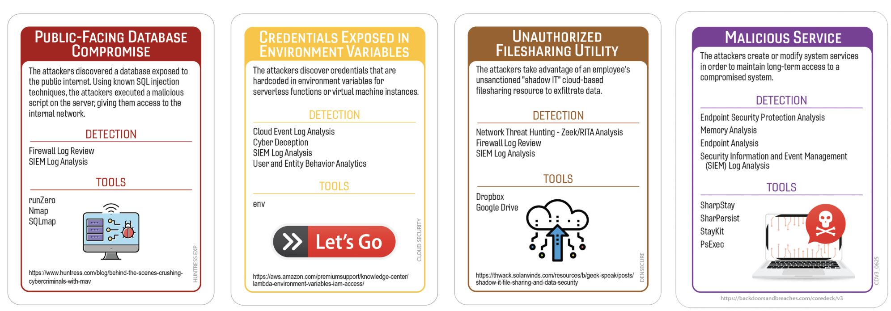
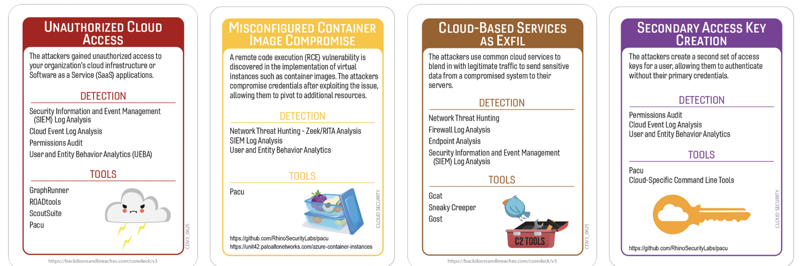
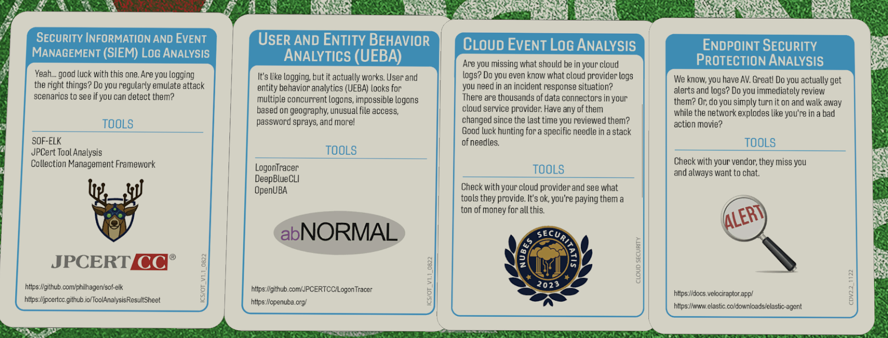

# SSN-onymous No More: From Data Broker to Broke
## NationalPublicData
### Author: Robin Noyes
## Summary of Event
In July 2024,  a hacker by the handle of USDOd,  released4 terabytes of data on BreachfForums that is purported to be acquired from the website nationalpublicdata.com (Krebs, 2024) .  The company collected public information that was then used in the performance of background screening and fraud prevention services, such as court documents, public and non-public available sources, and aggregated data which included names, addresses, social security numbers, and other sensitive data (databreach.com ).  

A sister site, RecordsCheck.net, published a “members.zip” archive containing admin credentials, usernames, and source code in plaintext. This likely allowed attackers lateral access or credential reuse to reach NPD’s core systems.
(Security Curated, cyberinfoblog.com) This reflects a failure in isolating sensitive assets, masking credentials, and enforcing least privilege.
  
Some reporting points to misconfigured cloud storage (e.g. public S3 buckets) and disabled or lax safeguards in the cloud environment, which would allow unrestricted access to sensitive data.
Even default protections appear to have been disabled to facilitate development, yet never reenabled in production.   These failures underscore how data brokers, which aggregate highly sensitive information, often lack the robust protections expected of financial or healthcare institutions.  

## Tags
Databrokers, compromised credentials, exposed backups, unencrypted databases, National Private Data, recordscheck.net 
## Compatible Decks
Huntress, Cloud, DenSecure, 

## Scenarios
### Variation 1

### Variation 2

### Initial Compromise
**Publicly Exposed Secret Key**
This card was selected as reports indicate misconfiguration and/or lack security allowing unrestricted access to data. \
**Unauthorized Cloud Access** This card was selected to give a more cloud specific feel to the scenario given little information on the actual attack vector used. 
* MiTRE 
	- T1595 – Active Scanning
	- T1530 – Data from Cloud
	- T1593 – Search Open Websites/Domains
	- T1078 – Valid Accounts

### Pivot & Escalate
**Credential Exposed in Environment Variables**  This card was selected as a loose interpretation of a zip file containing credentials being available for download, without password, on the sister site of NPD.  
**Misconfigured Container Image Compromise** This card was selected to give a more cloud specific feel to the scenario given little information on the actual attack vector used. 
* MiTRE
	- T1552.001 – Credentials in Files
	- T1552 – Unsecured Credentials
	- T1550 – Use of Alternate Authentication Material  

### C2 & Exfil
**Unauthorized Filesharing Utility** As there is no solid information on how the data was exfiltrated, it is assumed that a fileshare utility was used such as ShareFile,  WeTransfer, or Mega. \
**Cloud-Based Services as Exfil** This card was selected to give a more cloud specific feel to the scenario given little information on the actual attack vector used. 
* MiTRE
	- T1567.002 – Exfiltration to Cloud Storage 
	- T1048.002 – Exfiltration Over Asymmetric Encrypted Network
	- T1071.001 – Application Layer Protocol: Web Protocols

### Persistence
**Malicious Services** There is no evidence that a malicious service was crated but this card was selected to make the game play interesting. \
**Secondary Access Key Creation** This card was selected to give a more cloud specific feel to the scenario given little information on the actual attack vector used. 
* MiTRE
	- T1567.002 – Exfiltration to Cloud Storage
	- T1048.002 – Exfiltration Over Asymmetric Encrypted Network
	- T1071.001 – Application Layer Protocol: Web Protocols

## Procedures that Reveal the Attack Chain

* SIEM
	* D3‑ANLZ – Log Analysis
	* D3‑AUDT – Audit Log Aggregation
* EUBA
	* D3‑BEHA – Behavior Analytics
	* D3‑ANML – Anomaly Detection
* Cloud Event Log Analysis
	* D3‑CLDL – Cloud Logging 
	* D3‑ACCT – Account Monitoring
	* D3‑EXFL – Exfiltration Detection
* Endpoint Security Protection Analysis

## Written Procedures
* SIEM
	* Log all the things!  We should be able to find some kind of needle in this haystack.  Seriously though, we should have some logs to tell us what was going on.

* EUBA
	* This card was selected as a default but has the potential to identify system and user anomalies.

* Cloud Event Log Analysis
	* Presuming that cloud access was used, this should show access from unknown IPs or accessing new datasets.

* Endpoint Security Protection Analysis
	* There is no data to confirm this would have any impact on the scenario but this card was selected as most enterprises have a some form of Endpoint Security Protection Analysis, which is being loosely interpreted as an EDR.  

## Procedure Success 
### General Reasons
 - Technical
	- VarProcedure succeeded because the agent had been installed for a sufficient period, allowing it to collect enough telemetry to establish a solid baseline for detection.
	- VarProcedure worked efficiently due to appropriate permissions and full visibility across the environment, with no delays caused by approval workflows or access issues.
	- VarProcedure worked as expected because comprehensive procedural documentation and updated network/data flow diagrams accurately reflected all critical paths and dependencies.

- Financial
	- VarProcedure worked because logging levels were maintained at the necessary detail, and performance issues were mitigated through executive-approved upgrades to newer, more capable devices. Proactive investments ensured stability and data fidelity.
	- VarProcedure was successful because funding was approved to hire and/or train a dedicated SME. The team now has the necessary expertise to perform accurate and timely analysis using the tool.
	-  VarProcedure worked successfully because the budget was approved in advance to expand licensing for the tool/service/project/application across all required entities, including subsidiaries, remote offices, data centers, and contractor environments.

- Political
	- VarProcedure was deployed and worked as intended because the change board reached consensus with the security team, overcoming initial concerns through clear communication, risk mitigation, and alignment on shared goals.
		 
- Personnel
	- VarProcedure worked successfully because technicians were strategically distributed, and remote-access capabilities allowed immediate intervention without waiting for physical presence.
	 - VarProcedure worked successfully because new users were onboarded with accelerated training and baseline monitoring tools, allowing anomalies to be detected quickly.
	- VarProcedure worked successfully because the organization invested in continuous skill development, ensuring personnel expertise remained current with evolving threats.

### Procedure Success Explanations
- Technical
	- Somewhere, an unnamed cloud engineer pushed a fix at 3:17 a.m., realized it worked, and immediately went on PTO. The system healed, logs backfilled, and the status page never changed from “All systems operational.” 
This is the cloud equivalent of elves fixing your shoes overnight.
	- Containment worked so well it fixed unrelated problems: The “disabled” containment feature suddenly re‑enabled itself and quarantined three malware samples, two misconfigured printers, and one intern’s crypto‑mining rig.
	- The documentation migration succeeded by accident: The corrupted files regenerated into a beautifully indexed knowledge base, complete with diagrams no one remembers creating and troubleshooting steps that actually work.

- Financial
	- VP approval was granted instantly: The VP, stuck in holiday traffic, approved every pending request from their phone out of sheer boredom, unlocking features no one knew were licensed.
	- The multi‑region logging architecture overperformed: Despite being underfunded, it delivered logs faster than premium tiers — possibly because someone forgot to turn off “debug mode” in 2021 and it’s been overachieving ever since.
	- The lowest‑tier log license magically expanded: The vendor “accidentally” upgraded your account for free, claiming it was part of a “seasonal generosity initiative” (translation: someone clicked the wrong button).

- Political
	- The hacktivist protest turned into a security awareness fair: They got cold, came inside, and ended up helping hand out phishing‑awareness pamphlets. HR is now considering hiring two of them.
	- DevOps accidentally improved SIEM performance: Their “benchmark test” overloaded the system just long enough for the auto‑scaling logic to kick in and permanently upgrade the SIEM’s throughput. They now claim this was intentional.

- Personnel
	- The catered lunch created unexpected super‑productivity: The half of the company not poisoned became hyper‑motivated, bonded by shared survival, and resolved the incident before dessert.
	- The SIEM/UEBA/EDR owner achieved enlightenment: During the enterprise degradation call, they achieved a state of pure clarity, fixed all three tools simultaneously, and disconnected the conference call before anyone could blame security again.

## Procedure Failures
### General Reasons
- Technical (Detection Adaptability, Deployment & Infrastructure Readiness, Data Quality & Log Integrity, Visibility & Scope Coverage, and Operational Maturity.)
	-  VarProcedure did not work because the data center had an outage or no owner was identified for the system so it was unplugged/ripped out as part of vulnerability management.
	- VarProcedure did not work because agents/logging were installed and configured but alert logic/rule engine/data quality/data completeness was never validated.
	- VarProcedure did not work because only specific/internal/external CIDR rangers were used in the search.

- Financial (Detection Adaptability, Deployment & Infrastructure Readiness, Data Quality & Log Integrity, Visibility & Scope Coverage, and Operational Maturity.)
	- VarProcedure did not work because budget to hire/train a SME on the tool was not approved.  The current team member does not have the required skill/training to do the proper analysis but are doing their best.
	- VarProcedure did not work because the logging level had been lowered due to performance issues/degradations.  Newer devices would have reduced or eliminated the overall impact but had not been approved.  Executives are expediting the expenditure and implementation, to include professional services, to ensure data is available going forward.

 - Political (Detection Adaptability, Deployment & Infrastructure Readiness, Data Quality & Log Integrity, Visibility & Scope Coverage, and Operational Maturity.))
	- VarProcedure did not work because a member of the change board denied the change to deploy the agent/service/tool based on disagreements with the security team.
	- VarProcedure did not work because due to disagreements over ownership and maintenance of the tool delayed deployment and configuration that could have shown artifacts related to the attack path used by the adversary.  The team has since been given approval to rapidly deploy the necessary tools/configurations to ensure logging will begin to flow.
	- VarProcedure did not work because user/team/manager feels that the security team already has too much power and refuses to install/apply the required rights and permissions needed.  This will need to be corrected before the investigation can be completed.  This is an important reason to build inter-business relationships to confirm and explain under what circumstances the 'power' would be yielded and who has the authority to approve it.	

- Personnel (availability, skill and experience level, motivation, teamwork, quantity)
	- VarProcedure did not work because the team that manages/approves using VarProcedure is away at a conference.
	- VarProcedure did not work because the tool/system requires physical access and the nearest expert technician is hours away.
	- VarProcedure did not work because the SME is out of the country and unable to be contacted.  The team must use the provided playbook and hope for the best, albeit at a much slower pace.

### Procedure Failures Explanations
- Technical
	- There is currently an ongoing cloud provider outage, all tools are inaccessible at this time.
	- The capability to contain devices was inadvertently disabled after a system upgrade.
	- A migration project moving our documentation library to a new vendor product has resulted in missing or corrupted information.  We may have to ‘wing it’ . 

- Financial 
	- Due to a maintenance freeze for the holidays,  the capability to update/log/contain/enable a feature on the system/tool requires VP approval.
	- Underfunded multi‑region logging architectures delay evidence availability .
	- The company bought the lowest tier log volume and we have exceeded our license.  

- Political 
	- A hacktivist group is demonstrating in front of your company and preventing anyone from getting inside.
	- Devops decided to do a benchmark test against the logging infrastructure, without information stake-folder,  using half-open connections, exhausting system resources and resulting in a DoS of the SIEM.

- Personnel 
	- The company was celebrating a milestone event and had a catered lunch delivered.  Half of the company is now unavailable due to food poisoning.
	- The owner of the SIEM is unable to make any changes right now as they also own the UEBA and the EDR and are in the middle of an enterprise degradation call where all the security tools are being accused as the culprit.  

## Game Start
It is early in the quarter when your security team is contacted by a third party, stating they have observed unusual chatter on underground forums about your companies data. A threat actor claims to possess a massive dataset containing sensitive personal information — including full identity records — allegedly taken from an unnamed data aggregation service.  Your cloud dashboards show no alerts. Your SIEM is quiet. Nothing internally indicates a breach. But external reporting suggests that a large volume of sensitive data may already be circulating online.

## Game Conclusion
After days of investigation, your team finally pieces together what happened.

A large collection of sensitive personal records ( including identity data, background‑check information, and other high‑value attributes) had been stored in a cloud environment with minimal safeguards. A related web property exposed a downloadable archive containing plaintext credentials, environment variables, and source code. Those credentials provided attackers with the ability to move deeper into the environment and access additional datasets.

Cloud storage protections that should have been enabled by default were misconfigured or disabled entirely. Logging was inconsistent across regions. Some systems had no monitoring at all. By the time the exposure was discovered, a massive volume of data had already been accessed and exfiltrated through cloud‑based services.

There is no clear evidence of persistence, but the lack of visibility makes it impossible to rule out. What is certain is that the data is now circulating publicly, and the organization responsible for safeguarding it is facing severe operational, legal, and reputational fallout.

## Lessons Learned and Mitigating Controls
In short, the NPD breach illustrates how systemic failures in credential hygiene, data encryption, cloud security posture, monitoring, third-party oversight, and incident transparency can combine to magnify damage. For future resilience, organizations (especially data brokers) must adopt a foundational zero trust approach, enforce strong access and encryption controls, continuously monitor for anomalous behavior, and maintain robust vendor security oversight.

## References
* KrebsSecurity NationalPublicData.com Hack Exposes a Nations Data
    * https://krebsonsecurity.com/2024/08/nationalpublicdata-com-hack-exposes-a-nations-data/

* DataBreachcom What happened in the National Public Data Breach?
    * https://databreach.com/breach/national-public-data-2024*

* Microsoft National Public Data breach: What you need to know*
    * https://support.microsoft.com/en-us/topic/national-public-data-breach-what-you-need-to-know-843686f7-06e2-4e91-8a3f-ae30b7213535*

* PCMag Is Your SSN in the National Public Data Breach? Here's How to Find Out*
    * https://www.pcmag.com/news/is-your-ssn-in-the-national-public-data-breach-heres-how-to-find-out*

* USAToday National Public Data confirms massive data breach included Social Security numbers*
    * https://www.usatoday.com/story/tech/2024/08/17/social-security-hack-national-public-data-confirms/74843810007/*

* SBS Cyber Security  National Public Data Breach: A Comprehensive Overview
    * https://sbscyber.com/blog/national-public-data-breach-a-comprehensive-overview

* SecurityCurated How Did National Public Data's Breach Expore 2.7 Biolion Records?
    * https://securitycurated.com/data-protection-and-privacy/how-did-national-public-datas-breach-expose-2-7-billion-records/

* Cybercurated
    * https://securitycurated.com/data-protection-and-privacy/massive-data-breach-exposes-292-million-records-lawmakers-investigate/

### Additional Resources
* https://www.pcmag.com/news/company-behind-massive-social-security-number-leak-shuts-down
* https://www.floridatoday.com/story/news/2024/08/21/social-security-data-breach-florida-lawsuit-national-public/74884775007/
* https://www.itpro.com/security/data-breaches/the-national-public-data-breach-exposed-nearly-three-billion-users-now-the-company-has-filed-for-bankruptcy
* https://www.pcmag.com/news/company-behind-major-ssn-leak-to-stop-selling-user-data
* https://www.strongdm.com/what-is/national-public-data-breach
* https://spycloud.com/blog/national-public-data-breach-analysis/
* https://www.bladetechinc.com/news/exploring-the-national-public-data-breach
* https://nationalcioreview.com/articles-insights/information-security/out-with-a-whimper-data-broker-closes-for-good-following-devastating-breach/