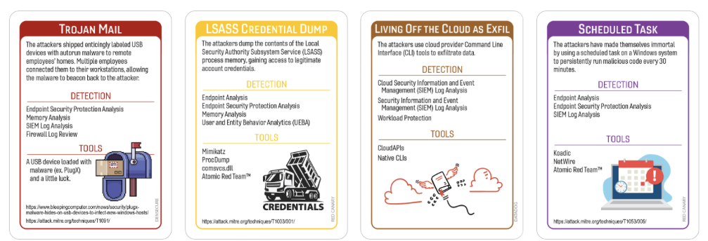

# Special Delivery: Plug and Prey, Get Ransomware
### Author:Robin Noyes
## Summary of Event
Between 2020 and 2022, multiple U.S. government advisories and cybersecurity news outlets documented a series of attacks in which the cybercrime group FIN7 mailed malicious USB devices to targeted organizations. According to the FBI, these packages were sent through USPS and UPS and often impersonated legitimate senders such as Amazon, Best Buy, or the U.S. Department of Health and Human Services. The mailed USB devices contained BadUSB‑style malware, capable of executing keystroke injection or installing ransomware once plugged into a victim’s computer. Reports indicate that this activity was active from at least April 2020 through January 2022, with multiple waves of attacks observed during this period (ThreatPost, TheRecord, UCLA OCISO) . 

Industry‑specific reporting indicates that FIN7’s mailed‑USB campaigns targeted a wide range of sectors, including transportation, retail, hospitality, defense, and insurance. Threatpost detailed how FIN7 mailed malicious USB sticks to organizations in these industries, often impersonating trusted brands such as Amazon or Best Buy to increase the likelihood of user interaction. Dark Reading similarly reported that the FBI observed FIN7 delivering ransomware via BadUSB devices sent through the mail, noting that some packages included fake gift cards or thank‑you notes. CSO Online added that these malicious USB dongles were mailed to targeted companies with the intent of tricking employees into plugging them into corporate systems.
(References: Threatpost; Dark Reading; CSO Online)

Long‑form investigative reporting and federal documentation provide additional context on FIN7’s broader operations and motivations. The FBI’s Seattle Field Office published a retrospective describing how FIN7 compromised hundreds of U.S. companies through sophisticated social engineering and malware deployment, illustrating the group’s long‑standing expertise in intrusion operations. More recent analysis from Krebs on Security described FIN7’s resurgence and evolving tactics, noting that the group continues to refine its methods, including physical‑delivery vectors such as mailed USB devices. ZDNet also reported that the FBI warned businesses about cybercriminals mailing USB drives capable of installing ransomware, reinforcing that this tactic was active and credible across multiple industries.
(References: FBI Seattle Field Office; Krebs on Security; ZDNet)

In more recent articles, it appears that the U.S Department of Justice had declared the group as defunct in May of 2023.  However, a resurgence of activity attributed to the groups as observe in April of 2024.  The group is known to prefer ‘Stark Industry Solutions’ hosting provider for targeted attacks against multiple industries using typo-squating posing as popular software download sites such as Notepad + + Anydesk, 7-zip, Putty and others (Krebs). 

## Tags
Badusb, Giftcard lure

## Compatible Decks
Densecure, Red Canary, DataDog

## Scenarios

### Initial Compromise
**_Trojan Mail_**
A suspiciously friendly package arrives through the mail, complete with branding and paperwork convincing enough that an employee decides to “check what’s on the included USB.” Once plugged in, the device reveals itself not as storage but as a BadUSB/HID‑injection tool, rapidly typing commands faster than any human could blink. These commands launch PowerShell, pull down a small loader, and quietly establish an initial foothold on the system. Nothing obvious appears on screen, so the user assumes the drive is simply defective and moves on with their day. Meanwhile, the loader performs quick reconnaissance and prepares the host for credential harvesting and lateral movement. It’s the corporate equivalent of someone strolling past the front desk with a clipboard and everyone assuming they must belong there.
* MITRE
	- T1204 — User Execution 
	- T1091 — Replication Through Removable Media 
	- T1059.001 — PowerShell 
	- T1105 — Ingress Tool Transfer 
	- T1566.001 — Spearphishing (Physical Delivery Variant; Social engineering via mailed package)
### Pivot & Escalate
_**LSASS Credential Dump**_
The attacker extracts credentials from LSASS memory, enabling lateral movement and access to additional systems using harvested accounts.  Once inside, the attacker goes straight for LSASS like it’s a piñata full of passwords. They poke around memory, scoop up credentials, and suddenly every locked door in the building opens like they’ve been handed the master key. It’s the digital equivalent of finding the sticky note with the Wi‑Fi password — except this one unlocks the whole domain.
* MITRE 
	- T1204 — User Execution
	- T1566.001 — Spearphishing Attachment (physical mail variant)
	-  T1059.001 — PowerShell
	- T1105 — Ingress Tool Transfer
### C2 & Exfil
_**Living off the Cloud as Exfil**_
The attacker uses legitimate cloud storage APIs to exfiltrate data and maintain command‑and‑control channels, blending activity into normal cloud service usage.  Why bother setting up shady servers when you can hide inside the same cloud services everyone else uses? The attacker uploads stolen data to a cloud drive like they’re backing up vacation photos. To the network, it looks like normal business traffic — just with a suspicious amount of enthusiasm.
* MITRE
	- T1003.001 — LSASS Memory Dump
	- T1550 — Use of Stolen Tokens
	- T1021.001 — RDP
	- T1021.002 — SMB
### Persistence
_**Schedule Task**_
A disguised scheduled task is created to periodically execute a remote stager, ensuring long‑term access under a compromised account.   Nothing says “I’m staying forever” like a scheduled task pretending to be routine maintenance. It runs quietly in the background, checking in with the attacker like a needy houseplant that waters itself. If anyone notices it, the name is vague enough to make analysts second‑guess whether it’s supposed to be there.
* MITRE Techniques:
	- T1003.001 — LSASS Memory Dump
	- T1550 — Use of Stolen Tokens
	- T1021.001 — RDP
	- T1021.002 — SMB
	
## Procedures that Reveal the Attack Chain

* Endpoint Security Protection Analysis
	* D3-EXECUTION-PREVENTION 
	* D3-PROCESS-ANALYSIS 
	* D3-BINARY-ANALYSIS 
	* D3-HOST-BASED-SENSOR
	* D3-APPLICATION-HARDENING 
* Cloud Security Information and Even Management (CSIEM) Log Analysis
	*  D3‑ANALYZE (Log Analysis)
	* D3‑DETECT (Behavior Anomaly Detection)
	* D3‑COLLECT (Cloud Telemetry Collection)
* Memory Analysis
	* D3-MEMORY-ANALYSIS 
	* D3-CREDENTIAL-HARDENING 
	* D3-PROCESS-ANALYSIS
	* D3-EXECUTION-INSPECTION 
	* D3-FORENSIC-COLLECTION 
*  User Entity Behavior Analytics (UEBA)
	* D3-ANOMALY-DETECTION
	* D3-IDENTITY-ANALYTICS
	* D3-AUTHENTICATION-HARDENING
	* D3-ACCESS-MONITORING
	* D3-BEHAVIOR-ANALYSIS

## Written Procedures
* Endpoint Security Protection Analysis
	* Analyzes endpoint behavior, process activity, and system changes to detect malicious execution, credential access attempts, and persistence.  Endpoint tools are the hall monitors of the environment — constantly tattling, occasionally helpful, and always watching. They are the first to notice when Word spawns PowerShell or when a scheduled task looks like it was named by someone in a hurry to hide evidence.
* Cloud Security Information and Event Manager Log Analysis(CSIEM)
	* Aggregates and analyzes cloud authentication, API usage, and data movement logs to identify anomalous or unauthorized activity.   Cloud SIEM is like reading the world’s worst group chat: thousands of messages, none of them labeled clearly, and somewhere in the chaos is the one line that tells you everything is on fire. If you can find it before your coffee gets cold, you win.
* Memory Analysis
	* Examines system memory to identify credential dumping artifacts, in‑memory malware, and unauthorized access to sensitive processes.  Memory analysis is digital dumpster‑diving — except the dumpster is on fire and full of secrets. If something sketchy touched LSASS, injected itself into a process, or tried to hide in RAM, this is where you catch it red‑handed.
* User Entity Behavior Analytics (UEBA)
	* Detects deviations from normal user and service account behavior to identify privilege escalation, lateral movement, and account misuse.  UEBA watches user behavior like a suspicious cat. The moment a service account starts acting like it’s training for a triathlon — logging in everywhere, touching everything — UEBA hisses, arches its back, and alerts the SOC.

## Procedure Success 
### General Reasons
- Technical
	- The organization maintained sufficient logging and telemetry across critical systems, enabling timely detection and correlation of suspicious activity.
	- Endpoint and network controls were configured with effective default‑deny or least‑privilege principles, reducing the attacker’s ability to execute or propagate tooling.
	- Security monitoring tools had up‑to‑date detection content, allowing analysts to identify anomalous behavior early in the intrusion chain.
	- System hardening and patching practices limited the attacker’s ability to exploit known vulnerabilities or escalate privileges.
	- Segmentation and access controls restricted lateral movement paths, preventing the attacker from reaching high‑value assets.
- Financial
	- The organization invested in modern security tooling and monitoring capabilities, improving visibility and reducing detection gaps.
	- Adequate funding supported regular staff training, enabling analysts to recognize and respond to suspicious activity more effectively.
	- Budget allocations allowed for timely replacement of legacy systems that would have otherwise increased the attack surface.
	- Financial support for third‑party assessments helped identify weaknesses before they could be exploited.
	- Sufficient resources were available to maintain a dedicated incident response capability, reducing time to containment.
- Political
	-  Leadership prioritized cybersecurity initiatives, enabling rapid decision‑making and coordinated response actions. 
	- Clear governance structures ensured that security policies were consistently applied across business units.
	- Cross‑department collaboration allowed security teams to quickly validate anomalies and escalate concerns.
	- Executive support for security operations empowered analysts to take decisive action without bureaucratic delays.
	- Established communication channels ensured that critical information reached the right stakeholders promptly.
- Personnel
	- Employees were trained to recognize suspicious activity and report it promptly, improving early detection.
	- Analysts demonstrated strong investigative skills, enabling them to correlate disparate indicators and identify malicious behavior.
	- IT and security staff followed established procedures for validating unusual system activity, reducing the likelihood of oversight.
	- Incident responders acted quickly and effectively, minimizing the attacker’s ability to expand their foothold.
	- Staff adhered to access‑control policies, limiting unnecessary privileges that could have been abused.

## Procedure Success 
### Explanations
- Technical
	- Endpoint security immediately freaked out when the USB started typing faster than any human with a caffeine addiction, giving analysts enough time to slam the digital brakes before the loader got comfy.
	- Memory analysis caught the attacker poking LSASS like it was a vending machine that ate their dollar, letting responders isolate the host before any credentials spilled out.
	- Cloud SIEM lit up like a Christmas tree when the compromised account started touching cloud resources it had no business knowing existed, allowing the team to shut down exfiltration before anything valuable left the building.
	- Scheduled task creation logs showed up in the timeline like a neon sign reading “Totally Not Suspicious,” helping analysts rip out the persistence mechanism before it could fire.
	- UEBA noticed the compromised account suddenly acting like it was speed‑running the entire environment, prompting analysts to investigate before the attacker could collect any achievements.
- Financial
	-  The organization’s investment in modern endpoint tools paid off when the BadUSB’s keyboard‑ninja routine triggered alerts that even the night shift couldn’t ignore.
	- Funding for cloud‑monitoring upgrades meant the attacker’s “just browsing” data‑access pattern was flagged before they could pack anything into a digital suitcase.
	- Money spent on memory‑forensics training ensured analysts recognized LSASS tampering instantly instead of shrugging and hoping it was “just Windows being Windows.”
	- Log‑retention improvements funded last quarter gave investigators a complete breadcrumb trail instead of the usual “some logs, some vibes.”
	- Prior investment in incident‑response readiness meant the team didn’t have to Google “how to isolate a host” while the attacker was still clicking around.
- Political
	- Leadership didn’t hesitate when the USB incident was reported, green‑lighting workstation isolation faster than you can say “unapproved peripherals.”
	- Governance policies were clear enough that LSASS alerts didn’t get stuck in a ticket queue behind printer issues and VPN resets.
	- Cloud admins and security analysts actually talked to each other for once, quickly confirming that the API activity was about as normal as a raccoon in the break room.
	- Executives backed the decision to disable the compromised account immediately, instead of asking for a 47‑slide justification deck.
	- Communication channels worked so well that everyone knew about the malicious scheduled task before it had a chance to introduce itself.
- Personnel
	- The employee who plugged in the USB reported the weird behavior right away, instead of pretending nothing happened and quietly hoping the computer “fixed itself.”
	- Analysts recognized the LSASS access pattern instantly, because nothing good ever comes from a random process trying to hug LSASS.
	- Cloud admins validated the suspicious data‑access pattern quickly, saving the SOC from playing “Is this normal?” roulette.
	- Incident responders deleted the malicious scheduled task before it could run, treating it like the digital equivalent of a suspicious package left in the lobby.
	- Staff followed least‑privilege rules, meaning the attacker’s compromised account had all the power of a guest pass at a private event.

## Procedure Failures
### General Reasons
- Technical
	- Logging and telemetry were insufficient or incomplete, preventing analysts from identifying key indicators of malicious activity.
	- Endpoint and network controls were misconfigured or overly permissive, allowing unauthorized execution or lateral movement.
	- Detection content was outdated or missing, resulting in missed alerts for suspicious behavior.
	- Critical systems lacked proper hardening, enabling the attacker to exploit known weaknesses.
	- Network segmentation was inadequate, allowing the attacker to move freely between systems.
- Financial
	- Budget limitations prevented investment in modern security tools or monitoring capabilities.
	- Insufficient funding restricted staff training opportunities, reducing the team’s ability to recognize and respond to threats.
	- Legacy systems remained in production due to cost constraints, increasing the organization’s attack surface.
	- Financial pressures delayed necessary upgrades or security improvements.
	- Limited resources prevented the organization from conducting regular third‑party assessments.
- Political
	- Leadership did not prioritize cybersecurity initiatives, resulting in slow or ineffective response actions.
	- Governance structures were unclear or inconsistently applied, leading to gaps in policy enforcement.
	- Cross‑department communication was poor, delaying the escalation of suspicious activity.
	- Decision‑making bottlenecks prevented timely containment efforts.
	- Security teams lacked executive support, reducing their authority to act decisively during incidents.
- Personnel
	- Employees were not adequately trained to recognize or report suspicious activity.
	- Analysts lacked the experience or resources needed to correlate indicators and identify malicious behavior.
	- IT and security staff deviated from established procedures, allowing critical signs of compromise to be overlooked.
	- Incident responders were slow to act or unable to coordinate effectively, giving the attacker more time to expand access.
	- Excessive or unnecessary privileges were granted to users, providing the attacker with additional opportunities for abuse.

## Procedure Failures 
### Explanations
- Technical
	- Endpoint security didn’t flag the BadUSB’s keyboard‑mashing behavior, leaving analysts to assume the user was just having a very productive morning.
	- Memory analysis wasn’t performed until much later, giving the attacker plenty of time to rummage through LSASS like it was a clearance bin.
	- Cloud SIEM alerts were either too noisy or too quiet, causing the attacker’s data‑access patterns to blend in with the usual chaos.
	- Scheduled task creation logs weren’t collected or correlated, allowing the persistence mechanism to sit quietly like a forgotten meeting reminder.
	- UEBA didn’t trigger on the compromised account’s sudden burst of “I have admin dreams now,” letting the attacker move around without raising eyebrows.
- Financial
	- Budget constraints meant endpoint protection was running in “best effort” mode, which is SOC‑speak for “good luck, everyone.”
	- Lack of funding for cloud‑monitoring improvements allowed the attacker’s exfiltration prep to masquerade as normal business traffic.
	- Memory‑forensics training was postponed for cost reasons, leaving analysts staring at LSASS artifacts like they were ancient runes.
	- Log‑retention limits meant half the attacker’s activity evaporated into the void, forcing investigators to reconstruct events using hope and intuition.
	- Incident‑response readiness suffered from underinvestment, causing delays while the team scrambled to figure out who was supposed to do what.
- Political
	- Leadership hesitated to isolate the affected workstation, worried it might disrupt productivity more than the active intrusion.
	- Governance gaps left LSASS‑related alerts stuck in a queue behind printer tickets and “VPN won’t connect” complaints.
	- Cloud and security teams operated in silos, turning the investigation into a slow‑motion relay race with no baton handoff.
	- Executives required multiple approvals before disabling the compromised account, giving the attacker a generous grace period.
	- Communication channels broke down, so half the team learned about the malicious scheduled task only after it had already executed.
- Personnel
	- The employee who plugged in the USB didn’t report anything unusual, assuming the computer’s weird behavior was just “Monday being Monday.”
	- Analysts dismissed early LSASS access patterns as noise, giving the attacker time to collect credentials like they were Pokémon.
	- Cloud admins were slow to validate suspicious data‑access patterns, leaving the SOC stuck in analysis limbo.
	- Incident responders hesitated to remove the malicious scheduled task, unsure whether it was attacker activity or just another mystery job left behind by IT.
	- Excessive privileges granted to the compromised account gave the attacker the digital equivalent of an all‑access backstage pass.

## Game Start
A user reports unusual behavior on their workstation after interacting with an unexpected item they received earlier in the day. The system briefly flashed a command window before returning to normal, and the employee noted that a few applications seemed slower than usual afterward. Initial endpoint alerts show a short burst of activity involving command‑line tools, but nothing that immediately identifies a clear threat. Authentication logs for the user account also show a handful of anomalies that don’t align with their typical access patterns. At this point, the SOC has only fragments of suspicious behavior and no confirmed compromise, but enough indicators exist to justify a deeper look. Your team is now tasked with determining whether this is a harmless glitch or the start of something more serious.

## Game Conclusion

## Lessons Learned and Mitigating Controls
Although there were no reported compromises using this technique, the below are recommended.
- The organization must strengthen controls around physical‑delivery vectors, as mailed USB devices continue to be a viable intrusion method that bypasses traditional perimeter defenses.
- Endpoint visibility and behavioral detections need improvement to ensure HID‑injection activity and rapid command execution bursts are surfaced quickly and reliably.
- Memory‑forensics readiness should be prioritized so analysts can rapidly validate or disprove LSASS‑related anomalies without delays or uncertainty.
- Cloud‑access monitoring must be tuned to detect unusual API calls, data‑access patterns, and privilege usage that deviate from normal user behavior. 
- Persistence‑related telemetry, especially around scheduled tasks, should be collected and correlated to prevent attackers from establishing long‑term footholds.
- Cross‑team communication workflows should be reinforced to ensure cloud, endpoint, and SOC teams can validate anomalies quickly during early‑stage investigations.

## References
  
Bing, J. “FBI: FIN7 Hackers Target U.S. Companies with BadUSB Devices to Install Ransomware.” The Record, 2021, https://therecord.media/fbi-fin7-hackers-target-us-companies-with-badusb-devices-to-install-ransomware.

UCLA Office of the Chief Information Security Officer. “FIN7 Cyber Actors Targeting U.S. Businesses Through USB Keystroke Injection Attacks.” UCLA OCISO, https://ociso.ucla.edu/news/fin7-cyber-actors-targeting-us-businesses-through-usb-keystroke-injection-attacks (ociso.ucla.edu in Bing).

ITPro. “FBI Warning: BadUSB Attacks on U.S. Businesses.” ITPro, https://www.itpro.com/security/cyber-attacks/361932/fbi-warning-badusb-attacks-us-businesses.

O’Donnell, Lindsey. “FIN7 Mailing Malicious USB Sticks to Deliver Ransomware.” Threatpost, https://threatpost.com/fin7-mailing-malicious-usb-sticks-ransomware/177541/.

Dark Reading Staff. “FBI Warns FIN7 Campaign Delivers Ransomware via BadUSB.” Dark Reading, https://www.darkreading.com/cyberattacks-data-breaches/fbi-warns-fin7-campaign-delivers-ransomware-via-badusb.

CSO Online Staff. “Cybercriminal Group Mails Malicious USB Dongles to Targeted Companies.” CSO Online, https://www.csoonline.com/article/569163/cybercriminal-group-mails-malicious-usb-dongles-to-targeted-companies.html.

Federal Bureau of Investigation. “How Cyber Crime Group FIN7 Attacked and Stole Data from Hundreds of U.S. Companies.” FBI Seattle Field Office, https://www.fbi.gov/contact-us/field-offices/seattle/news/stories/how-cyber-crime-group-fin7-attacked-and-stole-data-from-hundreds-of-us-companies.

Krebs, Brian. “The Stark Truth Behind the Resurgence of Russia’s FIN7.” Krebs on Security, 2024, https://krebsonsecurity.com/2024/07/the-stark-truth-behind-the-resurgence-of-russias-fin7/.

ZDNet Staff. “FBI: Cybercriminals Are Mailing Out USB Drives That Will Install Ransomware.” ZDNet, https://www.zdnet.com/article/fbi-cybercriminals-are-mailing-out-usb-drives-that-will-install-ransomware/.