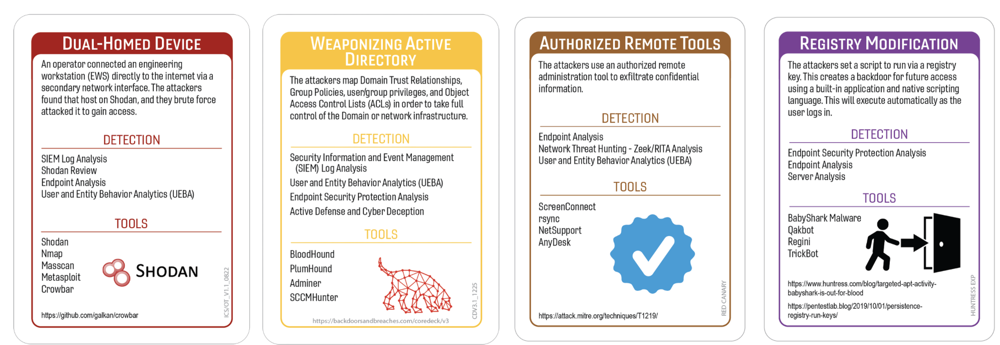
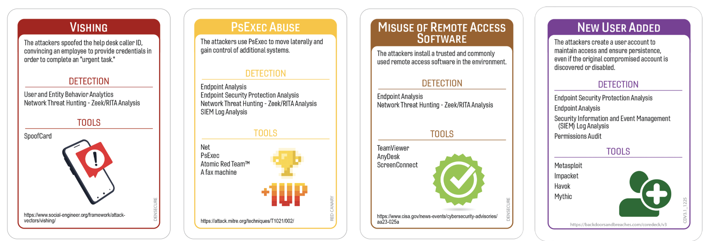
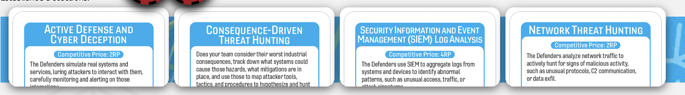

# The Credential Sync Catastrophe: When the MFA Button Finally Gave Up
### Cisco 2022
### Author:Robin Noyes
## Summary of Event
In May 2022, Cisco experienced a cyber intrusion that was later linked to an initial access broker associated with the Yanluowang ransomware ecosystem, as well as actors connected to UNC2447 and LAPSUS$. Although the attackers attempted extortion and claimed to have stolen approximately 2.8 GB of data, Cisco reported that the compromised information was limited and did not affect critical systems, customer data, products, or business operations. The incident became public after the threat actors posted stolen files on their leak site in August 2022. (The HackerNews, ComputerWeekly, Acronis)

The initial attack vector was not a software vulnerability but a combination of credential theft and social engineering. The attackers first compromised a Cisco employee's personal Google account. The employee had enabled Chrome password synchronization and stored Cisco credentials in the browser, causing those credentials to be synchronized to the personal Google account. After obtaining the username and password, the attackers targeted the employee with voice phishing (vishing) and MFA fatigue attacks (also known as push bombing), repeatedly sending MFA prompts until the employee eventually approved one. This approval granted VPN access to the attackers. (Phishing Tackle)

Once inside the environment, the threat actor established persistence, enrolled additional devices for MFA, created backdoor accounts, and moved laterally through the network. Cisco's investigation found attempts to compromise Citrix infrastructure, obtain privileged access to domain controllers, and conduct Active Directory reconnaissance using common post-exploitation tools such as AdFind, SecretsDump, and NTDS-related utilities. The attacker ultimately gained elevated privileges and accessed multiple internal systems before Cisco detected the activity and initiated containment. Cisco reported that the adversary repeatedly attempted to re-establish access after eviction but was unsuccessful.

## Tags

## Compatible Decks
Core Deck (v3),  ICS/IoT, RedCanary, DenSecure, Huntress

## Scenarios
### Variation 1

### Variation 

### Initial Compromise
**_Vishing/Dual Home_**
Look, it always starts with someone answering a phone call they absolutely shouldn’t. In this case, an employee picked up what they thought was IT Support, only to be greeted by the world’s most confident fake help‑desk technician. After a few rounds of “No really, I am from IT,” plus a sprinkle of urgency and a dash of “your account is about to be locked,” the attacker walked away with MFA approvals they didn’t deserve.  They had their personal Google account synced between their home PC and their corporate workstation, meaning all their personal bookmarks, extensions, and saved sessions came along for the ride. It was basically a digital U‑Haul of bad decisions, and the attacker didn’t even have to work hard to unpack it.

The adversary gained initial access through a vishing attack that successfully coerced the victim into approving MFA prompts. Once authenticated, the attacker benefited from the victim’s dual‑home configuration, where their personal Google account was synced across both home and corporate browsers. This synchronization introduced personal extensions, stored credentials, and session artifacts into the enterprise environment, effectively bridging external and internal contexts. The attacker leveraged this expanded access surface to perform reconnaissance and establish a foothold without deploying malware or exploiting traditional technical vulnerabilities.
* MiTRE:
	- T1598.003 – Voice Phishing (Vishing)
	- T1078 – Valid Accounts
	- T1110 – Brute Force (MFA Fatigue / Push Bombing)
	- T1056.002 – Multi‑Factor Authentication Request Generation (MFA fatigue)

### Pivot & Escalate
**_ Weaponized Active Directory/PS Exec Abuse _**
Once the attacker got inside, they started treating Active Directory like a playground with no adult supervision. Suddenly the SOC was seeing strange directory‑dump attempts coming from places that had no business trying to pull that kind of data. Then machine accounts — normally the quiet, well‑behaved background characters of the network — began doing things that made analysts sit up straight. Passwords were being reset out of nowhere, directory queries were flying around like someone was trying to map the entire domain before lunch, and credential‑harvesting behavior lit up logs in ways that made everyone ask, “Who woke up and chose chaos today?” To top it off, remote‑execution activity appeared that looked exactly like an admin doing maintenance… except no admin claimed responsibility. At that point, the SOC knew someone was joyriding through AD with the confidence of a bored sysadmin and the subtlety of a raccoon in a kitchen at 2 AM.

The attacker escalated privileges and moved laterally by extensively abusing Active Directory. Their activity included attempts to dump the NTDIS database using ntdsutil via PowerShell, leveraging machine accounts for unauthorized operations, and resetting passwords for additional accounts to expand access. Reconnaissance was conducted using ADFind to enumerate domain objects and relationships, while SecretsDump was used to extract credential material from compromised hosts. Lateral movement was facilitated through the deployment of psexecsvc, indicating the use of PSExec for remote command execution and service creation. These behaviors collectively represent a weaponization of Active Directory and administrative tooling to escalate privileges, harvest credentials, and pivot across the environment while blending into legitimate administrative workflows.
* MiTRE
	- T1069.002 – Permission Group Discovery: Domain Groups
	- T1087.002 – Account Discovery: Domain Accounts
	- T1570 – Lateral Tool Transfer
	- T1569.002 – System Services: Service Execution
	- T1035 – Service Execution (PSExec)

### C2 & Exfil
**_ Authorized Remote Tools/Misuse of Remote Tools _**
By the time the attacker reached the C2 stage, they were basically treating your remote‑access infrastructure like an Airbnb they didn’t pay for. The SOC kept seeing logins to systems that absolutely should not have been touched at 2 AM, especially through those corporate‑approved remote gateways everyone forgets exist until they break. Then came the RDP sessions that looked suspiciously like someone exploring the environment one server at a time. As if that wasn’t enough, the attacker tried to fire up a couple of “helpful” remote‑support tools that definitely weren’t part of your standard operating procedures. Nothing says “we have a problem” quite like seeing unauthorized remote‑control software pop up in logs and realizing the attacker is basically trying every remote‑access method they can find, like a kid flipping light switches to see which ones work.

For command‑and‑control and data exfiltration, the adversary leveraged authorized remote‑access pathways, including access to Citrix servers and direct RDP sessions, to blend into legitimate administrative activity. These sanctioned tools provided stable channels for interactive control and lateral movement without introducing anomalous binaries or traffic patterns. In addition, the attacker attempted to use unauthorized remote‑support utilities such as LogMeIn and TeamViewer, indicating efforts to establish alternative C2 mechanisms outside normal enterprise workflows. The combination of legitimate remote‑access infrastructure and misuse of third‑party remote‑control tools enabled the adversary to maintain persistent access, transfer data, and expand operational reach while complicating detection and response.
* MiTRE
	- T1105 – Ingress Tool Transfer
	- T1021.002 – Remote Services: SMB/Windows Admin Shares
	- T1071.001 – Application Layer Protocol: Web Protocols
	- T1041 – Exfiltration Over C2 Channel

### Persistence
**_ Registry Modification/New User Added 
By the time the attacker started working on persistence, it felt like they were rummaging through Windows internals the way someone digs through a junk drawer looking for batteries. The SOC saw attempts to yank entire registry hives out of the system — the kind of thing that makes analysts say, “Oh great, someone’s trying to steal the keys to the kingdom again.” Then came the classic “Windows accessibility feature magic trick,” where suddenly the login screen could open an elevated command prompt like it was a hidden cheat code. And just when the team thought they’d seen enough, new user accounts started appearing along with extra MFA devices tied to existing identities. Nothing says “we’re staying forever” quite like an attacker registering more authentication methods than the actual employee.

The adversary established persistence through multiple techniques. They attempted to export critical registry hives — including SAM, SECURITY, and SYSTEM — to obtain credential material and system configuration data. In addition, they leveraged Windows logon bypass techniques by manipulating accessibility features to spawn elevated command-line access at the login screen, enabling privileged operations without valid credentials. Persistence was further reinforced through identity‑based mechanisms: the attacker created new user accounts and enrolled additional MFA devices associated with compromised identities. These actions provided durable access paths that remained viable even if initial credentials were reset or traditional authentication controls were restored.
* MiTRE
	- T1547.001 – Registry Run Keys / Startup Folder
	- T1136.001 – Create Account: Local Account
	- T1112 – Modify Registry

## Procedures that Reveal the Attack Chain

* Active Defense and Cyber Deception
	* D3 DECEPTION
	* D3 HONEYTOKEN
	* D3 HONEYPATH
	* D3 THREAT MODELING
	* D3 BEHAVIORAL ANALYSIS

* Network Threat Hunting - Zeek/Rita
	* D3 NETWORK TRAFFIC ANALYSIS
	* D3 PROTOCOL VALIDATION
	* D3 ANOMALY DETECTION
	* D3 NETWORK BOUNDARY ENFORCEMENT
	* D3 FLOW ANALYSIS

* Security Information and Event Management (SIEM) Log Analysis
	* D3 ANALYZE LOGS
	* D3 AUDT Audit Log Aggregation
	* D3 HOSTBASED SENSOR
	* D3 APPLICATION HARDENING
	* D3 EVENT CORRELATION

* Endpoint Security Protection Analysis
	* D3 PROCESS ANALYSIS
	* D3 EXECUTION PREVENTION
	* D3 MALWARE ANALYSIS
	* D3 AUTORUN HARDENING
	* D3 FORENSIC COLLECTION

## Written Procedures
* Active Defense and Cyber Deception
	* The deception environment is where analysts get to play offense for once. When identity chaos erupts and remote tools start behaving like they have weekend plans, deception assets light up like a Christmas tree. Fake credentials, honey‑AD objects, and decoy admin shares suddenly become the SOC’s best friends, revealing exactly which “admin” is poking around where they shouldn’t. Active defense focuses on deploying and monitoring deception artifacts to identify unauthorized access attempts. Honeytokens, decoy credentials, and deceptive AD objects provide early indicators of lateral movement, privilege escalation, and misuse of remote administration tools. The goal is to detect adversary behavior early and redirect investigative focus toward compromised identities or systems.

* Network Threat Hunting - Zeek/Rita
	* Network hunting is where analysts stare at Zeek logs until patterns start making sense—or until caffeine runs out. When remote tools are abused, the traffic looks “normal enough” to pass casual inspection but “weird enough” to bother anyone who’s been doing this long enough. RITA helps surface beaconing, odd timing, and suspicious SMB chatter that shouldn’t exist at 3 a.m. Zeek and RITA provide structured visibility into protocol behavior, flow anomalies, and potential C2 patterns. Analysts review SMB, RPC, and HTTPS traffic for signs of remote‑tool misuse, lateral movement, and exfiltration. The objective is to identify deviations from baseline communication patterns and correlate them with identity‑driven compromise indicators.

* Security Information and Event Management (SIEM) Log Analysis
	* The SIEM immediately begins screaming when identity compromise meets remote‑tool abuse. Alerts pile up like someone spilled alphabet soup across the dashboard—failed MFA attempts, odd VPN logins, privilege jumps, and service executions that look like they were scheduled by a sleep‑deprived admin. It’s chaotic, loud, and exactly where the investigation starts. SIEM log analysis focuses on correlating identity events, authentication anomalies, remote‑tool execution logs, and registry‑based persistence indicators. Analysts review VPN logs, MFA events, AD audit trails, and service creation records to reconstruct the intrusion chain. The goal is to identify the initial access vector, track lateral movement, and validate persistence mechanisms.

* Endpoint Security Protection Analysis
	* Endpoint analysis is where analysts dig through systems that look like they’ve been through a digital tornado. Unexpected services, modified registry keys, and new user accounts appear like someone was redecorating the OS without permission. It’s messy, noisy, and exactly the kind of chaos that reveals persistence. Endpoint protection analysis examines process execution, registry modifications, service creation, and user‑account changes. Analysts validate whether remote‑tool execution occurred, identify persistence artifacts, and confirm whether privilege escalation was successful. The objective is to isolate compromised endpoints, document malicious changes, and support containment actions.

## Procedure Success 
### General Reasons
 - Technical
    - Detection logic was recently tuned, allowing identity anomalies and remote‑tool misuse to stand out clearly.
	- Network telemetry was complete enough to reveal suspicious SMB and RPC patterns associated with lateral movement.
	- Endpoint agents captured registry changes and service creation events without gaps, enabling rapid confirmation of persistence.
- Financial
	- Licensing included advanced analytics modules for Zeek/RITA and SIEM correlation, improving detection fidelity.
	- Prior investment in deception tooling provided early indicators of unauthorized AD exploration.
	- Funding for endpoint protection upgrades ensured complete coverage across critical systems.
- Political
	- Identity, network, and endpoint teams collaborated effectively, reducing delays in correlating events.
	- Leadership prioritized the investigation early, enabling rapid access to logs and systems.
	- Clear ownership of AD and remote‑tool policies prevented cross‑team disputes.
- Personnel
	- Analysts with strong AD and network‑hunting expertise were available during the incident window.
	- Familiarity with normal protocol behavior helped the team quickly identify anomalies.
	- Communication across teams was efficient, accelerating triage and containment.

## Procedure Success 
### Explanations
- Technical
	- Detection logic had finally been tuned by someone who knew what they were doing, so when the attacker started doing identity acrobatics and remote‑tool nonsense, the alerts didn’t politely whisper — they screamed like a smoke alarm in a microwave fire.
	- Network telemetry was actually complete for once, meaning the attacker’s SMB/RPC lateral‑movement dance lit up the dashboards like a SOC holiday parade instead of disappearing into the void.
	- Endpoint agents captured every registry poke, prod, and “surprise, new service!” moment with the enthusiasm of a golden retriever bringing you evidence, making persistence attempts painfully obvious.
	- The tuning work meant the attacker couldn’t hide behind normal admin noise — every weird authentication attempt stuck out like a raccoon at a board meeting.
	- Host‑level visibility was so clean that even the junior analyst could point at the logs and say, “Yeah, that’s definitely not Dave from IT.”
- Financial
	- The fancy analytics modules we paid for finally earned their keep, flagging the attacker’s bizarre traffic patterns before anyone had time to say, “Do we even use this feature?”
	- Deception tooling tripped the attacker so fast it was like watching someone step on a rake — instant alert, instant panic, instant action.
	- Previously completed  upgrades meant every critical system had eyes on it, so the attacker couldn’t sneeze without generating telemetry somewhere.
	- The correlation engines we licensed stitched logs together automatically, saving analysts from having to manually reconstruct events like medieval monks copying manuscripts.
	- Prior investment in visibility tools meant the attacker’s AD exploration looked less like “normal admin work” and more like “someone joyriding through the domain.”
- Political
	- Identity, network, and endpoint teams actually talked to each other like humans instead of sending passive‑aggressive tickets, so correlation happened in minutes instead of days.
	- Leadership didn’t stall — they said “drop everything,” which meant we got access to logs and systems without the usual bureaucratic scavenger hunt.
	- Clear ownership of AD and remote‑tool policies meant no turf wars, no finger‑pointing, just fast decisions and faster containment.
	- Everyone agreed on the severity early, so we didn’t waste time convincing people that “yes, this is actually bad.”
	- Policy clarity meant nobody argued about who was allowed to touch what — the response moved like a well‑oiled SOC machine for once.
- Personnel
	- The AD wizard and the network‑hunting gremlin were both on shift, and they immediately started pulling threads like they’d been waiting for this moment all week.
	- Analysts recognized the weird protocol behavior instantly — when you know what “normal” looks like, the attacker’s nonsense sticks out like a clown at a funeral.
	- Communication was so smooth it felt like everyone was speed‑running Incident Response Bingo — clear messages, fast updates, zero drama.
	- The team’s experience meant nobody had to Google “is this normal?” — they knew it wasn’t, and they acted fast.
	- Analysts were already familiar with the environment’s quirks, so the attacker’s deviations looked like neon signs pointing at compromise.

## Procedure Failures
### General Reasons
 - Technical
    - Certain systems lacked complete telemetry or had outdated configurations, resulting in blind spots during identity, network, or endpoint analysis.
	- Baselines for normal behavior were stale, making it difficult to distinguish legitimate activity from suspicious patterns.
	- Detection rules were outdated or misconfigured, causing missed alerts or delayed identification of key events.
- Financial 
	- Budget constraints limited access to advanced analytics modules or reduced retention windows, creating gaps in historical data needed for correlation.
	- Delayed renewals or procurement freezes resulted in temporary monitoring gaps or incomplete endpoint coverage.
	- Limited investment in training left analysts without the specialized knowledge required to interpret complex AD or protocol anomalies.
- Political (influence/rank, ownership, competition)
	- Unclear ownership of systems or logs caused delays in obtaining necessary data.
	- Leadership initially deprioritized the incident, slowing investigation and containment.
	- Interdepartmental friction hindered collaboration, resulting in incomplete or delayed information sharing.
- Personnel 
	- Key personnel with expertise in AD, remote‑tool behavior, or network hunting were unavailable due to leave or workload conflicts.
	- Alert fatigue caused analysts to misinterpret or dismiss early indicators.
	- Communication gaps led to missed context or incomplete execution of procedures.

## Procedure Failures 
### Explanations
- Technical
    - Some systems were basically running on “vibes only,” missing telemetry or stuck on outdated configs, so when the attacker started doing identity and lateral‑movement nonsense, half the sensors just shrugged and looked away.
	- Our behavioral baselines were so stale they might as well have been printed on parchment — everything looked “normal,” including the attacker joyriding through the environment.
	- Detection rules were old enough to qualify for retirement, so key alerts either didn’t fire or showed up fashionably late like they were attending a gala instead of an incident.
	- Endpoint visibility had gaps big enough to drive a truck through, meaning the attacker’s registry and service‑creation shenanigans slipped right past us.
	- Network monitoring missed critical RPC/SMB patterns, leaving us blind to the attacker’s lateral‑movement dance across servers.
- Financial
	- Budget constraints meant we didn’t have the fancy analytics modules, so instead of catching anomalies, we were stuck staring at raw logs like medieval monks deciphering runes.
	- Procurement freezes left monitoring tools in limbo, creating temporary blind spots where the attacker wandered freely like they were on a guided tour.
	- Reduced retention windows meant historical data vanished before analysts could correlate anything — it was like trying to solve a puzzle with half the pieces missing.
	- Training budgets were so thin that analysts had to Google half the AD and protocol anomalies, slowing triage to a crawl.
	- Limited investment in endpoint coverage meant some critical systems were basically dark rooms the attacker could hide in without anyone noticing.
- Political
	- Nobody could agree on who owned which logs or systems, so getting data felt like filing a tax return — slow, painful, and full of “please contact another department.”
	- Leadership initially treated the incident like a minor inconvenience, delaying escalation and giving the attacker extra time to redecorate the environment.
	- Interdepartmental friction meant teams shared information like it was contraband — slowly, reluctantly, and only after three meetings and a passive‑aggressive email chain.
	- Policy ambiguity caused teams to argue about responsibilities instead of focusing on the attacker, turning the investigation into a bureaucratic obstacle course.
	- Slow prioritization meant analysts were stuck waiting for approvals while the attacker continued their victory lap.
- Personnel
	- The AD guru, the network‑hunting gremlin, and the remote‑tool whisperer were all out — vacation, sick leave, on‑call rotations, you name it — leaving the SOC staffed with well‑meaning folks who weren’t specialists.
	- Alert fatigue hit hard, so early indicators were dismissed with the classic “probably just noise,” giving the attacker a head start.
	- Communication gaps meant half the team didn’t know what the other half had already found, turning the investigation into a scavenger hunt with missing clues.
	- Analysts were juggling too many tickets, so critical anomalies got buried under routine noise until it was too late.
	- Missing context led to procedures being executed incorrectly or incompletely, letting the attacker slip through cracks that shouldn’t have existed.

## Game Start
The shift was quiet until one identity event refused to behave. A login attempt popped up at an odd hour, followed by a burst of authentication noise that didn’t match the user’s normal pattern. At first it looked like routine drift—maybe someone working late, maybe a sync issue—but then remote‑tool activity appeared on a system that shouldn’t have been touched. The SIEM lit up, the network logs started whispering, and suddenly the room felt a lot less calm. Something was moving, and it wasn’t waiting for permission.

## Game Conclusion
The investigation confirmed that an attacker gained access through social‑engineering‑driven identity compromise, bypassed MFA through repeated prompts, and used legitimate remote tools to move laterally. Active Directory exploration, PSExec‑style execution, and registry‑based persistence revealed a clear intrusion chain. Endpoint and network telemetry validated the scope, and coordinated containment removed unauthorized accounts, persistence artifacts, and remote‑tool footholds. The incident closed with a clear lesson: identity compromise paired with legitimate‑tool misuse can escalate quickly when visibility and segmentation aren’t airtight.

## Lessons Learned and Mitigating Controls
- Strengthen protections against social‑engineering‑driven access by enforcing phishing‑resistant authentication and monitoring for abnormal MFA activity.
- Prevent personal‑to‑corporate exposure by disabling consumer‑account syncing and restricting non‑enterprise browser extensions.
- Improve identity governance by monitoring for unauthorized password resets, machine‑account misuse, and abnormal directory enumeration.
- Tighten remote‑access controls by allow‑listing authorized tools and alerting on unusual Citrix or RDP activity.
- Enhance persistence detection by monitoring registry hive access, accessibility‑feature misuse, and unexpected MFA device enrollment.
- Maintain complete and current telemetry across identity, network, and endpoint systems to detect subtle attacker activity.

## References
The Hacker News. Cisco Confirms It’s Been Hacked by Yanluowang Ransomware Group. The Hacker News, Aug. 2022, https://thehackernews.com/2022/08/cisco-confirms-its-been-hacked-by.html.
  
ThreatMon .Cisco Has Been Hacked by Yanluowang Ransomware Group. ThreatMon, https://threatmon.io/cisco-has-been-hacked-by-yanluowang-ransomware-group/.
  
Security Affairs. Paganini, Pierluigi. Cisco Hack: Yanluowang Ransomware Group Claims Responsibility. Security Affairs, https://securityaffairs.com/135625/cyber-crime/cisco-hack-yanluowang-ransomware.html.

Cisco Talos Intelligence. Recent Cyber Attack. Cisco Talos Intelligence, https://blog.talosintelligence.com/recent-cyber-attack/.

LinkedIn. Vasileios, Login Should. Lessons from Cyber History: Cisco Breach. LinkedIn, https://www.linkedin.com/pulse/lessons-from-cyber-history-cisco-breach-login-should-vasileios-ldfuf.

Acronis. Cisco Breached in Yanluowang Ransomware Attack: 28 GB Data Stolen. Acronis, https://www.acronis.com/en/tru/posts/cisco-breached-in-yanluowang-ransomware-attack-28-gb-data-stolen/.

Computer Weekly. Cisco Confirms Leaked Data Was Stolen in Yanluowang Ransomware Hit. Computer Weekly, https://www.computerweekly.com/news/252524873/Cisco-confirms-leaked-data-was-stolen-in-Yanluowang-ransomware-hit.

Phishing Tackle. Cisco Data Breach – Aug 2022. Phishing Tackle, https://phishingtackle.com/blog/cisco-data-breach-aug-2022.