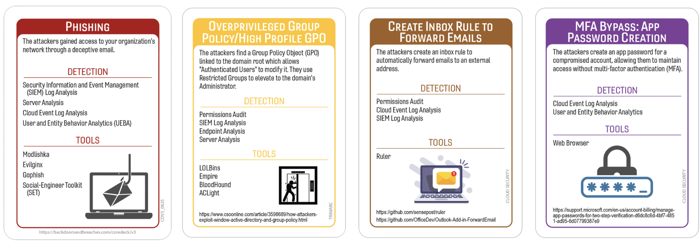
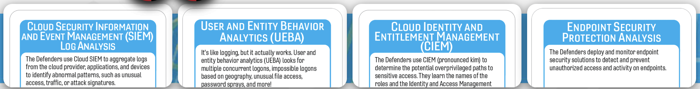

# The Great Mail Fail: Third Time’s Not the Charm
## MailChimp
### Author: Robin Noyes
## Summary of Event
In January 2023, Mailchimp disclosed that an unauthorized actor gained access to an internal tool used by customer support and account administration after conducting a social engineering attack on employees and contractors. Using compromised employee credentials, the attacker accessed data for 133 customer accounts; Mailchimp temporarily suspended affected accounts and began notifying and restoring them within about a day of detecting the incident on January 11–12, 2023. (Mailchimp, CyberSecurityDive)

The exposed data varied by customer but, in several cases (e.g., WooCommerce and others), reportedly included email addresses and names tied to marketing lists, which could be weaponized for downstream phishing. Multiple sources emphasize this was at least the second, and by some counts the third, similar Mailchimp support-tool breach in about a year, following earlier incidents in 2022 that also targeted high-value customers such as crypto-related services. (CPO Magazine) Mailchimp stated there was no evidence the breach extended beyond those 133 accounts, and no systems within their parent company, Intuit, were affected. (Mailchimp).   
  
The January 2023 attack relied on social engineering rather than exploiting a novel technical vulnerability: attackers tricked support staff into divulging or exposing credentials, then pivoted into an internal support environment with broad access to customer data and configuration. From there, they could view contact data, potentially alter campaigns, and send phishing emails from trusted domains or brands, effectively turning Mailchimp’s infrastructure into a phishing delivery platform(Mailchimp, CybersecurityDive). Several commentaries note that this pattern—repeated compromise of customer-support tooling via employee accounts—raised questions about Mailchimp’s internal security posture, particularly around identity, access, and detection controls, despite the company’s relatively quick response, account suspension, and incident communication. (CPO Magazine)

Separately, in 2025, the Everest ransomware group claimed they had breached Mailchimp and exfiltrated a 767 MB dataset with 943,536 lines of “internal company documents.” (Cybernews, DailySecurityReview) However, Mailchimp (via parent Intuit) denied evidence of any large-scale breach, and security experts reportedly downplayed the claim, calling the data “crumbs” relative to Mailchimp’s size and suggesting it may have come from a single customer or CRM export. (DailySecurity Review, Cybernews) Mailchimp stated “no evidence … of exfiltration of data from our systems” following their internal inquiry.

## Tags
Mailchimp, Social Engineering, Threepeat

## Compatible Decks
Core Deck (v2), Core Deck plus IR Expansion, Cloud Security (v2), ICS/IoT, RedCanary, DenSecure, Huntress

## Scenarios
#### Variation 1

#### Variation 2

### Initial Compromise
**_Phishing/Out-of-Band Phishing
This is our "Persistent Pest" card, the timeless art of social engineering—Mailchimp’s attackers clearly kept knocking until someone let them in—repeatedly. The exact medium remains a mystery: sliding into DMs, sending "urgent" Slack messages, or pulling the classic "it’s me, your IT guy" over a phone call, or carrier pigeon… who’s to say. What we do know is that the attackers cast a wide enough net that one unlucky user eventually took the bait, proving once again that humans remain the most ‘versatile’ attack surface in the enterprise.
* MiTRE
    - T1566 – Phishing  
    - T1598 – Spearphishing Voice / SMS / Other Social Engineering  
    - T1204 – User Execution (Social Engineering)  
    - T1078 – Valid Accounts  
    - T1556.003 – Multi‑Factor Authentication Bypass (Social Engineering)  

### Pivot & Escalate
**_Overprivileged Group/Local Privilege Escalation_**
This card represents the classic ‘I got in with one account but let me go ahead and borrow something with actual power’ maneuver. While the initial user may have opened the door, it’s entirely plausible a second, more privileged account did the real heavy lifting—because why stop at one compromised identity when you can upgrade your access like a frequent‑flyer perk. Since "using the internal admin panel like a personal megaphone" isn’t a standard card, we’re betting on the old-school tactic of inbox manipulation to keep their activities—and the replies—hidden in the shadows.
* MiTRE 
    - T1213 – Data from Information Repositories  
    - T1087 – Account Discovery  
    - T1069 – Permission Group Discovery  
    - T1098 – Account Manipulation (Use of Existing Privileged Accounts)  

### C2 & Exfil
**_Create Inbox Forwarding Rule_**
While there’s no smoking gun proving the attackers set up a secret mail relay, we know they used internal tools to blast out phishing emails. Since "using the internal admin panel like a personal megaphone" isn’t a standard card, we’re betting on the old-school tactic of inbox manipulation to keep their activities—and the replies—hidden in the shadows.
* MiTRE
    - T1537 – Transfer Data to Cloud Account  
    - T1041 – Exfiltration Over Web Services  
    - T1071.001 – Application Layer Protocol: Web Protocols  
    - T1566.002 – Spearphishing via Service  
    - T1586.002 – Compromise Infrastructure: Email Infrastructure  

### Persistence
**_MFA Bypass/Cross-Tenant Access_**
This card was selected as a nod to persistence techniques, even though nothing in the incident suggests MFA was touched.  Since the attackers successfully strolled into a cross-tenant administration tool like they owned the place, we have to assume they either whispered the right secrets to bypass Multi-Factor Authentication or found a way to hop the fence between accounts without tripping the alarms. It’s a bit of an "educated guess," but it beats assuming they just asked nicely.
* MiTRE
    - T1539 – Steal Web Session Cookie  
    - T1550.004 – Use of Web Session Cookie  
    - T1078 – Valid Accounts (Re‑use for Persistence)  

## Procedures that Reveal the Attack Chain

## Written Procedures
* Cloud Security and Event Management Log Analysis (SIEM)
    * Given that every device in the enterprise yeets its logs into the SIEM like raccoons flinging trash into a dumpster, there’s always the faint hope that—somewhere between the noise, the nonsense, and the 47,000 ‘informational’ alerts—we might accidentally stumble across something useful.
* User and Entity Behavior
    * This card was selected as research indicates the potential for multiple users to have access to all accounts rather than to only specific accounts.
* Cloud Identity and Entitlement Management (CIEM)
    * Information infers that there could have been anomalous activity based on where the user was accessing the information from, i.e. Geolocation.
* Endpoint Security Protection Analysis
    * Based on the available information, this card does not identify any of the attack tactics but they were selected because every SOC has at least one installed—like that one coffee mug nobody remembers buying that sits in the break room collecting dust.

## Procedure Success (explanations of why it worked)
### General Reasons
- Technical
    - VarProcedure worked effectively because the agent was deployed successfully, with full support for the operating system and device type, including legacy or critical assets.
    - VarProcedure successfully detected the attack because it adapted to the attacker’s change in TTPs through recent updates to detection logic and behavioral baselining.
 - Financial
    - VarProcedure was successful due to the recent hire of a SME on the specific tool.
- Political
    - VarProcedure was executed with zero disruption because prior concerns around impact were addressed through detailed scoping sessions. A technical demonstration clarified the tool’s function, and scans were scheduled to avoid critical production windows.
- Personnel
    - VarProcedure worked successfully because the SME documented detailed playbooks, and the team was trained to execute them confidently without delays.
    - VarProcedure worked successfully because a strong reporting culture encouraged personnel to escalate suspicious activity without hesitation.
    - VarProcedure worked successfully because leadership emphasized preparedness, ensuring documentation, playbooks, and escalation paths were always up to date.

### Procedure Success Explanations
- Technical
    - Cloud logs finally caught something useful because the attacker generated an error message so loud it practically filed its own ticket. 
    - Log-Pocalypse!  The success was purely a result of Data Quality & Log Integrity. The team had recently fixed a "noisy" log source that used to bury inbox changes under thousands of "Email Read" events. Once the data was clean, the creation of a single forwarding rule triggered a UEBA alert so clear it was impossible to ignore.
    - The Visibility & Scope Coverage was finally 100% because the CISO made it a personal mission to "illuminate" every shadow IT project in the company. When the attacker tried to escalate from a guest account to a "Project-X-Super-User," the CIEM screamed bloody murder because it was finally watching the corners of the network that everyone usually ignores.
    -  EDR caught the intrusion because the malware executed PowerShell in a way that made the agent say “absolutely not” before the script even finished typing itself.
- Financial
    - Cloud log retention worked because Finance accidentally approved enough storage to keep logs longer than 48 hours.
    - UEBA succeeded because leadership bought the “AI‑powered anomaly detection” add‑on during a holiday sale and it actually did something.
    - Having just spent a fortune on Skills & Talent Investment, the CISO demanded a "Weekly Hunt" to prove the new hires were worth their salaries. This high-pressure Strategic Investment Alignment forced the team to find something in the CIEM, and that "something" happened to be a legitimate attacker trying to hop into a Global Admin group. 
    -  Due to a Procurement & Renewal quirk, the company ended up with a higher-tier license for their endpoint protection than they actually intended to buy. This "accidental" Infrastructure Investment included an advanced exfiltration module that caught the administrative tool being used to send mass emails—a feature they didn't even know they had until it started screaming.
- Political
    - Cloud log analysis worked because a VP demanded answers “by lunchtime,” instantly turning the SOC into a forensic SWAT team.  Relying on previous built partnerships, the Network team and the Cloud team were in a competition to see who could respond to "Anomalous Escalations" faster. 
    - The success was due to the experience level of a senior admin who happened to be a hobbyist in social engineering tactics. They recognized the specific "vibe" of the phishing language in a reported chat log and pushed for a manual audit before the automated UEBA could even finish its baseline.
    - CIEM caught the threat because the IAM team wanted to prove they do matter after years of being ignored and due to an impending SOC2 audit. Every department head was terrified of being the one responsible for "Permission Bloat," so they actually cooperated with the CIEM cleanup. When the attacker tried to escalate, they stood out like a sore thumb in a newly "lean" environment.
    - EDR succeeded because the endpoint team refused to let the cloud team “win” detection bragging rights.
- Personnel
    - Cloud log analysts found the evidence because someone actually read the alerts instead of bulk‑closing them at 3 a.m.
    - The procedure was successful because there were enough warm bodies in the SOC to actually read the alerts. Usually, "Quantity" is a failure point, but this time, the sheer number of interns meant that someone was bound to click "Investigate" on the social engineering alert just to see what would happen.
    - CIEM detected the anomaly because one particular intern, possessing a high motivation to get a full-time offer, spent their weekend manually cross-referencing Slack logs against MFA timestamps—catching the "IT Support" imposter that the automated filters had initially marked as "low risk."	
    - EDR succeeded because the night‑shift SOC analyst got bored and went threat hunting out of sheer curiosity.

## Procedure Failures
### General Reasons
- Technical
    -  VarProcedure did not detect the attack because the agent could not be deployed on the OS/Server/Laptop/Endpoint due to unsupported/legacy/criticality of the asset.
    - VarProcedure did not work because procedural documents/network or data flow diagrams were incomplete and did not show a critical path required for the success of VarProcdure.
    - VarProcedure did not work because agents/logging were installed and configured but alert logic/rule engine/data quality/data completeness was never validated.
    - VarProcedure did not work because the agent was recently installed on the device/system and there has not been enough data collected to establish a baseline of normal.
- Financial 
    - VarProcedure did not work because the logging level had never been checked and validated. We have been receiving tons of informational level data but nothing with enough information to be useful.
    - VarProcedure did not work because the budget did not include any skills training and talent improvement for this year to go with the fancy new tools.
- Political 
    - VarProcedure did not work because only user accounts had been included in the prior data review.  There was no data related to ownership and usage of functional, service, or machine-to-machine accounts available.
    - VarProcedure did not work due to disagreements over ownership and accountability of revoking keys, tokens, session ids, keys, etc.
- Personnel 
    - VarProcedure did not work because no one noticed that there was no SME/Lead assigned to the shift and our dedicated on-call VoIP number is on the fritz again.
    - VarProcedure did not work because the analyst was a little too helpful with the ‘escalation’ request, thinking they were impressing a high-level employee.gitb

### Procedure Failures Explanations
- Technical
    -  Despite a heavy investment in EDR, the Visibility & Scope Coverage failed because the targeted employee was using a legacy "testing" laptop that was not in the central inventory. The phishing link was clicked in a vacuum where no security agent was listening.
    - Half the logging agents are installed, the other half are “scheduled for next quarter,” and the one that mattered was on a machine named “TEMP‑LAPTOP‑DO‑NOT‑USE.”
    - The SIEM data quality & log integrity was so poor that the "Inbox Forwarding Rule Created" event was buried under 40 million lines of "Daily Marketing Sync" logs. Finding the exfiltration event was like trying to find a specific grain of sand in a desert during a windstorm.	
    - UEBA didn’t see the attacker because the user’s behavior was so chaotic it blended in perfectly with normal Monday morning activity.
- Financial 
    - Due to a Licensing & Coverage failure, the company had only purchased the "Standard" logs for their email suite, which didn't include "Administrative Tool Audit Logs." They had the evidence, but it was locked behind a "Please Upgrade to Enterprise" paywall they couldn't clear until the next fiscal year.
    - The company spent its entire budget on Infrastructure Investment (faster servers) but $0 on Skills & Talent Investment. They had the most expensive UEBA on the market, but no one on the team actually knew how to write the custom detection logic for "Mass Email Exfiltration."
- Political 
    - Hierarchy & Influence meant that the most overprivileged accounts belonged to senior leaders who refused to have their "workflow disrupted" by CIEM restrictions. The attacker compromised one of these "VIP" accounts, and the security team was too politically intimidated to challenge the "unusual" admin activity.
    - When the CIEM flagged a privilege jump, the Cloud team and the Security team spent four hours arguing over Ownership & Accountability—specifically, whose job it was to revoke the key. By the time they stopped bickering and looked at the console, the attacker had already promoted themselves to "Global Admin."
- Personnel 
    - The quantity of alerts was so high and the motivation of the staff so low that the "Out-of-Band" phishing alert was treated like a car alarm in a big city—everyone heard it, but everyone assumed someone else was dealing with it. By the time an analyst clicked it, the attacker had already been "in the building" for three days.
    - The experience level of the night shift was too low to recognize that a chat message asking for a "session token" was a breach. They mistook the sophisticated social engineering for a standard "ticket escalation" and actually helped the attacker bypass the initial login hurdles.

## Game Start
You arrive for work, with your typical zeal to jump into the dashboards and see how things are going.  Suddenly there is a spike in password-reset requests and support tickets from customers reporting suspicious logon events for multiple customer profiles; the rapid successsion is far faster than normal workflows support.  You begin receiving complaints from customers about phishing emails coming from our platform/domain and appearing to originate from legitimate accounts. The SIEM is sitting in the corner, quietly contemplating the future but nothing is showing as out of the normal routine.  We need to dive in and see what is going on.

## Game Conclusion
After a full investigation, your team confirms that the incident stemmed from a targeted social‑engineering campaign against a small number of employees with access to internal support tools. The attackers successfully convinced at least one employee to disclose or approve access to their account, allowing unauthorized entry into internal administrative systems.

Once inside, the attacker used legitimate employee permissions to view customer account data and identify high‑value targets. Several customer accounts were accessed, and a subset of them were used to launch highly convincing phishing campaigns that appeared to originate from trusted, legitimate sources. Because the activity blended in with normal support workflows, early detection was difficult.

No malware was deployed, no infrastructure was breached, and no system vulnerabilities were exploited. The attacker relied entirely on social engineering, credential misuse, and the inherent trust placed in internal tools. While the intrusion was contained and the compromised accounts were secured, the incident exposed gaps in identity protection, MFA resilience, internal monitoring, and employee security awareness.

The attacker’s access has been revoked, but the downstream impact, including customer phishing exposure and reputational damage, will take time to fully assess. The investigation concludes with a clear takeaway: even mature organizations can be compromised when attackers target people instead of systems.

## Lessons Learned and Mitigating Controls
- Zero trust and least privilege: Restrict support tool access to narrowly scoped roles, with per-customer or per-function segmentation and just‑in‑time elevation rather than broad, persistent access.
- Strong conditional access: Enforce risk-based access policies (device posture, geo/behavior anomalies) before support tools can be reached, with stepped-up verification on sensitive actions (e.g., exporting lists, changing sending domains).
- Service-specific compartmentalization: Separate environments or tenants for high-risk customers (e.g., financial/crypto, large SaaS) so compromise of one support context does not expose the entire book of business.
- Stronger MFA and phishing-resistant authentication: Mandate FIDO2/WebAuthn-based MFA for all staff with access to customer data, so credential theft or OTP-harvesting is less effective.
- High-friction workflows for sensitive helpdesk actions: For example, require dual control (two separate employees) or manager approval for changing account owners, modifying API keys, or exporting large lists.
- Red-team-driven social engineering training: Use recurring, realistic phishing and vishing simulations targeted at support staff and contractors, with feedback loops and consequences if risky behavior persists.

### References
* TechCrunch:*Mailchimp says it was hacked — again
    * [https://techcrunch.com/2023/01/18/mailchimp-hacked/](#)
* MailChimp:*Information About a Recent Mailchimp Security Incident
    * [https://mailchimp.com/newsroom/january-2023-security-incident/](#)
* CyberzecurityDive: Mailchimp hit by second cyberattack in 6 months, 133 customers impacted
    * [https://www.cybersecuritydive.com/news/mailchimp-cyberattack-breach-social-engineering/640743/](#)
* Bleeping Computer: MailChimp discloses new breach after employees got hacked
    * [https://www.bleepingcomputer.com/news/security/mailchimp-discloses-new-breach-after-employees-got-hacked/](#)
* TheHackerNews: Mailchimp Suffers Another Security Breach Compromising Some Customers' Information
    * [https://thehackernews.com/2023/01/mailchimp-suffers-another-security.html](#)
* ComputerWeekly: Mailchimp suffers third breach in 12 months
    * [https://www.computerweekly.com/news/252529368/Mailchimp-suffers-third-breach-in-12-months](#)
* CPOMagainze: Another Security Breach at Mailchimp; Customer Support Tools Again Hijacked to Phish Clients, in Third Such Incident in a Year
    * [https://www.cpomagazine.com/cyber-security/another-security-breach-at-mailchimp-customer-support-tools-again-hijacked-to-phish-clients-in-third-such-incident-in-a-year/](#)
* TechCo: Third MailChimp Data Breach Makes It Hard To “Rebuild Trust”
    * [https://tech.co/news/mailchimp-breach-phishing-trust](#)
* DailySecurityReview: Everest Ransomware Group Claims Mailchimp but Experts Say Leak Is Minor and Unproven
    * [https://dailysecurityreview.com/security-spotlight/everest-ransomware-group-claims-mailchimp-but-experts-say-leak-is-minor-and-unproven/](#)
* Cybernews: Mailchimp claimed in ransomware attack, but security experts say data not worth the hype
    * [https://cybernews.com/news/mailchimp-ransomware-attack-everest-group-data-not-worth-hype/](#)
* Twingate: What Happened in the Mailchimp data breach?
    * [https://www.twingate.com/blog/tips/mailchimp-data-breach](#)