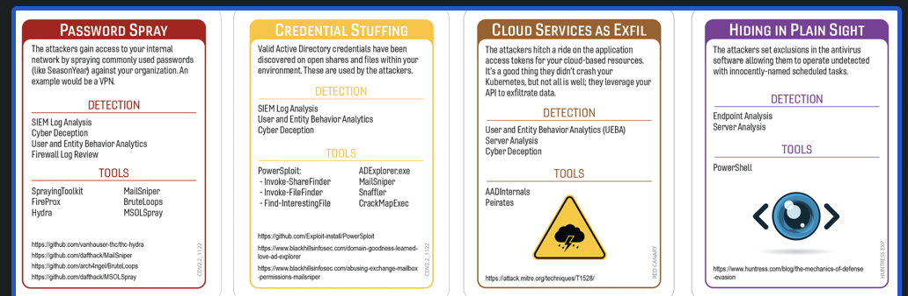
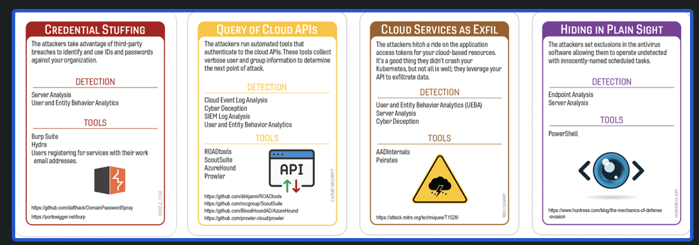
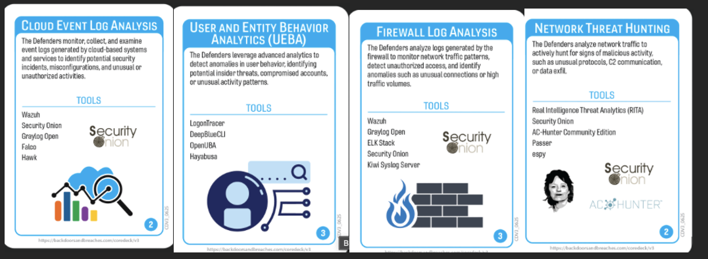

# What? We Are Related
## 23andMe
### Author: Robin Noyes
#### Summary of Event 
In October of 2023 a database of 23andMe's, a genetic testing and linage company, user data was found being sold in dark web forums; which appeared to be data of mostly targeting individuals of Chinese and Ashkenazi Jewish heritage.  Reports indicate that  14,000 customers data, .1 % of its 14 million customers, data was directly accessed.  However,  due to the initial compromised users having enabling the opt-in DNA Relatives' feature, it is estimated that at least 6.9 million users data had been accessed.  23andMe confirmed in December, 2023 that nearly half of its customer data was accessed by the threat actor.   The data included DNA results, predicted relationship information, family-tree information,  health-related information based on profiles, email addresses, phone numbers, and display names.  The adversary utilized dumps of previous compromised credentials and utilized this data to perform multiple credential stuffing attacks.  23andMe is facing 30 separate lawsuits and insists it was not at fault and did not suffer a security breach.  Rather, in the notifications to consumers “users negligently recycled and failed to update their passwords following these past security incidents, which are unrelated to 23andMe.” (Techcrunh, 2024)  
  
Key weaknesses included the lack of enforced multi-factor authentication prior to the breach, reliance on passwords vulnerable to reuse across sites, insufficient abuse controls on the DNA Relatives feature that allowed expansive access once a single account was compromised, and detection/response lag (with the breach unfolding before full impact was disclosed). Improvements should prioritize mandatory MFA for all accounts, adaptive risk-based authentication, credential-stuffing defenses like rate limiting and bot detection, tighter privacy defaults and granular access controls for relational features, and real-time anomaly detection tuned to unusual relationship-graph queries or large-scale profile enumeration. Clearer, faster breach communications and user-centric controls (easy opt-outs, visibility limits, and privacy-preserving defaults) would reduce exposure and restore trust. (USAToday, CBSNews).

## Tags
Database dumps, password reuse, valid accounts, 23andMe

## Compatible Decks 
Core Deck V2,Cloud Security (variation 2), RedCanary, Huntress

## Scenarios
### Variation 1

### Variation 2

### Initial Compromise
**Password Spray/ Credential Stuffing**
Hackers used previous password dumps to perform a credential stuffing attack against 14,000 different accounts.  We humans are creatures of habit and tend to be lazy.  Therefore those outside of cyber security (and probably some in it) often use the same credentials across multiple sites and accounts.

### Pivot & Escalate
**Credential Stuffing/ Query of APIs**
Once the adversary obtains access to the website/application, they utilize the opt-in 'DNA Sharing' feature to access and download family tree information.  The family-tree option allows the adversary to view relationships and other data, of other customers, without accessing their accounts.

### C2 & Exfil
**Cloud Services as Exfil**
Although there it has not been confirmed that a C2 was used, the adversary used the account access to scrap data from the owner of the account as well as any shared family tree information.  This may have been through exporting the data once the account was accessed or possibly through some form of scripted API access.

### Persistence
**Living off the Land/Hiding in Plain SighSight**
The adversary continued to access the 23andMe website, using multiple different accounts, presumably over several months, possibly from multiple IP potentially utilizing VPNs or cloud virtualization services.

## Procedures that Reveal the Attack Chain

* Security Information and Even Management (SIEM) Log Analysis
	* Initial Compromise--Password Spray; Credential Stuffing
	* Pivot and Escalate--Credential Stuffing; Query of Cloud API
	* C2 &Exfil--Cloud Service as Exfil 
	* Persistence--Living off the Land; Hiding in Plain Sight
	MiTRE
	  	* D3-ANLZ – Log Analysis
		* D3-AUDT – Audit Log Aggregation
* Cloud Event Log Analysis
	* Persistence--Living off the Land; Hiding in Plain Sight
	MiTRE
		* D3-CLDL – Cloud Logging
		* D3-ACCT – Account Monitoring
		*  D3-EXFL – Exfiltration Detection
* Server Analysis
	* Initial Compromise--Password Spray; Credential Stuffing
	* Pivot and Escalate--Credential Stuffing; Query of Cloud API
	* C2 &Exfil--Cloud Service as Exfil 
	MiTRE
		* D3-DSRC – Data Source Analysis
		* D3-EXFL – Exfiltration Detection
* Firewall Log Review (loosely interpreted as WAF)
	* Initial Compromise--Password Spray; Credential Stuffing
	* Pivot and Escalate--Credential Stuffing; Query of Cloud API
	* C2 &Exfil--Cloud Service as Exfil 
* Network Threat Hunting
	* Initial Compromise--Password Spray; Credential Stuffing
	* Pivot and Escalate--Credential Stuffing; Query of Cloud API
	* C2 &Exfil--Cloud Service as Exfil 
		 
## Written Procedures
* User and Entity Behavior Analytics (EUBA)  
	* This card was included because it does not discover any items in the attack chain. Just like in real life, just because you're good at something, doesn't mean it will help you. EUBA tools are typically agent based and installed on company assets to provide telemetry around that system and user.   In the case of 23andMe, the attack actions took place  through valid customer accounts, from non-managed devices.
	MiTRE
		* D3-BEHA – Behavior Analytics
		* D3-ANML – Anomaly Detection
* Security Information and Even Management (SIEM) Log Analysis
	* This procedure was selected as it can detect Initial Compromise and Pivot and Escalate.  Community articles appear to indicate the adversary may have changed IP's, used VPN or cloud hosting for access attempts, as well as scripting access activity.  It is possible that user-agent statistics may also have shown this activity.  Web application telemetry may have shown accessing other distant family trees that were not typical for the customer. 
* Cloud Event Log Analysis
	* This procedure was selected as it can detect C2 and Exfil .  This card is a very loose interpretation that the adversary either downloaded information directly to their host or used scripts and API calls to access and retrieve the data. 
* Server Analysis
	* This procedure was selected as it can detect Living off the Land/Hiding in Plain Site.  However, in this case, it is a very loose interpretation of valid account use from multiple IPs, location, or times of day. 

## Procedure Success 
### General Reasons
Technical
	- VarProcedure found unauthorized/suspicious evidence of IP/commands/software/log deletion on the system.  This was found by correlating logs from multiple data sets EDR/Windows Logs/Firewall/Proxy/Server/UberAgent.  This allowed for finding patient zero to use in subsequent searches.
	- VarProcedure discovered suspect network/data/flow activity between two devices that warrant further investigation of ports and protocols used.
	
- Financial
	- VarProcedure  was successful due to the recent budget approval to collect/deploy additional tool/services/application/log sources across the environment.
	- VarProcedure  was successful due to the recent implementation of additional models/packages for the tool/service/application which allowed key features to be enabled.
	
- Political
	- VarProcedure was effective because the board approved the deployment project within the current fiscal year, recognizing the operational risk of delay and prioritizing security readiness.
	- VarProcedure operated effectively because the user/team/manager had built trust with the security team, understood the boundaries of authority, and granted the necessary rights and permissions. This collaboration enabled timely investigation without escalation.

	 
- Personnel
	- VarProcedure worked successfully because multiple personnel were cross-trained, ensuring continuity even when one expert was unavailable.
	- VarProcedure worked successfully because agents were thoroughly tested, validated, and monitored, ensuring they remained installed and functional across critical systems.

## Procedure Failures
### General Reasons
- Technical
	- VarProcedure didn't detect anything because the attacker changed TTPs (Tactics, Techniques, Procedures).
	- VarProcedure did not detect the attack because the agent/signatures are out of date or were corrupted during a recent update.
	
- Financial
	- VarProcedure did not work because the budget was not approved or was delayed to expand licensing for tool/service/project/application to subsidiary/offices/datacenter/branch/new location/work from home/contractors.
	- VarProcedure failed because the PO to renew the tool/service got stuck in the payment process. The tool/service stopped before someone noticed.
	
- Political
	- VarProcedure wasn't configured at subsidiary/branch/business unit because Owner/VP/Senior Know-it-All/Project Manager said it would interfere with their CrItIcAl PrOjEcT timeline.
	- VarProcedure found nothing because the project to deploy agent/service/tool/configuration was delayed until next fiscal year by the board.
	
- Personnel
	- VarProcedure did not work because the only person that knows how to do/use VarProcedure is on vacation/retired/RIF/terminated yesterday.
	- The contractor hired to deploy VarProcedure ran out of hours in their contract.

### Procedure Failures Explanations
-Server Analysis
- Technical
	- During a planned maintenance activity, the incorrect server was shut-down.  This caused the failover system to become the primary active server, as a result no artifacts were found.  The application team is working on bringing up the correct server and providing access to the IR team.
- Financial
	- A member of the application team was a bit overzealous when told they need to trim costs on hardware.  They scripted a cronjob to clean up any webapp logs older than 7 days--you were shipping this to the SIEM, right?
- Political
	- The application teams did not create the break-glass accounts as they felt that would be too much power to another team.  The team has been having to work through a single-user who is not as experienced on this system and they keep providing the wrong log, wrong command output, and the delays in getting information are impacting the progress of the investigation.
- Personnel
	- Our primary forensics led is away at a conference and will not be back for two weeks.  The team is working to find their documentation to obtain artifacts.

-User and Entity Behavior Analytics (EUBA)  
- Technical
	- The UEBA did not have enough initial data to determine initial baselines for effective alerting/detection.  Therefore, the specified behaviors did not trigger an event.
- Financial
	-  A limited scope license was initially purchased, the UEBA tool cannot ingest all required data sources or is not on all required systems (only laptops not servers, etc).
- Political
	- Siloed departments refused to share their logs due to territorialism or fear of scrutiny.
- Personnel
	- Key staff are overloaded, leaving no time to tune or validate UEBA detections.

-Security Information and Even Management (SIEM) Log Analysis
- Technical
	- The initial implementation of the SIEM was performed by a 3rd party.  Although agents were installed and data was being collected, the web application logs were being sent in chunks and incomplete.
- Financial
	-  Budget was not approved to allow for maintaining more than 7 days of logs for the authentication data of the web application. 
- Political
	- No team has been held accountable for tuning, maintenance, or validating the tool's output.
- Personnel	
	- Our primary forensics led is away at a conference and will not be back for two weeks.  The team is working to find their documentation to obtain artifacts.

- Cloud Event Log Analysis
- Technical
	-  Logging was incorrectly implemented , wrong logging level or wrong data elements,  resulting in only partial log activity being available.
- Financial
	-  Someone incorrectly estimated the level of data we would be generating.  Therefore, we do not have all of the high-volume logs like VPC flowlogs or Cloudtrail. 
- Political
	- The application teams did not create the break-glass accounts as they felt that would be too much power to another team.  The team has been having to work through a single-user who is not as experienced on this system and they keep providing the wrong log, wrong command output, and the delays in getting information are impacting the progress of the investigation.
- Personnel
	- The team lacks experience with IAM events, API logs, or cloud threat patterns
	
## Game Start 
A 3rd party, with whom the company has no prior relationship, has notified our company of the discovery of data being sold on the dark web that appears to be from our company.  

## Game Conclusion
The attacker utilized prior password database dumps and began a credential stuffing attack against the company.  It is not know how long this had been happening nor if there had been any alerting to indicate multiple accounts being accessed from anomalous browsers, systems or locations.

## Lessons Learned and Mitigating Controls
1. Use different login ids and passwords for each site; utilize a password database for easier management.
2. Use MFA, where feasible use an app, trusted device,  or key-fob rather than SMS 2FA.
3. Check for password credential dumps of other organizations, there is a high likelyhood that someone else may have also used that password.

### References
* 23andMe user data targeting Ashkenazi Jews leaked online
	*  [https://www.nbcnews.com/news/us-news/23andme-user-data-targeting-ashkenazi-jews-leaked-online-rcna119324](#)

* 23andMe tells victims it’s their fault that their data was breached 
	* [https://techcrunch.com/2024/01/03/23andme-tells-victims-its-their-fault-that-their-data-was-breached/](#)

* 23andMe hack let threat actor access data for millions of customers, company says 
	* [https://www.cbsnews.com/news/hackers-accessed-23andme-dna-data-millions-users/](#)

* What happened in the 23andMe data breach? 
	* [https://www.twingate.com/blog/tips/23andme-data-breach](#)

* 23andMe agrees to $30 million settlement over data breach that affected 6.9 million users 
	* [https://www.usatoday.com/story/money/2024/09/16/23andme-class-action-lawsuit-settlement/75250132007/](#)
