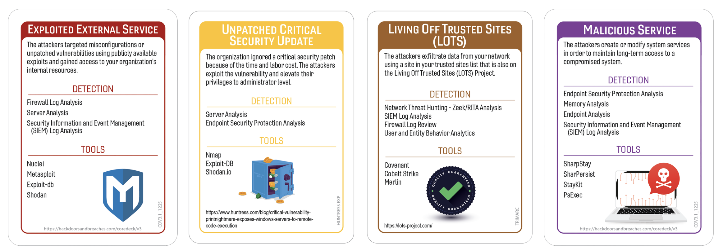
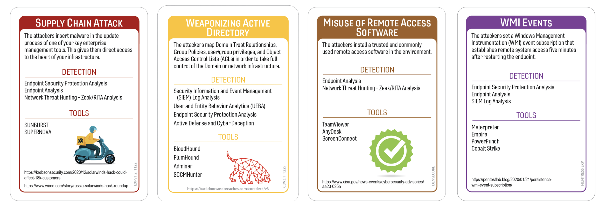
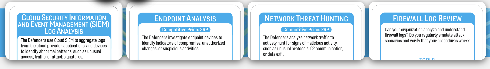

# Zoho? More Like Zo‑No: The Zero‑Day That Ruined Everyone’s Week
### Author:Robin Noyes
## Summary of Event

In 2021, attackers exploited a critical authentication bypass and remote code execution vulnerability in Zoho ManageEngine ADSelfService Plus (CVE‑2021‑40539), enabling unauthenticated access to exposed systems (CISA). Government advisories reported that state‑sponsored actors used the flaw to deploy web shells, steal credentials, and move laterally within victim networks (TechMonitor).

Reporting showed that attackers scanned thousands of vulnerable systems and successfully compromised multiple organizations across defense, energy, healthcare, technology, and education sectors (ITPro). The International Committee of the Red Cross confirmed that attackers exploited the Zoho vulnerability to breach a contractor and access sensitive humanitarian data (BleepingComputer).

Researchers warned that exploitation continued even after patches were released, with attackers chaining additional Zoho ManageEngine vulnerabilities across products such as ServiceDesk Plus and Desktop Central (CyberNews). Zoho later released an exploit‑detection tool to help organizations identify compromise as attacks persisted (SecurityWeek).

## Tags
Zoho

## Compatible Decks
Core Deck (v3), Core Deck plus IR Expansion, Cloud Security (v2), ICS/IoT, RedCanary, DenSecure, Huntress, DataDog

## Scenarios

V1
Exploitable External Service, Unpatched Critical Security Update, Living Off Trusted Sites (LOTS), Malicious Service/Just Malware

V2
Supply Chain, Weaponizing Active Directory, Misuse of Remote Access, WMI Events

### Initial Compromise
_**Exploitable External Service/Supply Chain**_
The attacker begins by taking advantage of an internet‑facing service that was never meant to be the organization’s front door but has been functioning as one for years. They identify a flaw in the exposed application and use it to slip inside without needing credentials, approvals, or even a polite knock. This works because the service is externally reachable, inconsistently patched, and monitored with the same enthusiasm as a forgotten houseplant. Once inside, the attacker gains a foothold on a system that often has more privileges than anyone remembers granting. This foothold gives them the ability to run commands, explore the environment, and test how far they can push without being noticed. The compromise sets the stage for deeper movement by giving the attacker a stable platform inside the network. From here, they can begin probing for internal weaknesses that were never meant to be exposed to the outside world. This initial success becomes the launchpad for the next phase of escalation.
MiTRE  
T1190 – Exploit Public‑Facing Application  
T1195 – Supply Chain Compromise

### Pivot & Escalate
_**Unpatched Critical Security Update/Weaponizing Active Directory**_
After gaining a foothold, the attacker looks for internal systems that are missing critical updates, which is usually not a difficult scavenger hunt. They exploit one of these unpatched systems to elevate their privileges, taking advantage of the fact that internal patching often follows a schedule best described as “aspirational.” This escalation gives them access to accounts, processes, or systems that were previously out of reach. With higher privileges, they can move laterally, explore sensitive areas, and blend in with legitimate administrative activity. The attacker uses this new level of access to gather information about the environment’s structure and weaknesses. This step is effective because internal systems are often trusted implicitly and monitored lightly. The elevated access allows them to prepare for long‑term control or data theft. This escalation directly enables the next phase by giving them the authority to communicate externally without raising alarms.
* MiTRE
	- T1068 – Exploitation for Privilege Escalation
	- T1484.001 – Domain Policy Modification 
	- 1484.002 – Domain Trust Modification
### C2 & Exfil
_**Living Off Trusted Sites (LOTS)/Misuse of Remote Access**_
The attacker establishes command‑and‑control by routing their traffic through well‑known, widely trusted cloud services that no one dares block. They use these legitimate platforms to blend their communications into normal business traffic, making detection feel like trying to spot a single suspicious raindrop in a thunderstorm. This approach works because outbound connections to these services are common, encrypted, and rarely inspected deeply. The attacker uses this channel to issue commands, retrieve results, and quietly move data out of the environment. By hiding inside trusted destinations, they avoid triggering alerts that would normally fire on unknown or suspicious domains. This technique also allows them to maintain persistence even if other parts of their operation are discovered. The trusted‑site traffic becomes the backbone of their remote control. This communication path sets up the final phase by giving them a reliable way to maintain access and extract valuable information.
* MiTRE  
	- T1102 – Web Services 
	- T1071.001 – HTTPS   
	- T1219 – Remote Access Software
### Persistence
_**Malicious Service/Just Malware/WMI Events**_
The attacker installs or modifies a system service to ensure they can return whenever they please, even if their initial access point is closed. They choose a service because it blends in with the dozens of legitimate ones that no one has reviewed since the system was deployed. This persistence mechanism starts automatically, runs quietly, and often uses names that sound just plausible enough to avoid suspicion. The attacker configures the service to execute their tools or reestablish communication with their command‑and‑control channel. This method works because service inventories are rarely maintained and even more rarely audited. The malicious service gives the attacker a durable foothold that survives reboots, patches, and administrative cleanup attempts. It also provides a stable platform for future operations. This persistence ensures the attacker can continue their activities long after the initial compromise is forgotten.  
* MiTRE
	- T1543.003 – Create/Modify Windows Service
	- T1546.003 – WMI Event Subscription

## Procedures that Reveal the Attack Chain

* Cloud Security Information and Even Management (CSIEM) Log Analysis
	* D3-LATENT-LOG-ANALYSIS 
	* D3-APPLICATION-HARDENING 
	* D3-LOG-AUTHENTICATION 
	* D3-LOG-ANOMALY-DETECTION 
* Endpoint Analysis
	* D3-PROCESS-ANALYSIS 
	* D3-MALWARE-ANALYSIS 
	* D3-AUTORUN-HARDENING 
	* D3-EXECUTION-PREVENTION
* Network Thread Hunting - Zeek/RITA Analysis
	* D3-NETWORK-BEHAVIOR-ANALYTICS
	* D3-NETWORK-EGRESS-FILTERING 
	* D3-TLS-INSPECTION
	* D3-FLOW-ANALYSIS
* Firewall Log Review
	* D3-NETWORK-BOUNDARY-ENFORCEMENT 
	* D3-NETWORK-TRAFFIC-ANALYSIS
	* D3-PROTOCOL-VALIDATION 
	* D3-NETWORK-SEGMENTATION 

## Written Procedures
* Cloud Security Information and Even Management (CSIEM) Log Analysis
	* This procedure involves diving into the SIEM to see whether the universe has blessed you with useful logs or cursed you with 40,000 alerts about printers. Analysts scroll through authentication failures, weird process launches, and network oddities while muttering things like “who designed this dashboard” and “why is this timestamp in the future.” The SIEM becomes a kind of digital tarot deck where every log line is a card and none of them are the one you need. Half the job is figuring out whether the data is missing, mislabeled, or simply lying. The other half is trying to correlate events that refuse to correlate, like two coworkers who pretend they’ve never met. Eventually, patterns emerge, usually after enough caffeine to blur the line between focus and self‑preservation. SIEM analysis is where analysts go to confirm their suspicions or develop entirely new ones they did not want. It is the closest thing to archaeology in cybersecurity, except the artifacts are JSON blobs and the ruins are your infrastructure.

* Endpoint Analysis
	* This procedure is where analysts poke at individual systems to see what horrors are hiding under the hood, like digital pest control with fewer gloves. They sift through processes with names that look suspiciously like typos, registry keys that haven’t been touched since the Mesozoic era, and scheduled tasks that definitely weren’t created by IT. Memory dumps reveal all sorts of surprises, including malware, abandoned scripts, and the occasional “temporary fix” left by an admin who has since vanished into legend. Analysts spend a lot of time asking, “Is this normal?” and the answer is almost always “No, but it’s been like that for years.” Endpoint analysis is equal parts detective work and digital spelunking, with the constant risk of discovering something that forces a meeting. It is messy, tedious, and absolutely necessary. It is also where the truth hides when the logs are lying.

* Network Thread Hunting - Zeek/RITA Analysis
	* This procedure involves staring at network metadata until patterns start to appear or sanity starts to fade, whichever comes first. Analysts use Zeek and RITA to hunt for beaconing, weird encryption patterns, and traffic going to places no one in the company should be talking to, like random VPS providers or “totally‑not‑malicious‑cloud‑storage.biz.” The tools spit out lists of “rare” connections that range from genuinely suspicious to “someone finally opened that training portal we bought in 2019.” Threat hunting is basically bird‑watching for packets: lots of waiting, lots of squinting, and occasional excitement when something flaps in the wrong direction. Analysts chase down odd flows, only to discover half of them are caused by printers, IoT devices, or that one legacy server everyone is afraid to reboot. But every so often, the stars align and the hunt reveals something genuinely bad. That moment is both triumphant and deeply inconvenient.

* Firewall Log Review
	* This procedure is the cybersecurity equivalent of reading tea leaves, except the tea leaves are firewall logs and the tea is cold. Analysts scroll through endless entries of “allowed,” “allowed,” “allowed,” and the occasional “blocked” that turns out to be someone mistyping a URL. The logs provide just enough information to raise suspicion but never enough to confirm anything, like a mystery novel missing the last chapter. Most of the time, the firewall is faithfully allowing everything the business insists it needs, which is apparently “the entire internet.” Analysts try to spot anomalies, but everything looks anomalous when the firewall rules were written by five different teams over ten years. Reviewing these logs rarely solves anything, but it does create a comforting illusion of diligence. It’s included because every organization insists on doing it, even though it’s about as effective as checking the weather by licking your finger indoors.

## Procedure Success 
### General Reasons 
- Technical_
	- Weak external monitoring ensures attackers enjoy the “all‑inclusive resort” experience on exposed systems.
	- Patch cycles move at the speed of continental drift, giving vulnerabilities time to settle down and start families.
	- Logging exists, but only in the philosophical sense — not in the “actually captures anything useful” sense.
	- Segmentation is more of a suggestion than a design principle, allowing attackers to tour the network like a hop‑on hop‑off bus.
- Financial
	- Budget approvals require a pilgrimage through seven committees and a fiscal alignment ritual.
	- Security tooling is purchased once, never tuned, and then proudly displayed like a museum artifact.
	- “Cost‑saving measures” ensure critical systems run on hardware last updated during the Bronze Age.
	- Outsourced services are chosen for price, not security, resulting in “value‑engineered” risk.
- Political
	- No one owns the vulnerable system, but everyone agrees it’s someone else’s problem.
	- Inter‑team communication resembles diplomatic negotiations between rival kingdoms.
	- Security exceptions are granted faster than security controls are implemented.
	- Leadership prioritizes uptime over patching, because “downtime is visible, breaches are theoretical.”
- Personnel
	- Admins are overloaded, under‑staffed, and one ticket away from becoming cryptids.
	- Institutional knowledge lives in one person’s head — and that person is on PTO.
	- Analysts are trained to ignore alerts because 99% of them are false positives, and the other 1% arrive at 3 AM.
	- Documentation is either outdated, missing, or written in a dialect no one speaks anymore.

## Procedure Success 
### Explanations
- Technical
	- Critical systems were patched on a schedule that could best be described as “seasonal.”
	- External exposure was discovered only after the attacker kindly demonstrated it.
	- Logging existed, but only in the same way Schrödinger’s cat exists — uncertain until inspected.
	- Internal segmentation was so flat that lateral movement felt like walking across a parking lot.
	- Monitoring tools were deployed everywhere except the systems that actually mattered.
- Financial
	- The budget for security improvements was approved right after the attacker finished using the gap.
	- Renewal funds went to tools that were never configured, tuned, or even logged into.
	- Cost‑saving measures ensured critical systems ran on hardware that predated modern patching practices.
	- The vulnerability scanner license covered “some” of the environment, but not the part that got compromised.
- Political
	- Ownership of the vulnerable system was a diplomatic dispute with no clear winner.
	- Emergency patching required approvals from three teams and one mythical committee.
	- Security exceptions were granted faster than security controls were implemented.
	- Leadership prioritized uptime over security, because “downtime is visible, breaches are theoretical.”
- Personnel
	- The only person who understood the system had left, retired, or ascended to legend.
	- Analysts were drowning in alerts and treated new ones like spam mail.
	- Documentation was outdated enough to qualify as historical fiction.
	- The team was so understaffed that “triage” meant “we’ll look at it next week.”

## Procedure Failures
### General Reasons
- Technical
	- Critical systems are patched before attackers can finish downloading the exploit.
	- Logging is actually enabled, centralized, and — the real miracle — reviewed.
	- Segmentation prevents attackers from treating the network like an open‑world RPG.
	- EDR tools are deployed everywhere except the coffee machine.
- Financial
	- Leadership funds security like they actually want to keep the company.
	- Budget cycles include “security emergencies” as a real category, not a rounding error.
	- Vendors are evaluated on security posture, not just who brings the best donuts to meetings.
	- Renewal money is spent on tuning and training, not just renewing the invoice.
- Political
	- Ownership of systems is clear, documented, and not a game of hot potato.
	- Security exceptions require actual justification, not just “pretty please.”
	- Leadership supports patching windows even when they’re inconvenient.
	- Cross‑team collaboration exists and does not require a mediator.
- Personnel
	- Analysts have enough staffing to investigate alerts before they fossilize.
	- Admins know which systems they own and have time to maintain them.
	- Training is current, relevant, and not a 2014 PowerPoint about phishing.
	- Documentation is accurate, accessible, and not written in hieroglyphics.

## Procedure Failures 
### Explanations
- Technical
	- The vulnerable system was documented as “internal only,” but the firewall politely disagreed.
	- Patching was scheduled for “next maintenance window,” which had not occurred since the previous fiscal year.
	- Logs were collected, but only on the system that wasn’t compromised.
	- Monitoring alerts fired, but the integration to the SOC channel was “pending review.”
	- Segmentation existed on paper, but in practice everything could talk to everything like a family reunion.
- Financial
	- The budget for fixing the issue was approved right after the attacker finished exploiting it.
	- Renewal funds went to tools that looked great in demos but were never deployed past the pilot phase.
	- The vulnerability scanner license covered exactly the wrong half of the network.
	- The team requested funding for hardening, but leadership funded “digital transformation” instead.
	 Cost‑saving measures ensured critical systems ran on hardware that refused to run modern security controls.
- Political
	- Ownership of the system was disputed so long that the attacker had time to settle in and redecorate.
	- Emergency patching required approvals from three teams, two directors, and one person who was on PTO.
	- Security exceptions were granted with the enthusiasm of a rubber‑stamp factory.
	- Leadership insisted the system was “low risk” because no one had ever looked closely enough to prove otherwise.
	- Inter‑team communication resembled a cold war standoff, with everyone waiting for someone else to act.
- Personnel
	- The only person who understood the system had left, and their replacement inherited a mystery box.
	- Analysts saw the alert but assumed it was noise because everything else was noise too.
	- Documentation was so outdated it listed a server that had been decommissioned in 2019 as “critical.”
	- The team was understaffed enough that “triage” meant “we’ll get to it when the stars align.”
	- The admin responsible for the system was juggling so many tasks that this one fell off the list entirely.

## Game Start
A user reports that their workstation has been behaving strangely after a routine login earlier in the day, noting a brief flash of a command window and slower application performance that wasn’t present before. Initial endpoint telemetry shows a short burst of activity involving system utilities that don’t normally run together, followed by an unusual lull that feels more suspicious than reassuring. Authentication logs for the same user display a handful of anomalies that don’t match their typical access patterns, including a few entries that appear slightly out of sequence. Network monitoring also picked up a small amount of outbound traffic to destinations the SOC doesn’t usually see from this segment, though nothing overtly malicious stands out yet. At this point, the team has only fragments of odd behavior—nothing conclusive, nothing obviously broken, but enough inconsistencies to justify a deeper look. Your analysts are now tasked with determining whether this is a harmless glitch, a misconfiguration waiting to be fixed, or the early signs of something that will ruin everyone’s weekend. the threat before the threat finds HR. Your peaceful night is gone. Time to investigate.

## Game Conclusion
The investigation confirmed that the unusual workstation behavior was the result of an attacker exploiting a critical vulnerability in an externally exposed identity‑adjacent service. The initial foothold was obtained through an authentication bypass that allowed remote code execution without valid credentials. Once inside, the attacker leveraged unpatched internal systems to escalate privileges and gain broader access to the environment. Their command‑and‑control activity blended into normal encrypted traffic by using trusted cloud services, enabling them to operate for a period without detection. Persistence was established through a modified system service and WMI‑based event triggers, ensuring continued access even if the initial vector was closed.
The incident demonstrated how external exposure, inconsistent patching, and limited monitoring coverage created opportunities for the attacker to move through the environment with minimal resistance. Although the team ultimately identified and contained the intrusion, the attacker’s ability to establish a durable presence highlighted gaps in governance, visibility, and operational discipline. The scenario concludes with the environment stabilized, the intrusion remediated, and a clear set of corrective actions identified to prevent similar compromises in the future.

## Lessons Learned and Mitigating Controls
The incident exposed long‑standing weaknesses in system ownership, patching discipline, and monitoring coverage, especially around externally exposed identity‑adjacent services. Critical systems remained vulnerable because patching workflows depended on manual coordination, outdated documentation, and approval chains that moved slower than the threat. Logging and telemetry gaps created blind spots that allowed early indicators to blend into background noise, delaying detection until the attacker had already established a foothold.

Durable controls would have prevented the compromise by enforcing automated patching for high‑risk systems, maintaining accurate inventories of externally reachable services, and ensuring consistent telemetry across identity‑related infrastructure. Clear ownership, expiration‑bound security exceptions, and staffing levels that support real‑time triage would have reduced the window of opportunity. Strengthened segmentation, service‑creation monitoring, and outbound traffic controls would have limited movement and exposed the intrusion earlier.

Together, these failures show that the environment relied too heavily on tribal knowledge, manual processes, and optimistic assumptions about internal trust. The durable controls highlight the need for predictable patching, consistent monitoring, and governance structures that prevent critical systems from drifting into unmanaged risk.

## References
TechMonitor. “Chinese APT Group Exploits Zoho Bug in Global Cyber‑Espionage Campaign.” *TechMonitor*, 2021. https://www.techmonitor.ai/technology/cybersecurity/zoho-hack-emmisary-panda-apt-china  

CyberNews. “Fintech Breach Following Critical Zoho Flaw.” *CyberNews*, 2021. https://cybernews.com/news/fintech-breach-following-critical-zoho-flaw/  

BleepingComputer. “Red Cross: State Hackers Breached Our Network Using Zoho Bug.” *BleepingComputer*, 2022. https://www.bleepingcomputer.com/news/security/red-cross-state-hackers-breached-our-network-using-zoho-bug/  

CISA. “APT Actors Exploiting ManageEngine ADSelfService Plus Vulnerability.” *Cybersecurity Advisory AA21‑259A*, 2021. https://www.cisa.gov/news-events/cybersecurity-advisories/aa21-259a  

ITPro. “Researchers Warn of Increase in Attacks on Zoho Software.” *ITPro*, 2021. https://www.itpro.com/security/cyber-security/361739/researchers-warn-increase-attacks-zoho-software  

SecurityWeek. “Zoho Confirms New Zero‑Day, Ships Exploit Detector.” *SecurityWeek*, 2021. https://www.securityweek.com/zoho-confirms-new-zero-day-ships-exploit-detector/
